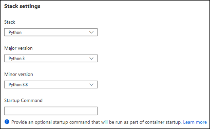
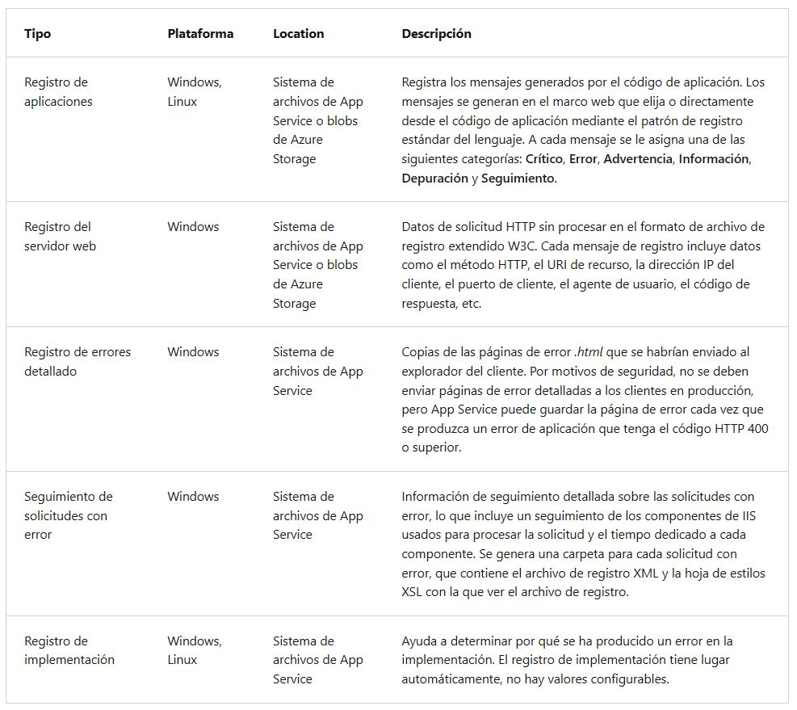
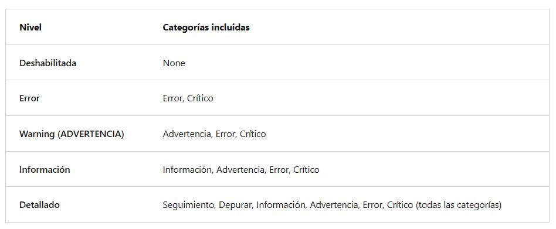
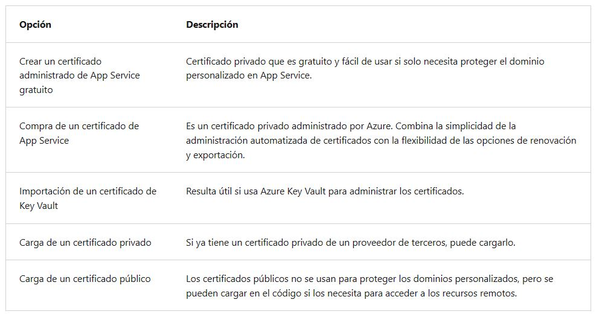

<h1 align="center"><ins>RUTA 1: IMPLEMENTACIÓN DE APLICACIONES WEB DE AZURE APP SERVICE</ins></h1>
<h2 align="center">MÓDULO 2 - CONFIGURAR APLICACIONES WEB</h2>

### Configuración de la aplicación

En App Service, las configuraciones de aplicaciones son variables que se pasan como variables de entorno al código de la aplicación. En el caso de las aplicaciones Linux y de los contenedores personalizados, App Service pasa la configuración de la aplicación al contenedor mediante la marca --env para establecer la variable de entorno en el contenedor.

Para acceder a la configuración de la aplicación, vaya a la página de administración de la aplicación y seleccione Configuración > Configuración de la aplicación.

Para los desarrolladores de ASP.NET y ASP.NET Core, la configuración de las opciones de aplicación en App Service es como configurarlas en <appSettings> en Web.config o appsettings.json, pero los valores de App Service reemplazan a los de Web.config o appsettings.json. Puede mantener la configuración de desarrollo (por ejemplo, la contraseña de MySQL local) de Web.config o appsettings.json y los secretos de producción (por ejemplo, la contraseña de base de datos de Azure MySQL) de forma segura en App Service. El mismo código usa la configuración de desarrollo cuando se depura localmente, y utiliza los secretos de producción cuando se implementa en Azure.

La configuración de la aplicación siempre se cifra cuando se almacena (cifrado en reposo).

#### Adición y edición de la configuración

Para agregar una nueva configuración de aplicación, seleccione Nueva configuración de la aplicación. Si usa ranuras de implementación, puede especificar si la configuración se puede intercambiar o no. En el cuadro de diálogo, puede fijar la configuración a la ranura actual.

Para editar una configuración, seleccione el botón Editar situado a la derecha.

Cuando haya terminado, seleccione Actualizar. No olvide volver a seleccionar Guardar en la página Configuración.

Nota: En un contenedor de Linux predeterminado o personalizado, cualquier estructura de clave JSON anidada en el nombre de configuración de la aplicación como ApplicationInsights:InstrumentationKey debe configurarse en App Service como ApplicationInsights__InstrumentationKey para el nombre de clave. Es decir, los símbolos : deben reemplazarse por __ (doble subrayado).

##### Edición masiva de la configuración de la aplicación
Para agregar o editar la configuración de la aplicación de forma masiva, haga clic en el botón Avanzado. Cuando haya terminado, seleccione Actualizar. La configuración de la aplicación tiene el formato JSON siguiente:

JSON

[
  {
    "name": "<key-1>",
    "value": "<value-1>",
    "slotSetting": false
  },
  {
    "name": "<key-2>",
    "value": "<value-2>",
    "slotSetting": false
  },
  ...
]

#### Configurar cadenas de conexión

Para los desarrolladores de ASP.NET y ASP.NET Core, los valores establecidos en App Service invalidan los de Web.config. Para otras pilas de lenguaje, es mejor usar la configuración de la aplicación en su lugar, ya que las cadenas de conexión requieren un formato especial en las claves de variable para poder acceder a los valores. Las cadenas de conexión siempre se cifran cuando se almacenan (cifrado en reposo).

Sugerencia: Hay un caso en el que puede que quiera usar cadenas de conexión en lugar de la configuración de la aplicación para los lenguajes que no son .NET: la copia de seguridad de determinados tipos de bases de datos de Azure se realiza junto con la aplicación solo si se configura una cadena de conexión para la base de datos en la aplicación de App Service.

La adición y edición de cadenas de conexión sigue los mismos principios que otras configuraciones de la aplicación y también se puede vincular a ranuras de implementación. Un ejemplo de cadenas de conexión en formato JSON que se usaría para la adición o edición de forma masiva.

JSON

[
  {
    "name": "name-1",
    "value": "conn-string-1",
    "type": "SQLServer",
    "slotSetting": false
  },
  {
    "name": "name-2",
    "value": "conn-string-2",
    "type": "PostgreSQL",
    "slotSetting": false
  },
  ...
]

### Configurar las opciones generales

En la sección Configuración > Configuración general, puede configurar algunas opciones comunes de la aplicación. Algunas configuraciones requieren escalar verticalmente hasta los planes de tarifa superiores.

Una lista de las opciones disponibles actualmente:

- Configuración de pila: La pila de software para ejecutar la aplicación, incluidos el lenguaje y las versiones del SDK. Para aplicaciones de Linux y aplicaciones de contenedor personalizadas, también puede establecer un archivo o un comando de inicio opcional.

- Configuración de plataforma: Le permite configurar opciones para la plataforma de alojamiento, incluidas:

1. Valor de bits: 32 bits o 64 bits.
2. Protocolo de WebSocket: para ASP.NET SignalR o socket.io, por ejemplo.
3. Always On: mantenga cargada la aplicación, incluso cuando no hay tráfico. De forma predeterminada, Always On no está habilitado y la aplicación se descarga después de 20 minutos sin ninguna solicitud entrante. Esto es necesario en los WebJobs continuos o WebJobs que se desencadenan mediante una expresión CRON.
4. Versión de canalización administrada: el modo de canalización de IIS. Establézcalo en Clásico si tiene una aplicación heredada que requiere una versión anterior de IIS.
5. Versión de HTTP: Establézcala en 2.0 para habilitar la compatibilidad con el protocolo HTTPS/2.
6. Afinidad ARR: en una implementación de varias instancias, asegúrese de que el cliente esté enrutado a la misma instancia de la vida de la sesión. Puede establecer esta opción en Desactivada para las aplicaciones sin estado.

- Depuración: habilite la depuración remota para las aplicaciones de ASP.NET, ASP.NET Core o Node.js. Esta opción se desactiva automáticamente después de 48 horas.

- Certificados de cliente entrantes: requieren certificados de cliente en la autenticación mutua. La autenticación mutua TLS se usa para restringir el acceso a la aplicación mediante la habilitación de diferentes tipos de autenticación.

### Configurar asignaciones de ruta de acceso

En la sección Configuración > Asignaciones de ruta de acceso puede configurar asignaciones de controladores y asignaciones de directorios y aplicaciones virtuales. La página Asignaciones de ruta de acceso muestra distintas opciones según el tipo de sistema operativo.

#### Aplicaciones de Windows (sin contenedor)

Para aplicaciones de Windows, puede personalizar las asignaciones de controlador de IIS, así como las aplicaciones y directorios virtuales.

Las asignaciones de controlador permiten agregar procesadores de script personalizados para controlar solicitudes de extensiones de archivo específicas. Para agregar un controlador personalizado, seleccione Nuevo controlador. Configure el controlador de la manera siguiente:

- Extensión: la extensión de archivo que quiere controlar, como *.php o handler.fcgi.
- Procesador de scripts: la ruta de acceso absoluta del procesador de scripts. El procesador de script procesa las solicitudes a archivos que coincidan con esta extensión de archivo. Utilice la ruta de acceso D:\home\site\wwwroot para hacer referencia al directorio raíz de la aplicación.
- Argumentos: argumentos de línea de comandos opcionales para el procesador de scripts.

Cada aplicación tiene la ruta de acceso de la raíz predeterminada (/) asignada a D:\home\site\wwwroot, donde el código se implementa de forma predeterminada. Si la raíz de la aplicación está en una carpeta diferente o si el repositorio tiene más de una aplicación, puede editar o agregar directorios y aplicaciones virtuales.

Puede configurar directorios y aplicaciones virtuales especificando cada directorio virtual y su ruta de acceso física correspondiente en relación con la raíz del sitio web (D:\home). Para marcar un directorio virtual como aplicación web, desactive la casilla Directorio.

#### Aplicaciones Linux y en contenedor

También puede agregar almacenamiento personalizado para la aplicación en contenedor. Las aplicaciones en contenedores incluyen todas las aplicaciones de Linux y también los contenedores personalizados de Windows y Linux que se ejecutan en App Service. Seleccione Nuevo montaje de Azure Storage y configure el almacenamiento personalizado de la manera siguiente:

- Name: El nombre para mostrar.
- Opciones de configuración: básica o avanzada.
- Cuentas de almacenamiento: cuenta de almacenamiento con el contenedor que quiere.
- Storage type (Tipo de almacenamiento): Azure Blobs o Azure Files Las aplicaciones de contenedor de Windows solo admiten Azure Files.
- Contenedor de almacenamiento: para la configuración básica, el contenedor que quiera.
- Nombre del recurso compartido: para la configuración avanzada, el nombre del recurso compartido.
- Clave de acceso: para la configuración avanzada, la clave de acceso.
- Ruta de acceso de montaje: La ruta de acceso absoluta en el contenedor para montar el almacenamiento personalizado.

### Activación del registro de diagnóstico

Hay diagnósticos integrados que ayudan a depurar una aplicación de App Service. En esta lección, aprenderá a habilitar el registro de diagnóstico y a agregar instrumentación a la aplicación, y verá cómo acceder a la información que registra Azure.

En la tabla siguiente se muestran los tipos de registro, las plataformas admitidas y dónde se pueden almacenar y localizar los registros para acceder a la información.

#### Habilitación del registro de aplicaciones (Windows)

Para habilitar el registro de aplicaciones para las aplicaciones de Windows en Azure Portal, vaya a su aplicación y seleccione Registros de App Service.

Seleccione Activado en Registro de la aplicación (sistema de archivos) o Registro de la aplicación (Blob) , o en ambos. La opción Sistema de archivos es para fines de depuración temporales y se desactiva en 12 horas. La opción Blob es para el registro a largo plazo y necesita un contenedor de almacenamiento de blobs en el que escribir los registros.

Nota: Si se regeneran las claves de acceso de la cuenta de almacenamiento, debe restablecer la configuración de registro correspondiente para usar las claves actualizadas. Para ello, desactive la característica de registro y vuelva a activarla.

También puede establecer el nivel de detalles incluidos en el registro como se muestra en la tabla siguiente.

Cuando termine, seleccione Guardar.

#### Habilitación del registro de aplicaciones (Linux o contenedor)

En Registros de App Service, establezca la opción Registro de la aplicación en Sistema de archivos.

En Cuota (MB), especifique la cuota de disco para los registros de aplicaciones. En Período de retención (días), establezca el número de días que se deben conservar los registros.

Cuando termine, seleccione Guardar.

#### Habilitar el registro de servidor web

Para el registro de servidor web, seleccione Almacenamiento para almacenar los registros en Blob Storage, o Sistema de archivos para almacenar los registros en el sistema de archivos de App Service.

En Período de retención (días), establezca el número de días que se deben conservar los registros.

Cuando termine, seleccione Guardar.

#### Adición de mensajes de registro en el código

En el código de la aplicación, se usan las funciones de registro habituales para enviar mensajes de registro a los registros de aplicaciones. Por ejemplo:

Las aplicaciones de ASP.NET pueden usar la clase System.Diagnostics.Trace para registrar información en el registro de diagnóstico de aplicaciones. Por ejemplo:

C#

System.Diagnostics.Trace.TraceError("If you're seeing this, something bad happened");

De forma predeterminada, ASP.NET Core usa el proveedor de registros Microsoft.Extensions.Logging.AzureAppServices.

Las aplicaciones de Python pueden usar el paquete OpenCensus para enviar registros al registro de diagnóstico de la aplicación.

#### Transmisión de registros

Antes de transmitir registros en tiempo real, habilite el tipo de registro que quiera. App Service transmite cualquier información escrita en archivos que terminan en .txt, .log o .htm y que se almacenan en el directorio /LogFiles (d:/home/logfiles).

Nota: Algunos tipos de búfer de registros se escriben en el archivo de registro, lo que puede ocasionar la transmisión de eventos desordenados. Por ejemplo, una entrada de registro de aplicaciones que se genera cuando un usuario visita una página se puede visualizar en la transmisión antes de la entrada de registro HTTP correspondiente para la solicitud de la página.

- Azure Portal: para transmitir registros en Azure Portal, vaya a la aplicación y seleccione Transmisión de registros.

- CLI de Azure: para transmitir registros en directo en Cloud Shell, use el siguiente comando:

az webapp log tail --name appname --resource-group myResourceGroup

- Consola local: para transmitir registros en la consola local, instale la CLI de Azure e inicie sesión en su cuenta. Cuando haya iniciado sesión, siga las instrucciones que se muestran para la CLI de Azure.

#### Acceso a los archivos de registro

Si configura la opción de blobs de Azure Storage para un tipo de registro, necesitará una herramienta de cliente que funcione con Azure Storage.

En el caso de los registros almacenados en el sistema de archivos de App Service, la manera más fácil es descargar el archivo ZIP en el explorador en:

- Aplicaciones Linux o de contenedor: https://<app-name>.scm.azurewebsites.net/api/logs/docker/zip
- Aplicaciones Windows: https://<app-name>.scm.azurewebsites.net/api/dump
  
En el caso de las aplicaciones Linux o de contenedor, el archivo ZIP contiene registros de salida de la consola para el host de Docker y el contenedor de Docker. En el caso de las aplicaciones escaladas horizontalmente, el archivo ZIP contiene un conjunto de registros para cada instancia. En el sistema de archivos de App Service, estos archivos de registro son el contenido del directorio /home/LogFiles.

### Configuración de certificados de seguridad

Se le ha pedido que ayude a proteger la información que se transmite entre la aplicación de la empresa y el cliente. Azure App Service tiene herramientas que le permiten crear, cargar o importar un certificado privado o un certificado público en App Service.

Los certificados cargados en una aplicación se almacenan en una unidad de implementación enlazada a la combinación de región y grupo de recursos del plan de App Service (que internamente se denomina espacio web). De esta manera, los certificados son accesible para otras aplicaciones de la misma combinación de región y grupo de recursos.

En la tabla siguiente se detallan las opciones que tiene para agregar certificados en App Service:

#### Requisitos de certificados privados

El certificado administrado de App Service gratuito y el certificado de App Service ya cumplen los requisitos de App Service. Si quiere usar un certificado privado en App Service, el certificado debe cumplir los siguientes requisitos:

- Se exporta como un archivo PFX protegido por contraseña, que está cifrado con Triple DES.
- Contener una clave privada con una longitud de al menos 2048 bits
- Contener todos los certificados intermedios de la cadena de certificados

Para proteger un dominio personalizado en un enlace TLS, el certificado debe cumplir otros requisitos:

- Contener un uso mejorado de clave para la autenticación de servidor (OID = 1.3.6.1.5.5.7.3.1)
- Estar firmado por una entidad de certificación de confianza
  
#### Creación de un certificado administrado gratuito

Para crear enlaces TLS/SSL personalizados o habilitar certificados de cliente para la aplicación de App Service, el plan de App Service debe estar en los niveles Básico, Estándar, Premium o Aislado.

El certificado administrado de App Service gratuito es una solución inmediata para proteger el nombre DNS personalizado en App Service. Se trata de un certificado de servidor TLS/SSL totalmente administrado por App Service y que se renueva de manera continua y automática en incrementos de seis meses, 45 días antes de la expiración. Usted crea el certificado y lo enlaza a un dominio personalizado, y deja que App Service se encargue del resto.

El certificado gratuito presenta las siguientes limitaciones:

- No admite certificados comodín.
- No admite el uso como certificado de cliente mediante la huella digital del certificado, cuya retirada está prevista.
- No admite DNS privado.
- No se puede exportar.
- No es compatible con un servicio App Service Environment (ASE).
- Solo admite caracteres alfanuméricos, guiones (-) y puntos (.).

#### Importación de un certificado de App Service

Si adquiere un certificado de App Service de Azure, Azure administra las siguientes tareas:

- Se ocupa del proceso de adquisición del proveedor de certificados.
- Realiza la comprobación de dominio del certificado.
- Mantiene el certificado en Azure Key Vault.
- Administra la renovación de certificados.
- Sincroniza el certificado automáticamente con las copias importadas en las aplicaciones de App Service.
  
Si ya tiene un certificado de App Service en funcionamiento, puede realizar lo siguiente:

- Importar el certificado en App Service.
- Administrar el certificado; por ejemplo, renovarlo, volver a especificar la clave y exportarlo.

Nota: En este momento, no se admiten certificados de App Service en nubes nacionales de Azure.