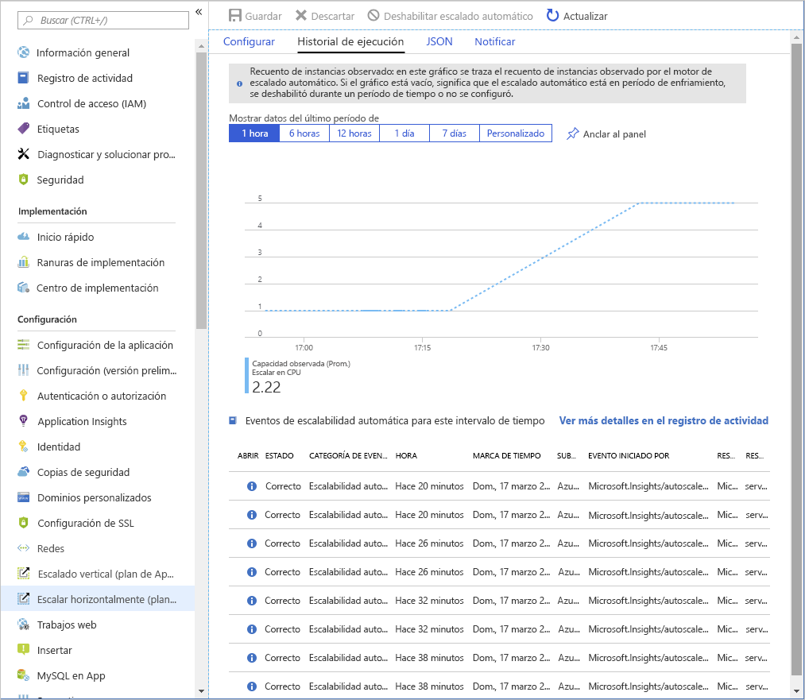
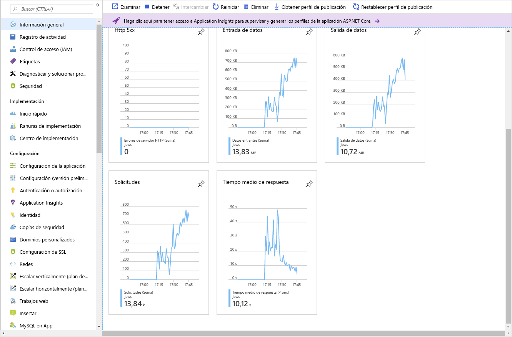

<h1 align="center"><ins>RUTA 1: IMPLEMENTACIÓN DE APLICACIONES WEB DE AZURE APP SERVICE</ins></h1>
<h2 align="center">MÓDULO 3 - ESCALADO DE APLICACIONES EN AZURE APP SERVICE</h2>

### Examen de los factores de escalado automático

El escalado automático se puede activar en función de una programación o evaluando si el sistema se ejecuta con recursos insuficientes. Por ejemplo, el escalado automático se podría activar si aumenta el uso de CPU o la ocupación de la memoria, si el número de solicitudes entrantes a un servicio parece incrementarse, o bien por otra combinación de factores.

#### ¿Qué es el escalado automático?

El escalado automático es un sistema o proceso en la nube que ajusta los recursos disponibles en función de la demanda actual. El escalado automático escala y reduce horizontalmente en lugar de escalar y reducir verticalmente.

#### Escalado automático de Azure App Service

En Azure App Service, el escalado automático supervisa las métricas de recursos de una aplicación web mientras se ejecuta. Detecta situaciones en las que se necesitan otros recursos para controlar un aumento de la carga de trabajo, y garantiza que esos recursos estén disponibles antes de que el sistema se sobrecargue.

El escalado automático responde a los cambios en el entorno mediante la adición o eliminación de servidores web, y el equilibrio de la carga entre ellos. El escalado automático no tiene ningún efecto en la potencia de la CPU, la memora ni la capacidad de almacenamiento de los servidores web que alimentan la aplicación; solo cambia el número de servidores web.

##### Reglas de escalado automático
El escalado automático toma sus decisiones en función de las reglas que se definan. Una regla especifica el umbral para una métrica y desencadena un evento de escalabilidad automática cuando se sobrepasa este umbral. El escalado automático también puede desasignar los recursos cuando la carga de trabajo disminuye.

Defina las reglas de escalado automático con precaución. Por ejemplo, un ataque por denegación de servicio probablemente tendrá como resultado una afluencia de tráfico entrante a gran escala. Intentar controlar un aumento repentino de las solicitudes provocado por un ataque por denegación de servicio sería costoso e infructuoso. Estas solicitudes no son auténticas, por lo que se deben descartar sin procesarlas. Una solución mejor consiste en implementar la detección y el filtrado de las solicitudes que se producen durante este tipo de ataque antes de que lleguen al servicio.

#### ¿Cuándo debería considerar el escalado automático?

El escalado automático proporciona elasticidad para los servicios. Por ejemplo, es posible que espere un aumento o una reducción de la actividad de una aplicación empresarial durante los días festivos.

El escalado automático mejora la disponibilidad y la tolerancia a errores. Puede ayudar a garantizar que las solicitudes cliente a un servicio no se denieguen porque una instancia no sea capaz de reconocer la solicitud de manera oportuna, o bien porque una instancia sobrecargada se haya bloqueado.

El escalado automático funciona mediante la adición o eliminación de servidores web. Si las aplicaciones web realizan procesamientos que consumen muchos recursos como parte de cada solicitud, es posible que el escalado automático no sea un procedimiento eficaz. En estas situaciones, puede ser necesario el escalado manual. Por ejemplo, si una solicitud enviada a una aplicación web implica realizar el procesamiento complejo de un conjunto de datos grande, en función del tamaño de la instancia, esta única solicitud podría agotar el procesamiento y la capacidad de memoria de la instancia.

El escalado automático no es el enfoque óptimo para controlar el crecimiento a largo plazo. Es posible que tenga una aplicación web que comience con unos pocos usuarios, pero cuya popularidad aumente con el tiempo. El escalado automático tiene una sobrecarga asociada a la supervisión de los recursos y a la determinación de si se debe desencadenar un evento de escalado. En este escenario, si puede anticipar la tasa de crecimiento, el escalado manual del sistema en el tiempo puede ser un enfoque más rentable.

El número de instancias de un servicio también es un factor que hay que tener en cuenta. Es posible que, la mayoría del tiempo, solo espere ejecutar algunas instancias de un servicio. Sin embargo, en esta situación, el servicio siempre será vulnerable a tiempo de inactividad o falta de disponibilidad, con independencia de que la escalabilidad automática esté o no habilitada. Cuanto menor sea el número de instancias inicial, menos capacidad tiene para controlar el aumento de la carga de trabajo mientras la escalabilidad automática pone en marcha instancias adicionales.

### Identificación de los factores de escalado automático

El escalado automático permite especificar las condiciones bajo las que se debe escalar horizontalmente una aplicación web y, luego, reducirla horizontalmente. El escalado automático eficaz garantiza que haya suficientes recursos disponibles para controlar grandes volúmenes de solicitudes en horas pico, al tiempo que se administran los costos cuando disminuye la demanda.

Puede configurar el escalado automático para detectar cuándo escalar y reducir horizontalmente según una combinación de factores, en función del uso de los recursos. También puede configurar el escalado automático para que se ejecute de acuerdo con una programación.

En esta unidad, aprenderá a especificar los factores que se pueden usar para la escalabilidad automática de un servicio.

#### Escalado automático y plan de App Service

El escalado automático es una característica del plan de App Service que usa la aplicación web. Cuando la aplicación web se escala horizontalmente, Azure inicia instancias nuevas del hardware definidas por el plan de App Service para la aplicación.

Para evitar el escalado automático descontrolado, el plan de App Service tiene un límite de instancias. Los planes de los planes de tarifa más caros tienen un límite mayor. El escalado automático no puede crear más instancias que las especificadas por este límite.

Nota: No todos los planes de tarifa de plan de App Service admiten el escalado automático.

#### Condiciones de la escalabilidad automática

Para indicar cómo realizar la escalabilidad automática, se crean condiciones de escalabilidad automática. Azure ofrece dos opciones para el escalado automático:

- Escalado basado en una métrica, como la longitud de cola de disco o el número de solicitudes HTTP en espera de procesamiento.
- Escalado a un número específico de instancias según una programación. Por ejemplo, puede organizar la operación de escalar horizontalmente a una hora concreta del día, una fecha específica o un día de la semana. También se especifica una fecha de finalización y el sistema se vuelve a escalar en ese momento.

El escalado a un número específico de instancias solo permite escalar horizontalmente a un número de instancias concreto. Si tiene que escalar horizontalmente de forma incremental, puede combinar el escalado automático basado en métricas y programación en la misma condición de escalabilidad automática. Por tanto, podría organizar el sistema para que se escale horizontalmente si el número de solicitudes HTTP supera un umbral específico, pero solo entre horas concretas del día.

Puede crear varias condiciones de escalabilidad automática para controlar métricas y programaciones diferentes. Azure realiza la escalabilidad automática del servicio cuando se aplica alguna de estas condiciones. Un plan de App Service también tiene una condición predeterminada que se usa si ninguna de las demás condiciones es aplicable. Esta condición siempre está activa y no tiene programación.

#### Métricas para las reglas de escalabilidad automática

El escalado automático por métrica requiere que se definan una o varias reglas de escalabilidad automática. Una regla de escalabilidad automática especifica una métrica para supervisar y cómo debe responder el escalado automático si esta métrica supera un umbral definido. Las métricas que puede supervisar para una aplicación web son las siguientes:

- **Porcentaje de CPU.** Esta métrica es una indicación del uso de la CPU en todas las instancias. Un valor alto muestra que las instancias están enlazadas a la CPU, lo que podría provocar retrasos en el procesamiento de las solicitudes cliente.
- **Porcentaje de memoria.** Esta métrica captura la ocupación de la memoria de la aplicación en todas las instancias. Un valor alto indica que la memoria libre se podría estar agotando, lo que provocaría que se produjera un error en una o varias instancias.
- **Longitud de cola de disco.** Esta métrica es una medida del número de solicitudes de E/S pendientes en todas las instancias. Un valor alto significa que se podría estar produciendo contención del disco.
- **Longitud de la cola HTTP.** Esta métrica muestra cuántas solicitudes cliente están a la espera de procesamiento por parte de la aplicación web. Si este número es alto, es posible que se produzcan errores HTTP 408 (tiempo de espera) en las solicitudes cliente.
- **Entrada de datos.** Esta métrica es el número de bytes recibidos en todas las instancias.
- **Salida de datos.** Esta métrica es el número de bytes enviados por todas las instancias.

También puede escalar en función de métricas para otros servicios de Azure. Por ejemplo, si la aplicación web procesa las solicitudes recibidas desde una cola de Service Bus, le podría interesar poner en marcha instancias adicionales de una aplicación web si el número de elementos contenidos en una cola de Azure Service Bus supera una longitud crítica.

#### Análisis de las métricas mediante una regla de escalabilidad automática

El escalado automático funciona mediante el análisis de tendencias en los valores de métrica en el tiempo entre todas las instancias. El análisis es un proceso de varios pasos.

En el primer paso, una regla de escalabilidad automática agrega los valores recuperados para una métrica para todas las instancias a lo largo de un período de tiempo que se conoce como intervalo de agregación. Cada métrica tiene su propio intervalo de agregación intrínseco, pero en la mayoría de los casos este período es de 1 minuto. El valor agregado se conoce como agregación de tiempo. Las opciones disponibles son Media, Mínimo, Máximo, Suma, Último y Recuento.

Un minuto es un intervalo corto para determinar si algún cambio en la métrica tiene la duración suficiente para que la escalabilidad automática valga la pena. Por tanto, una regla de escalabilidad automática ejecuta un segundo paso que realiza una agregación adicional del valor calculado por la agregación de tiempo durante un período más largo especificado por el usuario, conocido como duración. La duración mínima es de 5 minutos. Si la duración se establece en 10 minutos, por ejemplo, la regla de escalabilidad automática agrega los 10 valores calculados para el intervalo de agregación.

El cálculo de agregación para la duración puede ser diferente al del intervalo de agregación. Por ejemplo, si la agregación de tiempo es Promedio y la estadística que se obtiene es Porcentaje de CPU durante un intervalo de agregación de 1 minuto, se calcula cada minuto del porcentaje de uso de la CPU promedio entre todas las instancias durante ese minuto. Si la estadística de intervalo de agregación se establece en Máximo y la duración de la regla se establece en 10 minutos, el valor máximo de los 10 valores promedio del porcentaje de utilización de la CPU es para determinar si se ha superado el umbral de la regla.

#### Acciones de escalabilidad automática

Cuando una regla de escalabilidad automática detecta que una métrica ha superado un umbral, puede realizar una acción de escalabilidad automática. Una acción de escalabilidad automática puede ser de escalabilidad horizontal o reducción horizontal. Una acción de escalabilidad horizontal aumenta el número de instancias, mientras que una de reducción horizontal lo reduce. Una acción de escalabilidad automática usa un operador (como menor que, mayor que, igual a y así sucesivamente) para determinar cómo reaccionar ante el umbral. Las acciones de escalabilidad horizontal normalmente usan el operador mayor que para comparar el valor de la métrica con el umbral. Las acciones de reducción horizontal tienden a comparar el valor de la métrica con el umbral mediante el operador menor que. Una acción de escalabilidad automática también puede establecer el recuento de instancias en un nivel específico, en lugar de aumentar o reducir el número disponible.

Una acción de escalabilidad automática tiene un período de tiempo de finalización, que se especifica en minutos. Durante este intervalo, la regla de escalado no se vuelve a desencadenar. Esto permite que el sistema se estabilice entre los eventos de escalabilidad automática. Recuerde que se tarda tiempo en iniciar o apagar las instancias, por lo que es posible que las métricas recopiladas no muestren cambios significativos durante varios minutos. El período de tiempo de finalización mínimo es de cinco minutos.

### Emparejamiento de reglas de escalabilidad automática

Debe planear la reducción horizontal al disminuir una carga de trabajo. Considere la posibilidad de definir reglas de escalabilidad automática en pares en la misma condición de escalabilidad automática. Una regla de escalabilidad automática debe indicar cómo escalar horizontalmente el sistema si una métrica supera un umbral superior. Posteriormente, otra regla debe definir cómo volver a escalar el sistema si la misma métrica se sitúa por debajo de un umbral inferior.

#### Combinación de reglas de escalabilidad automática

Una misma condición de escalabilidad automática puede contener varias reglas de escalabilidad automática (por ejemplo, una de escalabilidad horizontal y la correspondiente de reducción horizontal). Pero no es necesario que las reglas de escalabilidad automática de una condición de escalabilidad automática estén directamente relacionadas. Podría definir las cuatro reglas siguientes en la misma condición de escalabilidad automática:

- Si la longitud de la cola HTTP es superior a 10, escalar horizontalmente en 1.
- Si el uso de la CPU supera el 70 %, escalar horizontalmente en 1.
- Si la longitud de la cola HTTP es cero, reducir horizontalmente en 1.
- Si el uso de la CPU es inferior al 50 %, reducir horizontalmente en 1.

Al determinar si se debe escalar horizontalmente, la acción de escalabilidad automática se realiza si se cumple cualquiera de las reglas de escalabilidad horizontal (la longitud de la cola HTTP es superior a 10, o bien el uso de la CPU supera el 70 %). Al reducir horizontalmente, la acción de escalabilidad automática se realiza solo si se cumplen todas las reglas de reducción horizontal (la longitud de la cola HTTP se reduce a cero y el uso de la CPU es inferior al 50 %). En el caso de que tenga que reducir horizontalmente si solo se cumple una de las reglas de reducción horizontal, tendrá que definir las reglas en condiciones independientes de escalabilidad automática.

### Habilitación del escalado automático en App Service

En esta unidad, aprenderá a habilitar la escalabilidad automática, crear reglas de escalabilidad automática y supervisar la actividad de escalabilidad automática.

#### Habilitación del escalado automático

Para empezar a trabajar con el escalado automático, vaya a su plan de App Service en Azure Portal y seleccione Escalar horizontalmente (plan de App Service) en el grupo Configuración del panel de navegación izquierdo.

Nota: No todos los planes de tarifa admiten el escalado automático. Los planes de tarifa de desarrollo se limitan a una única instancia (los planes F1 y D1), o bien solo proporcionan escalado manual (el plan B1). Si ha seleccionado uno de estos planes, primero debe escalar verticalmente hasta S1 o cualquiera de los planes de producción del nivel P.

De forma predeterminada, un plan de App Service solo implementa el escalado manual. Al seleccionar Escalabilidad automática personalizada se revelan los grupos de condiciones que puede usar para administrar la configuración de escalado.

#### Incorporación de condiciones de escalado

Una vez habilitado el escalado automático, puede editar la condición de escalado predeterminada y agregar condiciones personalizadas propias. Recuerde que cada condición de escalado puede escalar según una métrica o un número específico de instancias.

Esta condición de escalado predeterminada se ejecuta cuando ninguna de las otras condiciones de escalado está activa.

Una condición de escalado basada en métricas también puede especificar el número mínimo y máximo de instancias que se van a crear. El número máximo no puede superar los límites definidos por el plan de tarifa. Además, todas las condiciones de escalado que no sean la predeterminada pueden incluir una programación que indique cuándo aplicar la condición.

#### Creación de reglas de escalado

Una condición de escalado basada en métricas contiene una o más reglas de escalado. Puede usar el vínculo Agregar una regla para agregar reglas personalizadas propias. Los criterios que indican cuándo una regla debe desencadenar una acción de escalabilidad automática y qué acción se va a ejecutar (escalar o reducir horizontalmente) se definen mediante las métricas, las agregaciones, los operadores y los umbrales que se han descrito anteriormente.

#### Supervisión de la actividad de escalado automático

Azure Portal permite realizar el seguimiento de cuándo se ha producido el escalado automático a través del gráfico Historial de ejecución. En este gráfico se muestra cómo varía el número de instancias con el tiempo y qué condiciones de escalabilidad automática han producido cada cambio.

Puede usar el gráfico Historial de ejecución con las métricas que se muestran en la página Información general para correlacionar los eventos de escalado automático con la utilización de recursos.

### Exploración de los procedimientos recomendados de escalado automático

Si no sigue los procedimientos recomendados al crear la configuración de escalado automático, puede crear condiciones que produzcan resultados no deseados. En esta unidad aprenderá a evitar la creación de reglas que entren en conflicto entre sí.

#### Conceptos de escalado automático

- Una configuración de escalado automático escala instancias horizontalmente aumentando las instancias y las reduce horizontalmente disminuyendo el número de instancias. Una configuración de escalado automático presenta unos valores máximo, mínimo y predeterminado de instancias.

- Un trabajo de escalado automático siempre lee la métrica asociada por la que realizar la escala y comprueba si se rebasó el umbral establecido para el escalado horizontal o la reducción horizontal.

- Todos los umbrales se calculan en el nivel de instancia. Por ejemplo, "escalar horizontalmente en una instancia cuando el uso medio de la CPU sea superior al 80% cuando el número de instancias sea 2" significa escalar horizontalmente cuando el uso medio de la CPU en todas las instancias sea superior al 80%.

- Todos los errores y éxitos de escalado automático se registran en el registro de actividad. Después puede configurar una alerta de registro de actividad de forma que pueda recibir una notificación por correo electrónico, SMS o webhook siempre que haya actividad.

#### Procedimientos recomendados de escalado automático

##### Asegúrese de que los valores máximo y mínimo son diferentes y de que hay margen suficiente entre ellos
Si tiene una configuración en la que el valor mínimo es dos, el valor máximo es dos y el recuento de instancias es dos, no se puede ejecutar ninguna acción de escalado. Mantenga un margen suficiente entre los números de instancias máximo y mínimo, que son inclusivos. El escalado automático siempre escala entre estos límites.

##### Elija la estadística adecuada para la métrica de diagnósticos
Para las métricas de diagnóstico, puede elegir entre Promedio, Mínimo, Máximo y Total como métrica a partir de la que escalar. La estadística más común es Promedio.

##### Elija los umbrales cuidadosamente para todos los tipos de métrica
Es recomendable tener cuidado a la hora de elegir los diferentes umbrales de escalado y reducción horizontal en función de las situaciones prácticas.

No se recomienda una configuración de escalabilidad automática como las de los siguientes ejemplos con los mismos valores de umbral, o similares, en condiciones de escalado o reducción horizontal:

- Aumentar las instancias en uno cuando el número de subprocesos >= 600
- Disminuir las instancias en uno cuando el número de subprocesos <= 600

Veamos un ejemplo de lo que puede llevar a producir un comportamiento confuso. Considere la siguiente secuencia.

1. Imaginemos que hay dos instancias inicialmente y después aumenta el número promedio de subprocesos por instancia a 625.
2. La escalabilidad automática escala horizontalmente para agregar una tercera instancia.
3. Imaginemos ahora que el número promedio de subprocesos en la instancia se reduce a 575.
4. Antes de reducir horizontalmente, el escalado automático intenta calcular cuál será el estado final si se escala horizontalmente. Por ejemplo, 575 x 3 (recuento de instancias actual) = 1725/2 (número final de instancias cuando se reducen horizontalmente) = 862,5 subprocesos. Esto significa que el escalado automático tiene que volver a escalar horizontalmente de inmediato (incluso después de haber reducido horizontalmente) si el número promedio de subprocesos sigue siendo el mismo o incluso si se reduce solo una pequeña cantidad. Sin embargo, si se escalaba horizontalmente de nuevo, todo el proceso se repetiría, lo que daría lugar a un bucle infinito.
5. Para evitar esta situación (lo que se denomina "oscilación"), el escalado automático no se reduce horizontalmente en absoluto. En su lugar, pasa esto por alto y vuelve a evaluar la situación la siguiente vez que el trabajo del servicio se ejecuta. Esto puede ser confuso para muchos usuarios, ya que puede dar la impresión de que la escalabilidad automática no funciona cuando el número promedio de subprocesos es 575.

La estimación durante una reducción horizontal está diseñada para evitar situaciones "oscilantes", donde las acciones de reducción y escalabilidad horizontales avanzan y retroceden continuamente. Recuerde este comportamiento cuando elija los mismos umbrales de escalado horizontal y reducción horizontal.

Nuestra recomendación es establecer un margen suficiente entre el escalado horizontal y en los umbrales. Por ejemplo, echemos un vistazo a esta siguiente combinación de reglas, que es mejor.

- Aumentar las instancias en 1 cuando el porcentaje de CPU >= 80
- Disminuir las instancias en 1 cuando el porcentaje de CPU <= 60
En este caso

1.Imaginemos que hay 2 instancias para empezar.
2. Si el promedio de porcentaje de CPU entre instancias llega a 80, el escalado automático escala horizontalmente agregando una tercera instancia.
3. Imaginemos ahora que, con el tiempo, el porcentaje de CPU cae a 60.
4. La regla de reducción horizontal del escalado automático calcula el estado final como si fuese a reducirse horizontalmente. Por ejemplo, 60 x 3 (recuento de instancias actual) = 180/2 (número final de instancias cuando se reducen horizontalmente) = 90. Por tanto, el escalado automático no reduce horizontalmente porque tendría que volver a escalar horizontalmente de inmediato. En su lugar, omite la reducción horizontal.
5. La próxima vez que comprueba el escalado automático, la CPU ha seguido cayendo a 50. Vuelve a calcular: 50 x 3 instancias = 150/2 instancias = 75, lo que está por debajo del umbral de escalado horizontal de 80. Por tanto, reduce horizontalmente a 2 instancias.

##### Consideraciones de escalado cuando hay varias reglas configuradas en un perfil
Hay casos en los que puede que sea necesario establecer varias reglas en un perfil. Cuando se establecen varias reglas, los servicios usan el siguiente conjunto de reglas de escalado automático.

Al escalar horizontalmente, el escalado automático se ejecuta si se cumple cualquier regla. Al reducir horizontalmente, el escalado automático necesita que todas las reglas se cumplan.

Para ilustrar esto, imaginemos que tiene las siguientes cuatro reglas de escalabilidad automática:

- Con una CPU < 30 %, se reduce horizontalmente en 1
- Con una memoria < 50 %, se reduce horizontalmente en 1
- Si CPU > 75 %, escalar horizontalmente en 1
- Si memoria > 75 %, escalar horizontalmente en 1

Después, ocurrirá lo siguiente:

Con una CPU del 76 % y una memoria del 50 %, se escala horizontalmente.
Con una CPU del 50 % y una memoria del 76 %, se escala horizontalmente.
Por otro lado, con una CPU del 25 % y una memoria del 51 %, el escalado automático no reduce horizontalmente. Se produciría una reducción horizontal automática con una CPU del 29 % y una memoria del 49 %, ya que ambas reglas de reducción horizontal serían verdaderas.

##### Seleccione siempre un número predeterminado de instancias seguro
El número predeterminado de instancias es importante, porque el escalado automático escala el servicio a dicho número cuando no hay métricas disponibles. Por tanto, seleccione un número predeterminado de instancias que sea seguro para sus cargas de trabajo.

##### Configure notificaciones de escalado automático
La escalabilidad automática se publica en el registro de actividad si se cumple alguna de las condiciones siguientes:

- Problemas de escalado automático en una operación de escala.
- El servicio de escalado automático completa correctamente una acción de escalado.
- El servicio de escalado automático no puede realizar una acción de escalado.
- No hay métricas disponibles para que el servicio de escalado automático tome una decisión de escalado.
- Vuelve a haber métricas disponibles (recuperación) para poder tomar una decisión de escalado.
  
También puede usar una alerta de registro de actividades para supervisar el mantenimiento del motor de escalado automático. Además de utilizar alertas de registro de actividad, puede configurar notificaciones de correo electrónico o webhook para recibir una notificación cada vez que se lleve a cabo una acción de escalado correcta a través de la pestaña de notificaciones de la configuración de escalado automático.