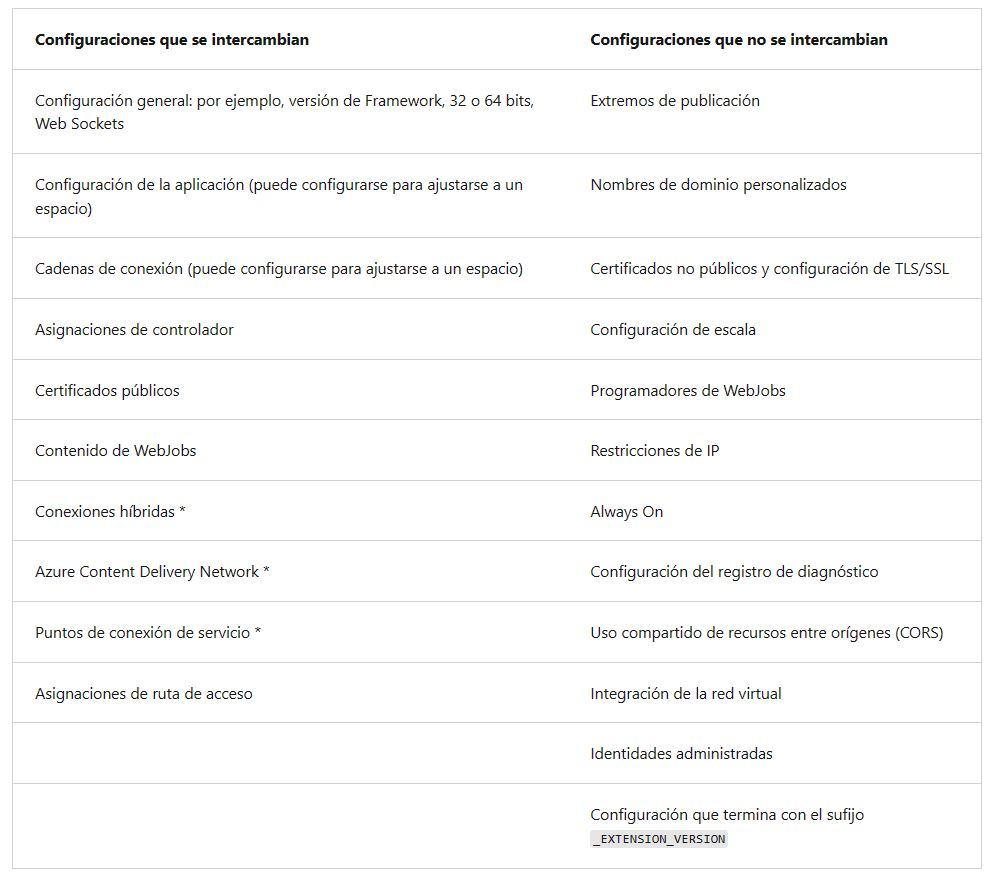

<h1 align="center"><ins>RUTA 1: IMPLEMENTACIÓN DE APLICACIONES WEB DE AZURE APP SERVICE</ins></h1>
<h2 align="center">MÓDULO 4 - EXPLORACIÓN DE RANURAS DE IMPLEMENTACIÓN DE AZURE APP SERVICE</h2>

### Exploración de entornos de ensayo

Al implementar la aplicación web, la aplicación web en Linux, el back-end móvil o la aplicación API en Azure App Service, puede usar una ranura de implementación independiente en lugar del espacio de producción predeterminado si realiza la ejecución en el nivel de plan Estándar, Premium o Aislado de App Service. Las ranuras de implementación son aplicaciones activas con sus propios nombres de host. Los elementos de contenido y configuraciones de aplicaciones se pueden intercambiar entre dos ranuras de implementación, incluida la ranura de producción.

La implementación de la aplicación en un espacio que no sea de producción ofrece las siguientes ventajas:

- Puede validar los cambios en la aplicación en una ranura de implementación de ensayo antes de intercambiarla con la ranura de producción.
- La implementación de una aplicación en un espacio y su posterior paso a producción garantiza que todas las instancias del espacio están preparadas antes de dicho paso a producción. Esto elimina tiempos de inactividad a la hora de implementar la aplicación. El redireccionamiento del tráfico es perfecta y no se pierde ninguna solicitud en las operaciones de intercambio. Todo este flujo de trabajo se puede automatizar mediante la configuración del intercambio automático cuando no sea necesario realizar ninguna validación antes del intercambio.
- Después del intercambio, la ranura con la aplicación de ensayo anterior ahora ocupa la aplicación de producción anterior. Si las modificaciones que se han intercambiado en el espacio de producción no son los que esperaba, puede volver a realizar un intercambio inmediatamente para tener el "último sitio que sabe que funciona correctamente".
  
Cada nivel del plan de App Service admite un número distinto de ranuras de implementación. El uso de las ranuras de implementación no tiene costo adicional. Para averiguar el número de ranuras que admite el nivel de la aplicación, consulte Límites de App Service.

Para escalar la aplicación a un nivel diferente, asegúrese de que el nivel de destino admite el número de ranuras que la aplicación ya usa. Por ejemplo, si la aplicación tiene más de cinco, no se puede reducir verticalmente al nivel Estándar, ya que este nivel solo admite cinco ranuras de implementación.

Al crear una nueva ranura, la nueva ranura de implementación no tiene contenido, incluso si clona la configuración de otra ranura. La implementación en el espacio se puede realizar desde otra rama del repositorio o desde otro repositorio.

### Examen del intercambio de ranuras

Al cambiar entre dos ranuras (por ejemplo, de un espacio de ensayo al espacio de producción), App Service hace lo siguiente para garantizar que la ranura de destino no experimente tiempo de inactividad:

1. Aplique las siguientes opciones de configuración de la ranura de destino (por ejemplo, la de producción) a todas las instancias de la ranura de origen:

   - Configuración de aplicación y cadenas de conexión específicas de la ranura, si procede.
   - Configuración de implementación continua, si está habilitada.
   - Configuración de autenticación de App Service, si está habilitada.

Cualquiera de estos casos desencadena el reinicio de todas las instancias de la ranura de origen. Durante el intercambio con vista previa, esta marca el final de la primera fase. La operación de intercambio se pausará y podrá validar que la ranura de origen funciona correctamente con la configuración de la ranura de destino.

2. Espere a que todas las instancias de la ranura de origen se hayan reiniciado. Si el reinicio no se puede realizar en alguna instancia, el intercambio revierte todos los cambios en la ranura de origen y detiene la operación.

3. Si la caché local está habilitada, desencadene la inicialización de la caché local mediante una solicitud HTTP a la raíz de la aplicación ("/") en cada instancia de la ranura de origen. Espere a que todas las instancias devuelvan cualquier respuesta HTTP. La inicialización de la caché local produce otro reinicio en cada instancia.

4. Si el intercambio automático está habilitado con preparación personalizada, desencadene la inicialización de la aplicación mediante una solicitud HTTP a la raíz de la aplicación ("/") en cada instancia de la ranura de origen.

    - Si applicationInitialization no se especifica, desencadene una solicitud HTTP a la raíz de la aplicación de la ranura de origen en cada instancia.
    - Si una instancia devuelve cualquier respuesta HTTP, se considera que se ha preparado.

5. Si todas las instancias de la ranura de origen se han preparado correctamente, intercambie las dos ranuras; para ello, cambie las reglas de enrutamiento de las dos ranuras. Después de este paso, la ranura de destino (por ejemplo, la de producción) tendrá la aplicación que se preparó previamente en la ranura de origen.

6. Ahora que la ranura de origen tiene la aplicación que se preparó previamente antes del intercambio, realice la misma operación; aplique la configuración y reinicie las instancias.

Durante el intercambio, todo el trabajo de inicialización de las aplicaciones intercambiadas se realiza en la ranura de origen. La ranura de destino permanece en línea mientras la de origen se está preparando, independientemente de en qué punto el intercambio se realice o no correctamente. Para intercambiar una ranura de ensayo con la de producción, asegúrese de que esta última es siempre la de destino. De este modo, el intercambio no afecta a la aplicación de producción.

Cuando crea un clon de la configuración de otro espacio de implementación, la configuración clonada se puede editar. Algunos elementos de configuración siguen al contenido en los intercambios (no son específicos de la ranura), mientras que otros permanecen en la misma ranura después de este (específicos). En la tabla siguiente se muestra la configuración que cambia al intercambiar ranuras.

Nota: Para que la configuración se pueda intercambiar, agregue la configuración WEBSITE_OVERRIDE_PRESERVE_DEFAULT_STICKY_SLOT_SETTINGS de la aplicación de cada ranura de la misma y establezca su valor en 0 o false. Esta configuración se puede intercambiar o no. Recuerde que no puede hacer que solo algunos valores de configuración sean intercambiables y que los demás no lo sean. Las identidades administradas nunca se intercambian y no se ven afectadas por esta invalidación de la configuración de la aplicación.

Para configurar la aplicación o una cadena de conexión de esta para que se ajuste a una ranura específica (sin intercambio), vaya a la página Configuración de esa ranura. Agregue configuración o modifíquela y seleccione Configuración de ranura de implementación. Al seleccionar esta casilla se indica a App Service que la configuración no se puede intercambiar.

### Intercambio de ranuras de implementación

Las ranuras de implementación se pueden intercambiar en las páginas Ranuras de implementación e Información general de la aplicación. Antes de intercambiar una aplicación de una ranura de implementación a producción, asegúrese de la de producción es la ranura de destino y de que todas las configuraciones de la ranura de origen son exactamente como las quiere en producción.

#### Intercambio manual de ranuras de implementación

Para intercambiar ranuras de implementación:

1. Vaya a la página Ranuras de implementación y seleccione Intercambiar. El cuadro de diálogo Intercambiar muestra la configuración de la ranura de origen y de destino seleccionadas que se van a cambiar.

2. Seleccione los espacios Origen y Destino. Por lo general, el destino suele ser el espacio de producción. Además, seleccione las pestañas Cambios de origen y Cambios de destino, y compruebe que los cambios en la configuración son los esperados. En cuanto termine, puede intercambiar los espacios. Para ello solo debe seleccionar Intercambiar. Para ver cómo se ejecutaría la ranura de destino con la nueva configuración antes de que el intercambio se produzca de verdad, no seleccione Intercambiar, pero siga las instrucciones en Intercambio con vista previa a continuación.

3. Cuando haya terminado, seleccione Cerrar para cerrar el cuadro de diálogo.

##### Intercambio con vista previa (intercambio en varias fases)
Antes de cambiar a producción como ranura de destino, valide que la aplicación se ejecute con la configuración intercambiada. La ranura de origen también se ha preparado antes de que finalice el intercambio, algo que es conveniente para las aplicaciones críticas.

Al realizarse un intercambio con vista previa, App Service realiza el mismo intercambio, pero se detiene tras el primer paso. En ese momento puede comprobar el resultado en la ranura de ensayo antes de completar el intercambio.

Si cancela el intercambio, App Service vuelve a aplicar los elementos de configuración en la ranura de origen.

Para realizar el intercambio con vista previa:

1. Siga los pasos anteriores en Intercambiar ranuras de implementación, pero seleccione Realizar intercambio con versión preliminar. El cuadro de diálogo muestra cómo cambia la configuración de la ranura de origen en la fase 1 y cómo cambian tanto la ranura de origen como la de destino en la fase 2.

2. Cuando esté listo para iniciar el intercambio, seleccione Iniciar intercambio. Cuando se complete la fase 1, se le notificará en el cuadro de diálogo. Vaya a https://<app_name>-<source-slot-name>.azurewebsites.net para obtener una vista previa del intercambio en la ranura de origen.

3. Cuando esté listo para completar el intercambio pendiente, seleccione Completar intercambio en Acción de intercambio y seleccione Completar intercambio. Para cancelar un intercambio pendiente, seleccione Cancelar intercambio en su lugar.

4. Cuando haya terminado, seleccione Cerrar para cerrar el cuadro de diálogo.

#### Configuración del intercambio automático

El intercambio automático optimiza los escenarios de Azure DevOps Services en los que se quiera implementar una aplicación continuamente sin arranques en frío ni tiempos de inactividad para los clientes de la aplicación. Cuando se habilita el intercambio automático para una ranura a producción, cada vez que se insertan los cambios de código en esa ranura, App Service cambia automáticamente la aplicación a producción después de que se haya preparado en la de origen.

Nota: El intercambio automático no se admite en aplicaciones web en Linux y Web App for Containers.

Para configurar el intercambio automático:

1. Vaya a la página de recursos de la aplicación y seleccione la ranura de implementación que desea configurar para realizar el intercambio automático. El valor está en la página Configuración > Configuración general.

2. Establezca Intercambio automático habilitado en Activado. A continuación, seleccione la ranura de destino deseada como Ranura de implementación de intercambio automático y seleccione Guardar en la barra de comandos.

3. Ejecute una inserción de código en el espacio de origen. El intercambio automático se realiza al poco tiempo y la actualización se refleja en la dirección URL de la ranura de destino.

#### Especificación de Preparación personalizada

Algunas aplicaciones pueden requerir acciones de preparación personalizadas para el intercambio. El elemento de configuración applicationInitialization de web.config permite especificar acciones de inicialización personalizadas. El intercambio espera hasta que se completa esta preparación personalizada para realizar el intercambio con la ranura de destino. He aquí un fragmento de ejemplo del archivo web.config.

<system.webServer>
    <applicationInitialization>
        <add initializationPage="/" hostName="[app hostname]" />
        <add initializationPage="/Home/About" hostName="[app hostname]" />
    </applicationInitialization>
</system.webServer>

Para más información sobre la personalización del elemento applicationInitialization, consulte Most common deployment slot swap failures and how to fix them (Errores de intercambio de ranuras de implementación más comunes y soluciones).

También puede personalizar el comportamiento de la preparación con una o ambas de las siguientes opciones de configuración de la aplicación:

- WEBSITE_SWAP_WARMUP_PING_PATH: ruta de acceso para hacer ping y así preparar el sitio. Agregue esta configuración de aplicación especificando una ruta de acceso personalizada que comience con una barra diagonal como valor. Un ejemplo es /statuscheck. El valor predeterminado es /.
- WEBSITE_SWAP_WARMUP_PING_STATUSES: códigos de respuesta HTTP válidos para la operación de preparación. Agregue esta configuración de aplicación con una lista de códigos HTTP separados por comas. Un ejemplo sería 200,202. Si el código de estado devuelto no está en la lista, las operaciones de preparación e intercambio se detienen. Por defecto, todos los códigos de respuesta son válidos.
- WEBSITE_WARMUP_PATH: una ruta de acceso relativa en el sitio al que se debe hacer ping cada vez que se reinicie (no solo durante los intercambios de ranura). Los valores del ejemplo incluyen /statuscheck o la ruta de acceso raíz, /.

#### Reversión y supervisión de un intercambio

Si aparecen errores en el espacio de destino (por ejemplo, el espacio de producción) después de un intercambio de espacios, restaure los espacios al estado que tenían antes del intercambio. Para ello, vuelva a intercambiarlos de inmediato.

Si el intercambio tarda mucho tiempo en completarse, puede obtener información sobre su estado en el registro de actividad.

En la página de recursos de la aplicación del portal, en el panel izquierdo, seleccione Registro de actividad.

Una operación de intercambio aparece en la consulta de registro como Swap Web App Slots. Puede expandirla y seleccionar una de los suboperaciones o errores para ver los detalles.

### Enrutamiento del tráfico en App Service

De forma predeterminada, todas las solicitudes que realiza el cliente a la dirección URL de producción de la aplicación (http://<app_name>.azurewebsites.net) se enrutan al espacio de producción. Una parte del tráfico se puede enrutar a otro espacio. Esta característica es útil si se necesitan los comentarios de los usuarios al respecto de una nueva actualización, pero dicha actualización aún no está lista para enviarla a producción.

#### Enrutamiento automático del tráfico de producción

Para enrutar automáticamente el tráfico de producción:

1. Vaya a la página de recursos de la aplicación y seleccione Ranuras de implementación.

2. En la columna Tráfico % del espacio que se desea enrutar, especifique un porcentaje (entre 0 y 100) que represente la cantidad del tráfico total que desea enrutar. Seleccione Guardar.

Una vez guardado el valor, el porcentaje especificado de clientes se enruta aleatoriamente a la ranura que no es de producción.

Una vez enrutado un cliente automáticamente a una ranura concreta, permanece "anclado" en esa ranura todo el tiempo que dure su sesión. En el explorador del cliente, para ver a qué espacio está anclada la sesión debe examinar la cookie x-ms-routing-name en los encabezados HTTP. Las solicitudes que se enrutan a al espacio "de ensayo" tienen la cookie x-ms-routing-name=staging. Las solicitudes que se enrutan al espacio de producción tienen la cookie x-ms-routing-name=self.

#### Enrutamiento manual del tráfico de producción

Además del enrutamiento automático del tráfico, App Service puede enrutar solicitudes a un espacio concreto. Esto es útil cuando desee que los usuarios puedan escoger el enrutamiento a la aplicación beta, o la exclusión voluntaria de esta. Para enrutar el tráfico de producción de manera manual se usa el parámetro de consulta x-ms-routing-name.

Para permitir que los usuarios opten por la exclusión del enrutamiento a la aplicación beta, por ejemplo, puede poner este vínculo en la página web:

<a href="<webappname>.azurewebsites.net/?x-ms-routing-name=self">Go back to production app</a>

La cadena x-ms-routing-name=self especifica la ranura de producción. Cuando el explorador del cliente accede al vínculo, se le redirige a la ranura de producción. Cada solicitud posterior tiene la cookie x-ms-routing-name=self que ancla la sesión a la ranura de producción.

Para permitir a los usuarios participar en la aplicación de la versión beta, establezca el mismo parámetro de consulta con el nombre de la ranura que no es de producción. Este es un ejemplo:

<webappname>.azurewebsites.net/?x-ms-routing-name=staging

De forma predeterminada, a las ranuras nuevas se les da una regla de enrutamiento de 0%, un valor predeterminado se muestra en gris. Al establecer explícitamente el valor de la regla de enrutamiento en 0%, se muestra en negro y sus usuarios pueden acceder al espacio de ensayo manualmente mediante el parámetro de consulta x-ms-routing-name. Pero no se les enrutará automáticamente a la ranura, ya que el porcentaje se ha establecido en 0. Se trata de un escenario avanzado donde puede "ocultar" su ranura de ensayo del público y permitir que los equipos internos prueben los cambios en la ranura al mismo tiempo.