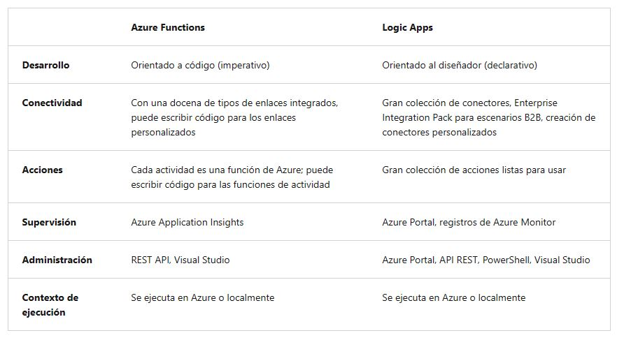
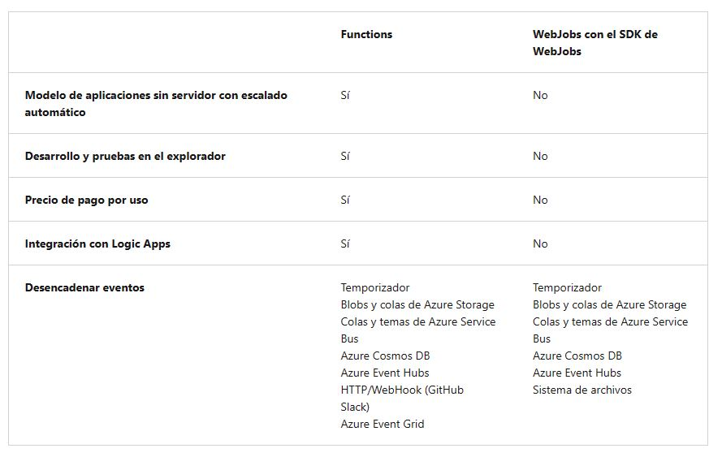
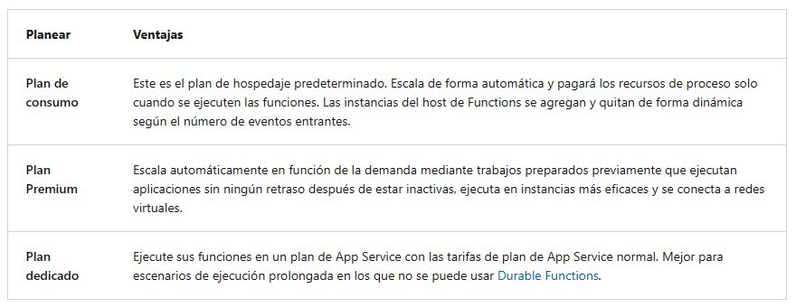
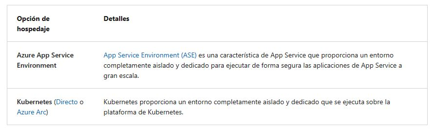
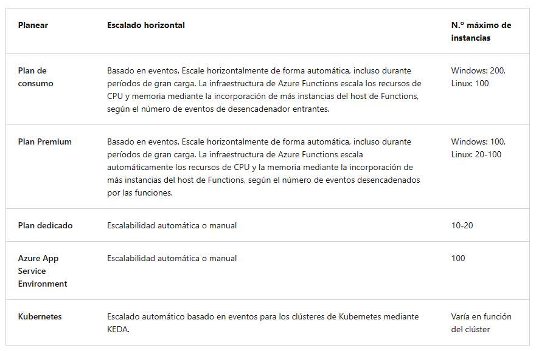
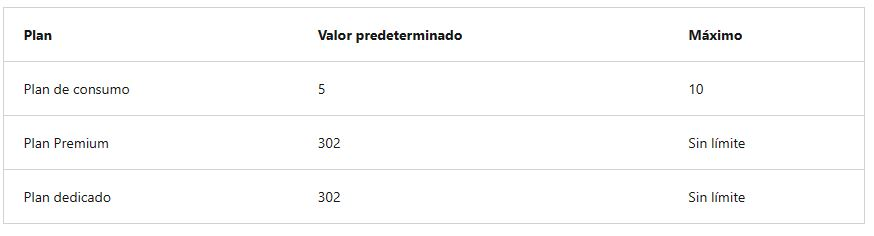

<h1 align="center"><ins>RUTA 2: IMPLEMENTACIÓN DE AZURE FUNCTIONS</ins></h1>
<h2 align="center">MÓDULO 1 - EXPLORACIÓN DE AZURE FUNCTIONS</h2>

### Descubrir Azure Functions

Azure Functions es una solución sin servidor que le permite escribir menos código, mantener menos infraestructura y ahorrar costos. En lugar de preocuparse por implementar y mantener servidores, la infraestructura en la nube proporciona todos los recursos actualizados necesarios para mantener las aplicaciones en ejecución.

A menudo, se crean sistemas para que reaccionen a una serie de eventos críticos. Independientemente de si compila una API web, responde a cambios en una base de datos, procesa flujos de datos de IoT o incluso si administra colas de mensajes, cada aplicación necesita una forma de ejecutar código a medida que se producen estos eventos.

Azure Functions admite desencadenadores que son formas de iniciar la ejecución del código, y enlaces que son formas de simplificar la codificación para los datos de entrada y salida. Hay otros servicios de integración y automatización en Azure y todos ellos pueden resolver problemas de integración y automatizar procesos empresariales. Todos pueden definir entradas, acciones, condiciones y salidas.

#### Comparativa entre Azure Functions y Azure Logic Apps

Tanto Functions como Logic Apps son servicios de Azure que posibilitan las cargas de trabajo sin servidor. Azure Functions es un servicio de proceso sin servidor, mientras que Azure Logic Apps es una plataforma de integración de flujos de trabajo sin servidor. Ambos pueden crear orquestaciones complejas. Una orquestación es una colección de funciones o pasos, llamados acciones en Logic Apps, que se ejecutan para realizar una tarea compleja.

En Azure Functions, las orquestaciones se desarrollan mediante la escritura de código y el uso de la extensión Durable Functions. En Logic Apps, las orquestaciones se crean mediante una GUI o editando archivos de configuración.

En la tabla siguiente se enumeran algunas de las principales diferencias entre Functions y Logic Apps:

#### Comparativa entre Functions y WebJobs

Al igual que Azure Functions, Azure App Service WebJobs con el SDK de WebJobs es un servicio de integración de tipo código primero que está diseñado para desarrolladores. Ambos se basan en Azure App Service y admiten características como la integración del control de código fuente, la autenticación y la supervisión con integración de Application Insights.

Azure Functions se basa en el SDK de WebJobs, por lo que comparte muchos desencadenadores de eventos y conexiones con otros servicios de Azure. Estos son algunos de los factores que se deben tener en cuenta al elegir entre Azure Functions y WebJobs con el SDK de WebJobs:

Azure Functions ofrece más productividad de desarrollo que WebJobs de Azure App Service. También ofrece más opciones de lenguajes de programación, entornos de desarrollo, integración del servicio Azure y precios. En la mayoría de los casos, es la mejor opción.

### Comparación de las opciones de hospedaje de Azure Functions

Cuando crea una aplicación de funciones en Azure, debe elegir un plan de hospedaje para su aplicación. Hay tres planes de hospedaje básico disponibles para Azure Functions: Plan de consumo, Plan Prémium y Plan Dedicado (App Service). Todos los planes de hospedaje tienen disponibilidad general (GA) en máquinas virtuales Linux y Windows.

El plan de hospedaje que elija determina los comportamientos siguientes:

- Cómo se escala la aplicación de funciones.
- Los recursos disponibles para cada instancia de aplicación de funciones.
- Compatibilidad con funcionalidad avanzada, como la conectividad con Azure Virtual Network.

A continuación se muestra un resumen de las ventajas de los tres planes de hospedaje principales de Functions:

Hay otras dos opciones de hospedaje que proporcionan el mayor control y aislamiento posibles con los que ejecutar las aplicaciones de funciones.

#### Planes de hospedaje y escalado

En la siguiente tabla se comparan los comportamientos de escalado de los distintos planes de hospedaje. El número máximo de instancias se da en función de una aplicación por función (consumo) o por plan (Premium/Dedicado), a menos que se indique lo contrario.

Nota: El escalado horizontal máximo puede variar por región y el plan de hospedaje. Para más información, visite el artículo sobre el plan Prémium y los límites del plan de App Service.

#### Duración del tiempo de espera de una aplicación de función

La propiedad functionTimeout del archivo del proyecto host.json especifica la duración del tiempo de espera de las funciones de una aplicación de funciones. Esta propiedad se aplica específicamente a las ejecuciones de funciones. Una vez que el desencadenador inicia la ejecución de la función, la función debe devolver o responder dentro de la duración del tiempo de espera.

En la tabla siguiente se muestran los valores predeterminados y máximos (en minutos) para planes específicos:

#### Requisitos de la cuenta de almacenamiento

En cualquier plan, una aplicación de funciones requiere una cuenta de Azure Storage general que admita almacenamiento de Azure en blobs, colas, archivos y tablas. Esto es porque Functions se basa en Azure Storage para operaciones como la administración de desencadenadores y el registro de las ejecuciones de funciones, pero algunas cuentas de almacenamiento no admiten colas ni tablas.

Los desencadenadores y enlaces para almacenar los datos de la aplicación también pueden usar la misma cuenta de almacenamiento que usa la aplicación de función. Sin embargo, para las operaciones que consumen muchos recursos de almacenamiento, debe usar una cuenta de almacenamiento independiente.

### Escalado de Azure Functions

En los planes Consumo y Premium, Azure Functions escala los recursos de CPU y memoria mediante la incorporación de instancias adicionales del host de Functions. El número de instancias se determina sobre el número de eventos que desencadenan una función.

Cada instancia del host de Functions del plan de consumo tiene una limitación de 1.5 GB de memoria y una CPU. Una instancia del host es la aplicación de funciones completa, lo que significa que todas las funciones de una aplicación de funciones comparten recursos al mismo tiempo en una instancia y escala determinadas. Las aplicaciones de funciones que comparten el mismo plan de consumo se escalan de manera independiente. En el plan Prémium, el tamaño del plan determina la memoria y la CPU disponibles para todas las aplicaciones de ese plan en esa instancia.

Los archivos de código de función se almacenan en recursos compartidos de Azure Files en la cuenta de almacenamiento principal de la función. Al eliminarse la cuenta de almacenamiento principal de la aplicación de función, los archivos de código de función también se eliminan y no se pueden recuperar.

#### Escalado del entorno de tiempo de ejecución

Azure Functions usa un componente denominado controlador de escala para supervisar la tasa de eventos y determinar si se debe escalar o reducir horizontalmente. El controlador de escala usa la heurística para cada tipo de desencadenador. Por ejemplo, al usar un desencadenador de Azure Queue Storage, se escala en función de la longitud de la cola y la antigüedad del mensaje más antiguo de la cola.

La unidad de escala de Azure Functions es la aplicación de funciones. Al escalar horizontalmente la aplicación de función, se asignan más recursos para ejecutar varias instancias del host de Azure Functions. Por el contrario, si la demanda se reduce, el controlador de escala elimina instancias del host de la función. El número de instancias se "reduce horizontalmente" hasta cero cuando no se ejecuta ninguna función en la aplicación de funciones.

Nota: Una vez que la aplicación de funciones ha estado inactiva durante varios minutos, la plataforma puede escalar el número de instancias en las que la aplicación se ejecuta hasta cero. La siguiente solicitud tiene la latencia agregada al escalar de cero a uno. Esta latencia se conoce como arranque en frío.

#### Comportamientos de escalado

El escalado puede variar en función de muchos factores y realizarse de forma diferente según el desencadenador y el lenguaje seleccionados. Hay algunas complejidades de los comportamientos del escalado que hay que tener en cuenta:

- Número máximo de instancias: Una aplicación de funciones única solo se escala horizontalmente hasta un máximo de 200 instancias. Una única instancia puede procesar más de un mensaje o solicitud a la vez, por lo que no hay un límite establecido en el número de ejecuciones simultáneas.

- Nueva tasa de instancias: En el caso de los desencadenadores HTTP, solo se asignan nuevas instancias como máximo una vez cada segundo. Para los desencadenadores que no son HTTP, solo se asignan nuevas instancias como máximo una vez cada 30 segundos.

#### Límite de escalabilidad horizontal

Es posible que quiera restringir el número máximo de instancias que una aplicación usa para realizar el escalado horizontal. Esto es más común en los casos en los que un componente de nivel inferior, como una base de datos, tiene un rendimiento limitado. De forma predeterminada, las funciones del plan de Consumo se escalan horizontalmente hasta 200 instancias y las funciones del plan Premium se escalan horizontalmente hasta 100 instancias. Puede especificar un máximo inferior para una aplicación específica modificando el valor functionAppScaleLimit. functionAppScaleLimit se puede establecer en 0 o null para indicar que no hay restricciones, o en un valor válido entre 1 y el máximo de la aplicación.