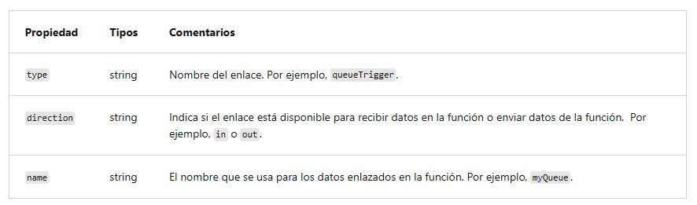
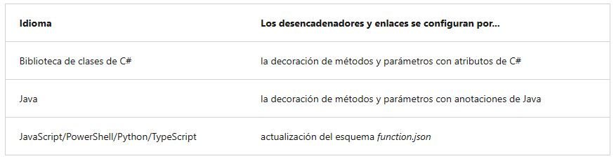

<h1 align="center"><ins>RUTA 2: IMPLEMENTACIÓN DE AZURE FUNCTIONS</ins></h1>
<h2 align="center">MÓDULO 1 - DESARROLLO DE AZURE FUNCTIONS</h2>

### Exploración del desarrollo de Azure Functions

Una función contiene dos elementos importantes: el código, que se puede escribir en diversos lenguajes, y la configuración, el archivo function.json. Con los lenguajes compilados, este archivo de configuración se genera automáticamente a partir de las anotaciones del código. Para los lenguajes de scripting, debe proporcionar el archivo de configuración.

El archivo function.json define el desencadenador de la función, los enlaces y otras opciones de configuración. Cada función tiene un solo desencadenador. Este archivo de configuración se usa en tiempo de ejecución para determinar los eventos que se supervisarán y cómo pasar datos y devolverlos al ejecutarse una función. El siguiente es un ejemplo de archivo function.json.

{
    "disabled":false,
    "bindings":[
        // ... bindings here
        {
            "type": "bindingType",
            "direction": "in",
            "name": "myParamName",
            // ... more depending on binding
        }
    ]
}

La propiedad bindings es donde configura los enlaces y los desencadenadores. Cada enlace comparte unos ajustes de configuración comunes y algunos parámetros que son específicos de un determinado tipo de enlace. Cada enlace requiere la siguiente configuración:

#### Aplicación de función

La aplicación de función proporciona un contexto de ejecución en Azure donde ejecutar las funciones. Como tal, es la unidad de implementación y administración de las funciones. Una aplicación de función se compone de una o varias funciones individuales que se administran, implementan y escalan conjuntamente. Todas las funciones de una aplicación de función comparten el mismo plan de precios, el mismo método de implementación y la misma versión en tiempo de ejecución. Una aplicación de función es como una forma de organizar y administrar las funciones de manera colectiva.

Nota: En Functions 2.x, todas las funciones de una aplicación de funciones deben crearse en el mismo lenguaje. En versiones anteriores del tiempo de ejecución de Azure Functions, esto no era necesario.

#### Estructura de carpetas

El código de todas las funciones de una aplicación de funciones está ubicado en una carpeta de proyecto raíz que contiene un archivo de configuración de host. El archivo host.json contiene configuraciones específicas del entorno de ejecución y está en la carpeta raíz de la aplicación de funciones. Un carpeta bin contiene paquetes y otros archivos de biblioteca que requiere la aplicación de funciones. Las estructuras de carpeta específicas necesarias para la aplicación de funciones dependen del lenguaje:

- Compilado en C# (.csproj)
- Script de C# (.csx)
- Script de F#
- Java
- JavaScript
- Python

#### Entornos de desarrollo locales

Azure Functions le permite usar el editor de código y las herramientas de desarrollo que prefiera para crear y probar sus funciones en un equipo local. Las funciones locales pueden conectarse a servicios de Azure en directo, y puede depurar sus funciones en el equipo local con el entorno de tiempo de ejecución de Functions completo.

La manera en la que desarrolla las funciones en el equipo local depende del lenguaje y las herramientas que prefiera. Consulte Codificación y comprobación de las funciones de Azure Functions en un entorno local para obtener más información.

Advertencia: No mezcle el desarrollo local con el desarrollo del portal en la misma aplicación de función. Cuando cree y publique funciones desde un proyecto local, no debe intentar mantener o modificar el código del proyecto en el portal.

### Creación de desencadenadores y enlaces

Los desencadenadores provocan la ejecución de una función. Un desencadenador define cómo se invoca una función y cada función debe tener exactamente un desencadenador. Los desencadenadores tienen datos asociados, que a menudo son la carga de la función.

El enlace a una función es una manera de conectar otro recurso a la función mediante declaración. Los enlaces pueden estar conectados como enlaces de entrada, enlaces de salida o ambos. Los datos de los enlaces se proporcionan a la función como parámetros.

Puede mezclar y asignar enlaces diferentes para satisfacer sus necesidades. Los enlaces son opcionales y cada función puede tener uno o varios enlaces de entrada y de salida.

Los desencadenadores y enlaces evitan codificar el acceso a otros servicios. La función recibe los datos (por ejemplo, el contenido de un mensaje de cola) en parámetros de función. El usuario envía datos (por ejemplo, para crear un mensaje de la cola) mediante el valor devuelto de la función.

#### Definiciones de desencadenador y enlace

Los desencadenadores y enlaces se definen de forma diferente en función del lenguaje de desarrollo.

Para los lenguajes que dependen de function.json, el portal proporciona una interfaz de usuario para agregar enlaces en la pestaña Integración. También se puede editar el archivo directamente en el portal, en la pestaña Código y prueba de la función.

En .NET y Java, el tipo de parámetro define el tipo de datos de entrada. Por ejemplo, use string para enlazar al texto de un desencadenador de cola, una matriz de bytes para leerla como binaria y un tipo personalizado para deserializar a un objeto. Dado que ni las funciones de la biblioteca de clases de .NET ni las funciones de Java utilizan function.json para las definiciones de enlace, no se pueden crear ni editar en el portal. La edición del portal en C# se basa en un script en C#, que usa function.json, en lugar de los atributos.

Para los lenguajes que se escriben dinámicamente, como JavaScript, use la propiedad dataType del archivo function.json. Por ejemplo, para leer el contenido de una solicitud HTTP en formato binario, establezca dataType en binary:

{
    "dataType": "binary",
    "type": "httpTrigger",
    "name": "req",
    "direction": "in"
}

Otras opciones para dataType son stream y string.

#### Dirección de los enlaces

Todos los desencadenadores y enlaces tienen una propiedad de dirección en el archivo function.json:

- En el caso de los desencadenadores, esta propiedad siempre aparece como in
- Los enlaces de entrada y de salida usan in y out
- Algunos enlaces admiten la dirección especial inout. Si utiliza inout, solo estará disponible la opción Editor avanzado mediante la pestaña Integrar en el portal.

Cuando se usan atributos en una biblioteca de clases para configurar los desencadenadores y los enlaces, la dirección se proporciona en un constructor de atributos o se deduce del tipo de parámetro.

#### Ejemplo de desencadenador y enlace de Azure Functions

Supongamos que quiere escribir una fila nueva en Azure Table Storage cada vez que aparezca un nuevo mensaje en Azure Queue Storage. Este escenario puede implementarse mediante un desencadenador de Azure Queue Storage y un enlace de salida de Azure Table Storage.

Este es un archivo function.json para este escenario.

{
  "bindings": [
    {
      "type": "queueTrigger",
      "direction": "in",
      "name": "order",
      "queueName": "myqueue-items",
      "connection": "MY_STORAGE_ACCT_APP_SETTING"
    },
    {
      "type": "table",
      "direction": "out",
      "name": "$return",
      "tableName": "outTable",
      "connection": "MY_TABLE_STORAGE_ACCT_APP_SETTING"
    }
  ]
}

El primer elemento de la matriz bindings es el desencadenador de Queue Storage. Las propiedades type y direction identifican el desencadenador. La propiedad name identifica el parámetro de función que va a recibir el contenido del mensaje de cola. El nombre de la cola que supervisar está en queueName y la cadena de conexión, en la configuración de la aplicación identificada por connection.

El segundo elemento de la matriz bindings es el enlace de salida de Azure Table Storage. Las propiedades type y direction identifican el enlace. La propiedad name especifica cómo la función proporcionará la nueva fila de tabla, en este caso, con el valor devuelto de función. El nombre de la tabla está en tableName y la cadena de conexión, en la configuración de la aplicación identificada por connection.

##### Ejemplo de script de C#
Este es el código de script de C# que funciona con este enlace y este desencadenador. Tenga en cuenta que el nombre del parámetro que proporciona el contenido del mensaje de cola order; este nombre se requiere porque el valor de propiedad name en function.json es order.

#r "Newtonsoft.Json"

using Microsoft.Extensions.Logging;
using Newtonsoft.Json.Linq;

// From an incoming queue message that is a JSON object, add fields and write to Table storage
// The method return value creates a new row in Table Storage
public static Person Run(JObject order, ILogger log)
{
    return new Person() { 
            PartitionKey = "Orders", 
            RowKey = Guid.NewGuid().ToString(),  
            Name = order["Name"].ToString(),
            MobileNumber = order["MobileNumber"].ToString() };  
}

public class Person
{
    public string PartitionKey { get; set; }
    public string RowKey { get; set; }
    public string Name { get; set; }
    public string MobileNumber { get; set; }
}

##### Ejemplo de JavaScript
El mismo archivo function.json puede utilizarse con una función de JavaScript:

// From an incoming queue message that is a JSON object, add fields and write to Table Storage
module.exports = async function (context, order) {
    order.PartitionKey = "Orders";
    order.RowKey = generateRandomId(); 

    context.bindings.order = order;
};

function generateRandomId() {
    return Math.random().toString(36).substring(2, 15) +
        Math.random().toString(36).substring(2, 15);
}

##### Ejemplo de biblioteca de clases
En una biblioteca de clases, los atributos, en lugar de un archivo function.json, proporcionan la misma información sobre desencadenadores y enlaces (nombres de cola y tabla, cuentas de almacenamiento, parámetros de función para entrada y salida). Este es un ejemplo:

public static class QueueTriggerTableOutput
{
    [FunctionName("QueueTriggerTableOutput")]
    [return: Table("outTable", Connection = "MY_TABLE_STORAGE_ACCT_APP_SETTING")]
    public static Person Run(
        [QueueTrigger("myqueue-items", Connection = "MY_STORAGE_ACCT_APP_SETTING")]JObject order,
        ILogger log)
    {
        return new Person() {
                PartitionKey = "Orders",
                RowKey = Guid.NewGuid().ToString(),
                Name = order["Name"].ToString(),
                MobileNumber = order["MobileNumber"].ToString() };
    }
}

public class Person
{
    public string PartitionKey { get; set; }
    public string RowKey { get; set; }
    public string Name { get; set; }
    public string MobileNumber { get; set; }
}

### Conexión de funciones a servicios de Azure

El proyecto de función hace referencia a la información de conexión por nombre de su proveedor de configuración. No acepta directamente los detalles de conexión, lo que permite cambiarlos entre entornos. Por ejemplo, una definición de desencadenador podría incluir una propiedad connection, pero no se puede establecer la cadena de conexión directamente en function.json. En su lugar, debe establecer connection en el nombre de una variable de entorno que contenga la cadena de conexión.

El proveedor de configuración predeterminado usa variables de entorno que se establecen en Configuración de la aplicación cuando se ejecuta en el servicio Azure Functions, o desde el archivo de configuración local al desarrollar localmente.

#### Configuración de una conexión basada en identidades

Algunas conexiones de Azure Functions están configuradas para usar una identidad en lugar de un secreto. La compatibilidad depende de la extensión que utiliza la conexión. En algunos casos es posible que se requiera una cadena de conexión en Functions aunque el servicio al que se conecta admita conexiones basadas en identidades.

Nota: Las conexiones basadas en identidades no se admiten con Durable Functions.

Cuando se hospeda en el servicio de Azure Functions, las conexiones basadas en identidades usan una identidad administrada. La identidad asignada por el sistema se usa de manera predeterminada, aunque se puede especificar una identidad asignada por el usuario con las propiedades credential y clientID. Cuando se ejecuta en otros contextos, como el de desarrollo local, se usa en su lugar la identidad del desarrollador.

#### Concesión de permiso a la identidad

Cualquier identidad que se utilice debe tener permisos para realizar las acciones previstas. Esto suele hacerse mediante la asignación de un rol en RBAC de Azure o la especificación de la identidad en una directiva de acceso, en función del servicio al que se conecte.

Importante: Es posible que el servicio de destino muestre algunos permisos que no son necesarios para todos los contextos. Siempre que sea posible, respete el principio de privilegios mínimos y conceda solo los privilegios necesarios a la identidad.