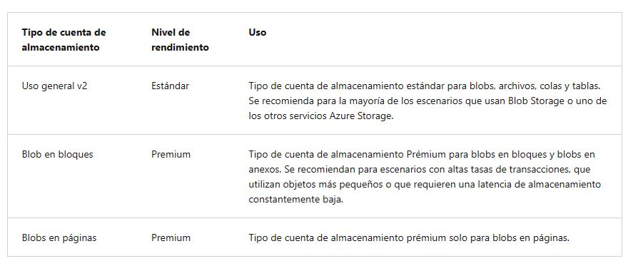
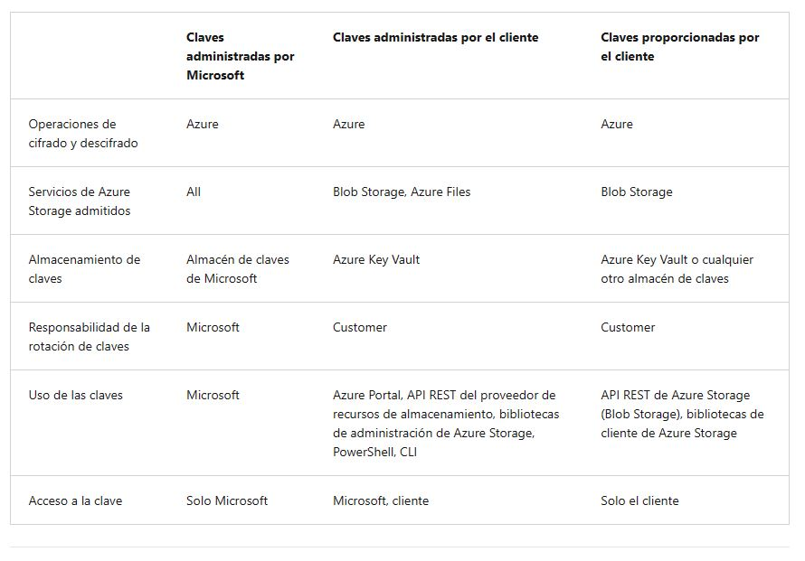
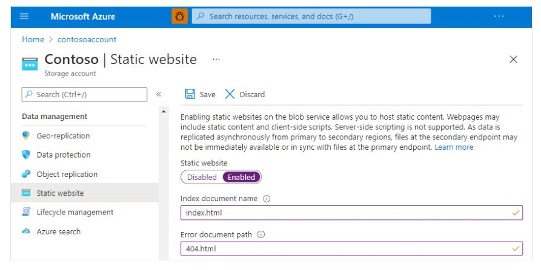

<h1 align="center"><ins>RUTA 3: DESARROLLO DE SOLUCIONES QUE USAN BLOB STORAGE</ins></h1>
<h2 align="center">MÓDULO 1 - EXPLORACIÓN DE AZURE BLOB STORAGE</h2>

### Exploración de Azure Blob Storage

Azure Blob Storage es la solución de almacenamiento de objetos de Microsoft para la nube. El almacenamiento de blobs está optimizado para almacenar grandes cantidades de datos no estructurados. Los datos no estructurados son datos que no se ciñen a ningún un modelo de datos o definición concretos, como texto o datos binarios.

Blob Storage está diseñado para:

- Visualización de imágenes o documentos directamente en un explorador.
- Almacenamiento de archivos para acceso distribuido.
- Streaming de audio y vídeo.
- Escribir en archivos de registro.
- Almacenamiento de datos para copia de seguridad y restauración, recuperación ante desastres y archivado.
- Almacenamiento de datos para el análisis en local o en un servicio hospedado de Azure.

Los usuarios o las aplicaciones cliente pueden acceder a objetos en Blob Storage a través de HTTP/HTTPS, desde cualquier lugar del mundo. Se puede acceder a los objetos de Blob Storage mediante la API REST de Azure Storage, Azure PowerShell, la CLI de Azure o una biblioteca de cliente de Azure Storage.

Una cuenta de Azure Storage es el contenedor de nivel superior para todo su Azure Blob Storage. La cuenta de almacenamiento proporciona un espacio de nombres único para los datos de Azure Storage que es accesible desde cualquier lugar del mundo a través de HTTP o HTTPS.

#### Tipos de cuentas de almacenamiento
Azure Storage ofrece dos niveles de rendimiento de cuentas de almacenamiento, estándar y premium. Cada nivel de rendimiento admite características diferentes y tiene un modelo de precios propio.

- Estándar: se trata de la cuenta de uso general v2 estándar y se recomienda para la mayoría de los escenarios en los que se usa Azure Storage.
- Premium: las cuentas Premium ofrecen un mayor rendimiento mediante el uso de unidades de estado sólido. Si crea una cuenta Premium, puede elegir entre tres tipos de cuenta: blobs en bloques, blobs en páginas o recursos compartidos de archivos.

En la tabla siguiente se describen los tipos de cuentas de almacenamiento recomendados por Microsoft para la mayoría de los escenarios que usan Blob Storage.

####    Niveles de acceso a datos de blob en bloques

Azure Storage ofrece diferentes opciones para obtener acceso a los datos de blob en bloques, en función de los patrones de uso. Cada nivel de acceso en Azure Storage está optimizado para un patrón particular de uso de datos. Al seleccionar el nivel de acceso adecuado a sus necesidades, puede almacenar sus datos de blob en bloques de la manera más rentable.

Los niveles de acceso disponibles son:

- El nivel de acceso frecuente, que está optimizado para el acceso frecuente de objetos en la cuenta de almacenamiento. El nivel de acceso frecuente tiene los costos de almacenamiento más altos, pero los costos de acceso más bajos. Las nuevas cuentas de almacenamiento se crean en el nivel de acceso frecuente de forma predeterminada.

- El nivel de acceso esporádico está optimizado para almacenar grandes cantidades de datos a los que se accede con poca frecuencia y que llevan guardados al menos 30 días. El nivel de acceso esporádico tiene menores costos de almacenamiento y mayores costos de acceso en comparación con el nivel de acceso frecuente.

- El nivel de almacenamiento de archivo está disponible solo para blobs en bloques individuales. Este nivel está optimizado para los datos que pueden tolerar varias horas de latencia de recuperación y que permanecerán en el nivel de almacenamiento de archivo durante un mínimo de 180 días. El nivel de almacenamiento de archivo es el más rentable de todos para almacenar datos, pero el acceso a esos datos es más costoso que acceder a los datos del nivel de acceso frecuente o esporádico.

Si hay un cambio en el patrón de uso de datos, también se puede cambiar de nivel de acceso en cualquier momento.

### Detección de los tipos de recursos de Azure Blob Storage

Blob Storage ofrece tres tipos de recursos:

- Cuenta de almacenamiento.
- Un contenedor en la cuenta de almacenamiento.
- Un blob en un contenedor.

#### Cuentas de almacenamiento

Una cuenta de almacenamiento le proporciona un espacio de nombres único en Azure para sus datos. Cada objeto que almacena en Azure Storage tiene una dirección que incluye su nombre de cuenta único. La combinación del nombre de la cuenta y el punto de conexión del blob de Azure Storage constituye la dirección base de los objetos de la cuenta de almacenamiento.

Por ejemplo, si la cuenta de almacenamiento se llama mystorageaccount, los puntos de conexión predeterminados para Blob Storage son: http://mystorageaccount.blob.core.windows.net

#### Contenedores

Un contenedor organiza un conjunto de blobs, de forma parecida a un directorio en un sistema de archivos. Una cuenta de almacenamiento puede contener un número ilimitado de contenedores y un contenedor puede almacenar un número ilimitado de blobs.

Un nombre de contenedor debe ser un nombre DNS válido, ya que forma parte del URI (identificador uniforme de recursos) único que se usa para direccionar el contenedor o sus blobs. Siga estas reglas al asignar un nombre a un contenedor:

- Los nombres de contenedor pueden tener entre 3 y 63 caracteres.
- Los nombres de contenedor deben comenzar por una letra o un número, y solo pueden contener letras en minúscula, números y el carácter de guión (-).
- En los nombres de contenedor no se permiten dos o más guiones consecutivos.
- 
El URI de un contenedor es similar a: https://myaccount.blob.core.windows.net/mycontainer

#### Datos BLOB

Azure Storage admite tres tipos de blobs:

- Los blobs en bloques almacenan texto y datos binarios. Los blobs en bloques se componen de bloques de datos que se pueden administrar de forma individual. Los blobs en bloques pueden almacenar hasta aproximadamente 190,7 TiB.
- Los blobs en anexos constan de bloques, como los blobs en bloques, pero están optimizados para operaciones de anexión. Los blobs en anexos resultan muy convenientes para escenarios como el registro de datos de máquinas virtuales.
- Los blobs en páginas almacenan archivos de acceso aleatorio con un tamaño de hasta 8 TB. Los blobs en páginas almacenan los archivos del disco duro virtual (VHD) y sirven como discos para las máquinas virtuales de Azure.
- 
El URI de un blob es similar a: https://myaccount.blob.core.windows.net/mycontainer/myblob o https://myaccount.blob.core.windows.net/mycontainer/myvirtualdirectory/myblob

### Exploración de las características de seguridad de Azure Storage

Azure Storage proporciona un completo conjunto de funcionalidades de seguridad que, conjuntamente, permiten a los desarrolladores compilar aplicaciones seguras:

- Todos los datos (incluidos los metadatos) escritos en Azure Storage se cifran automáticamente con Storage Service Encryption (SSE).
- Azure Active Directory (Azure AD) y el control de acceso basado en rol (RBAC) son compatibles con Azure Storage para las operaciones de administración de recursos y las operaciones de datos, como se indica a continuación:
    1. Puede asignar roles de RBAC en el ámbito de la cuenta de almacenamiento para las entidades de seguridad y utilizar Azure AD para autorizar las operaciones de administración de recursos, como la administración de claves.
    2. La integración con Azure AD se admite para las operaciones de datos de cola y blob. Puede asignar roles de RBAC en el ámbito de una suscripción, un grupo de recursos, una cuenta de almacenamiento, un contenedor individual o una cola a una entidad de seguridad o identidad administrada para los recursos de Azure.
- Los datos se pueden proteger en tránsito entre una aplicación y Azure usando cifrado de cliente, HTTPS o SMB 3.0.
- Se puede establecer el cifrado de los discos de datos y del sistema operativo utilizados por Azure Virtual Machines mediante Azure Disk Encryption.
- Se puede conceder acceso delegado a los objetos de datos de Azure Storage mediante las firmas de acceso compartido.
  
#### Cifrado de Azure Storage para datos en reposo

Azure Storage cifra automáticamente los datos al guardarlos en la nube. El cifrado protege los datos y le ayuda a cumplir los compromisos de cumplimiento y seguridad de la organización. Los datos de Azure Storage se cifran y descifran de forma transparente mediante el cifrado AES de 256 bits, uno de los cifrados de bloques más sólidos que hay disponibles, y son compatibles con FIPS 140-2. El cifrado de Azure Storage es similar al cifrado de BitLocker en Windows.

El cifrado de Azure Storage está habilitado para todas las cuentas de almacenamiento, nuevas o existentes, y no se puede deshabilitar. Como los datos están protegidos de forma predeterminada, no es necesario modificar el código o las aplicaciones para aprovechar el cifrado de Azure Storage.

Las cuentas de almacenamiento se cifran independientemente de su nivel de rendimiento (Estándar o Premium) o del modelo de implementación (Azure Resource Manager o clásico). Todas las opciones de redundancia de Azure Storage admiten el cifrado y se cifran todas las copias de una cuenta de almacenamiento. Se cifran todos los recursos de Azure Storage, incluidos los blobs, los discos, los archivos, las colas y las tablas. También se cifran todos los metadatos de objetos.

El cifrado no afecta al rendimiento de Azure Storage. No hay ningún costo adicional por el cifrado de Azure Storage.

##### Administración de claves de cifrado
Puede confiar en las claves administradas por Microsoft para el cifrado de la cuenta de almacenamiento, o puede administrar el cifrado con sus propias claves. Si opta por administrar el cifrado con sus propias claves, tiene dos opciones:

- Puede especificar una clave administrada por el cliente que se use para cifrar y descifrar todos los datos de la cuenta de almacenamiento. Una clave administrada por el cliente se usa para cifrar todos los datos de todos los servicios de la cuenta de almacenamiento.
- Puede especificar una clave proporcionada por el cliente en las operaciones de Blob Storage. Un cliente que realiza una solicitud de lectura o escritura en el almacenamiento de blobs puede incluir una clave de cifrado en la solicitud para tener un control detallado sobre el cifrado y el descifrado de los datos de blob.

En la tabla siguiente se comparan las opciones de administración de claves para el cifrado de Azure Storage.

### Detección del hospedaje de sitios web estáticos en Azure Storage

Puede proporcionar contenido estático (HTML, CSS, JavaScript y archivos de imagen) directamente desde un contenedor de almacenamiento llamado $web. El hospedaje de contenido en Azure Storage permite usar arquitecturas sin servidor que incluyen Azure Functions y otros servicios de plataforma como servicio (PaaS). El hospedaje de sitios web estáticos de Azure Storage es una opción excelente en los casos en los que no es necesario que un servidor web represente contenido.

Los sitios web estáticos tienen algunas limitaciones. Por ejemplo, si desea configurar encabezados, tendrá que usar Azure Content Delivery Network (Azure CDN). No hay forma de configurar encabezados como parte de la propia característica de sitio web estático. Además, no se admiten AuthN ni AuthZ. Si estas características son importantes para su escenario, considere la posibilidad de usar Azure Static Web Apps.

#### Habilitación del hospedaje de sitios web estáticos

El hospedaje de sitios web estáticos es una característica que permite habilitar la cuenta de almacenamiento. Cuando configura la cuenta para el hospedaje de sitios web estáticos, Azure Storage crea automáticamente un contenedor llamado $web. El contenedor $web contiene los archivos del sitio web estático.

Para habilitar el hospedaje de sitios web estáticos:

1. Busque la cuenta de almacenamiento en Azure Portal y muestre la información general de la cuenta.
2. Seleccione Sitio web estático para mostrar la página de configuración.
3. Seleccione Habilitado para habilitar el hospedaje del sitio web estático para la cuenta.
4. En el campo Nombre del documento de índice, especifique una página de índice predeterminada. Por ejemplo, index.html.
5. En el campo Ruta de acceso del documento de error, especifique una página de error predeterminada. Por ejemplo, 404.html.
6. Seleccione Guardar.
   

#### Impacto de la configuración del nivel de acceso en el contenedor web

Puede modificar el nivel de acceso público del contenedor $web, pero esto no afecta al punto de conexión principal del sitio web estático porque estos archivos se proporcionan a través de solicitudes de acceso anónimo. Eso significa acceso público (de solo lectura) a todos los archivos.

Aunque el punto de conexión principal del sitio web estático no se ve afectado, un cambio en el nivel de acceso público afecta al punto de conexión principal de Blob service.

Por ejemplo, si cambia el nivel de acceso público del contenedor $web de Privado (acceso no anónimo) a Blob (acceso anónimo de lectura solo para blobs), el nivel de acceso público al punto de conexión principal del sitio web estático https://contosoblobaccount.z22.web.core.windows.net/index.html no cambia.

Sin embargo, el acceso público al punto de conexión principal de Blob service https://contosoblobaccount.blob.core.windows.net/$web/index.html cambia de privado a público. Ahora los usuarios pueden abrir ese archivo mediante cualquiera de estos dos punto de conexión.

Deshabilitar el acceso público en una cuenta de almacenamiento mediante la configuración de acceso público de la cuenta de almacenamiento no afecta a los sitios web estáticos hospedados en esa cuenta de almacenamiento. Para más información, consulte Corrección del acceso de lectura público anónimo a datos de blobs (implementaciones de Azure Resource Manager).

#### Asignación de un dominio personalizado a una dirección URL de un sitio web estático

Puede hacer que el sitio web estático esté disponible a través de un dominio personalizado.

Es más fácil habilitar el acceso HTTP para un dominio personalizado, ya que Azure Storage lo admite de forma nativa. Para habilitar HTTPS, tendrá que usar Azure CDN porque Azure Storage no admite de forma nativa HTTPS con dominios personalizados. Para obtener instrucciones pormenorizadas, visite Asignación de un dominio personalizado a un punto de conexión de Azure Blob Storage.