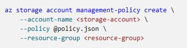

<h1 align="center"><ins>RUTA 3: DESARROLLO DE SOLUCIONES QUE USAN BLOB STORAGE</ins></h1>
<h2 align="center">MÓDULO 2 - ADMINISTRACIÓN DEL CICLO DE VIDA DE AZURE BLOB STORAGE</h2>

### Exploración del ciclo de vida de Azure Blob Storage

Los conjuntos de datos tienen ciclos de vida únicos. Al principio del ciclo de vida, las personas acceden con frecuencia a algunos datos. Pero la necesidad de acceso desciende drásticamente a medida que los datos se hacen más antiguos. Algunos datos permanecen inactivos en la nube y, una vez almacenados, no se suele acceder a ellos. Otros datos expiran en días o meses después de su creación, mientras que otros conjuntos de datos se leen y modifican de forma activa en el transcurso de sus ciclos de vida.

#### Niveles de acceso

Azure Storage ofrece distintos niveles de acceso, lo que permite almacenar datos de objeto de blob de la manera más rentable. Los niveles de acceso disponibles incluyen:

- **Frecuente:** Optimizado para almacenar datos que se consultan con frecuencia.
- **Esporádico:** Optimizado para almacenar datos a los que se accede con poca frecuencia y al menos durante 30 días.
- **Archivo:** optimizado para almacenar datos a los que se accede muy pocas veces y almacenados durante al menos 180 días con requisitos de latencia flexibles, del orden de horas.
  
Las siguientes consideraciones se aplican a los distintos niveles de acceso:

- El nivel de acceso se puede establecer en un blob durante o después de la carga.
- Solo los niveles de acceso frecuente y esporádico se pueden establecer en el nivel de cuenta. El nivel de acceso de archivo solo se puede establecer en el nivel de blob.
- Los datos del nivel de acceso esporádico tienen una disponibilidad ligeramente inferior, pero aun así ofrecen una gran durabilidad, latencia de recuperación y unas características de rendimiento similares a las de los datos de acceso frecuente.
- Los datos del nivel de acceso de archivo se almacenan sin conexión. El nivel de archivo ofrece los costos de almacenamiento más bajos, pero también los costos de acceso más altos.
- Los niveles de acceso frecuente y esporádico son compatibles con todas las opciones de redundancia. El nivel de archivo solo admite las opciones de LRS, GRS y RA-GRS.
- Los límites de almacenamiento de datos se establecen en el nivel de cuenta y no por nivel de acceso. Puede elegir usar todo el límite en un nivel o entre los tres niveles.

#### Administración del ciclo de vida de los datos

La administración del ciclo de vida de Azure Blob Storage ofrece una directiva enriquecida basada en reglas para cuentas de almacenamiento de blobs y de uso general v2. Use la directiva para realizar la transición de los datos a los niveles de acceso adecuados o hacer que expiren al final de su ciclo de vida. La directiva de administración del ciclo de vida le permite:

- Realizar la transición de los blobs a un nivel de almacenamiento de acceso esporádico (frecuente a esporádico, frecuente a archivo o esporádico a archivo) para optimizar el rendimiento y el costo
- Eliminar los blobs al final de sus ciclos de vida
- Definir reglas que se ejecutarán una vez al día en el nivel de cuenta de almacenamiento
- Aplicar reglas a contenedores o a un subconjunto de blobs (mediante prefijos como filtros)

Considere un escenario donde los datos tienen acceso frecuente durante las primeras fases del ciclo de vida, pero solo ocasionalmente al cabo de dos semanas. Transcurrido el primer mes, rara vez se accede al conjunto de datos. En este escenario, es mejor el almacenamiento de acceso frecuente durante las primeras etapas. El almacenamiento de acceso esporádico es más adecuado para un acceso ocasional. El almacenamiento de archivo es la mejor opción de nivel una vez que los datos tengan un mes. Con el ajuste de los niveles de almacenamiento en relación con la antigüedad de los datos, puede designar las opciones de almacenamiento menos caras para satisfacer sus necesidades. Para conseguir esta transición, las reglas de directivas de administración del ciclo de vida se encuentran disponibles para mover los datos antiguos a niveles de almacenamiento de acceso más esporádico.

Nota: Los datos almacenados en una cuenta de almacenamiento de blobs en bloques Premium no se pueden organizar en niveles de acceso frecuente, esporádico o de archivo con Set Blob Tier ni mediante la administración del ciclo de vida de Azure Blob Storage. Para mover datos, debe copiar los blobs de forma sincrónica desde la cuenta de almacenamiento de blobs en bloques al nivel de acceso frecuente de otra cuenta mediante la API Put Block From URL o una versión de AzCopy que admita esta API. Put Block From URL API copia datos de forma asíncrónica en el servidor, lo que significa que la llamada solo se completa una vez que todos los datos se han movido de la ubicación original del servidor a la ubicación de destino.

### Detección de directivas de ciclo de vida de Blob Storage

Una directiva de administración del ciclo de vida es una colección de reglas en un documento JSON. Cada definición de regla incluye un conjunto de filtros y un conjunto de acciones. El conjunto de filtros limita las acciones de regla a un determinado conjunto de objetos dentro de un contenedor o nombres de objetos. El conjunto de acciones aplica las acciones de nivel o eliminación al conjunto filtrado de objetos:

{
  "rules": [
    {
      "name": "rule1",
      "enabled": true,
      "type": "Lifecycle",
      "definition": {...}
    },
    {
      "name": "rule2",
      "type": "Lifecycle",
      "definition": {...}
    }
  ]
}

Una directiva es una colección de reglas:

Cada regla de la directiva tiene varios parámetros:

#### Reglas

Cada definición de regla incluye un conjunto de filtros y un conjunto de acciones. El conjunto de filtros limita las acciones de regla a un determinado conjunto de objetos dentro de un contenedor o nombres de objetos. El conjunto de acciones aplica las acciones de nivel o eliminación al conjunto filtrado de objetos.

La siguiente regla de ejemplo filtra la cuenta para ejecutar las acciones en objetos que existen dentro de container1 y empiezan por foo.

- Establecer el nivel de blob en nivel esporádico 30 días después de la última modificación
- Establecer el nivel de blob en nivel de almacenamiento de archivo 90 días después de la última modificación
- Eliminar el blob 2555 días (siete años) después de la última modificación
- Eliminar instantáneas de blob 90 días después de la creación de las instantáneas

{
  "rules": [
    {
      "name": "ruleFoo",
      "enabled": true,
      "type": "Lifecycle",
      "definition": {
        "filters": {
          "blobTypes": [ "blockBlob" ],
          "prefixMatch": [ "container1/foo" ]
        },
        "actions": {
          "baseBlob": {
            "tierToCool": { "daysAfterModificationGreaterThan": 30 },
            "tierToArchive": { "daysAfterModificationGreaterThan": 90 },
            "delete": { "daysAfterModificationGreaterThan": 2555 }
          },
          "snapshot": {
            "delete": { "daysAfterCreationGreaterThan": 90 }
          }
        }
      }
    }
  ]
}

#### Filtros de reglas

Los filtros limitan las acciones de regla a un subconjunto de blobs dentro de la cuenta de almacenamiento. Si se define más de un filtro, un operador AND lógico se ejecutará en todos los filtros. Entre los filtros están los siguientes:

#### Acciones de regla

Las acciones se aplican a los blobs filtrados cuando se cumple la condición de ejecución.

La administración del ciclo de vida admite el cambio de niveles y la eliminación de blobs e instantáneas de blob. Defina al menos una acción para cada regla en los blobs o las instantáneas de blob.

Nota: Si define más de una acción en el mismo blob, la administración del ciclo de vida aplica la acción menos cara al blob. Por ejemplo, la acción delete es más económica que la acción tierToArchive. La acción tierToArchive es más económica que la acción tierToCool.

Las condiciones de ejecución se basan en la antigüedad. Para realizar el seguimiento de la antigüedad, los blobs de base usan la hora de la última modificación y las instantáneas de blob usan la hora de creación de la instantánea.

### Implementación de directivas de ciclo de vida de Blob Storage

Puede agregar, editar o quitar una directiva mediante cualquiera de los métodos siguientes:

- Portal de Azure
- Azure PowerShell
- Azure CLI
- API de REST
  
A continuación, se muestran los pasos y algunos ejemplos del portal y la CLI de Azure.

#### Azure Portal

Hay dos maneras de agregar una directiva a través de Azure Portal: la vista Lista y la vista Código.

##### Vista de lista de Azure Portal
1. Inicie sesión en Azure Portal.
2. Seleccione Todos los recursos y seleccione su cuenta de almacenamiento.
3. En Administración de datos, seleccione Administración del ciclo de vida para ver o cambiar las reglas.
4. Seleccione la pestaña Vista de lista.
5. Seleccione Agregar regla y después rellene los campos del formulario Conjunto de acciones. En el siguiente ejemplo, los blobs se mueven al almacenamiento esporádico si no se han modificado durante 30 días.
6. Seleccione Conjunto de filtros para agregar un filtro opcional. A continuación, seleccione Examinar para especificar un contenedor y una carpeta por los que filtrar.
7. Seleccione Revisar + agregar para revisar la configuración de la directiva.
8. Seleccione Agregar para agregar la nueva directiva.

##### Vista de código de Azure Portal
1. Siga los tres primeros pasos en la sección de la vista Lista.
2. Seleccione la pestaña Vista Código. El siguiente código JSON es un ejemplo de una directiva que mueve un blob en bloques cuyo nombre comienza con log al nivel de acceso esporádico si han pasado más de 30 días desde la modificación del blob.

3. Seleccione Guardar.

#### CLI de Azure

Para agregar una directiva de administración del ciclo de vida con la CLI de Azure, escriba la directiva en un archivo JSON y, después, llame al comando **az storage account management-policy create** para crear la directiva.

Una directiva de administración del ciclo de vida se debe leer o escribir completamente. No se admiten las actualizaciones parciales.

### Rehidratación de los datos de blob desde el nivel de archivo

Mientras un blob se encuentra en el nivel de acceso de archivo, se considera que está sin conexión y no se puede leer ni modificar. Para leer o modificar los datos de un blob archivado, primero debe rehidratar el blob en un nivel en línea, ya sea el nivel de acceso frecuente o esporádico. Hay dos opciones para rehidratar un blob que se almacena en el nivel de archivo:

- Copiar un blob archivado en un nivel en línea: puede rehidratar un blob archivado si lo copia en un nuevo blob en el nivel de acceso frecuente o esporádico con la operación Copy Blob o Copy Blob from URL. Microsoft recomienda esta opción para la mayoría de los escenarios.

- Cambio del nivel de acceso de un blob a un nivel en línea: puede rehidratar un blob archivado a acceso frecuente o esporádico cambiando su nivel mediante la operación Set Blob Tier.

La rehidratación de un blob de un nivel de acceso de archivo puede tardar varias horas en completarse. Microsoft recomienda rehidratar blobs más grandes para obtener un rendimiento óptimo. La rehidratación de varios blobs pequeños de forma simultánea puede requerir tiempo adicional.

#### Prioridad de la rehidratación

Al rehidratar un blob, puede establecer la prioridad de la operación de rehidratación a través del encabezado x-ms-rehydrate-priority opcional en una operación Establecer nivel de blob o Copiar blob o Copiar blob desde URL. Las opciones de prioridad de rehidratación incluyen:

- Prioridad estándar: la solicitud de rehidratación se procesa en el orden en que se recibió y puede tardar hasta 15 horas.
- Prioridad alta: la solicitud de rehidratación tiene prioridad con respecto a las solicitudes de prioridad estándar y puede completarse en menos de una hora para objetos con un tamaño inferior a 10 GB.
  
Para comprobar la prioridad de rehidratación mientras se está en curso la operación de rehidratación, llame a BLObGet Blob Properties para devolver el valor del encabezado. La propiedad de prioridad de rehidratación devuelve Standard o High.

#### Copia de un blob archivado en un nivel en línea

Puede usar la operación Copy Blob o Copy Blob from URL para copiar el blob. Al copiar un blob archivado en un nuevo blob en un nivel en línea, el blob de origen permanece sin modificar en el nivel de archivo. Debe copiar el blob archivado en un nuevo blob con un nombre diferente o en un contenedor diferente. No se puede sobrescribir el blob de origen copiándolo en el mismo blob.

Solo se admite la copia de un blob archivado en un nivel de destino en línea dentro de la misma cuenta de almacenamiento. No se puede copiar un blob archivado en un blob de destino que también esté en el nivel de archivo.

En la tabla siguiente se muestra el comportamiento de una operación de copia de blob, en función de los niveles del blob de origen y de destino.

#### Cambio del nivel de acceso de un blob a un nivel en línea

La segunda opción para rehidratar un blob del nivel de archivo a un nivel en línea es cambiar el nivel del blob mediante una llamada a Set Blob Tier. Con esta operación, puede cambiar el nivel del blob archivado a nivel de acceso frecuente o esporádico.

Una vez que se inicia una solicitud Set Blob Tier, no se puede cancelar. Durante la operación de rehidratación, la configuración del nivel de acceso del blob continúa a modo de archivado hasta que se completa el proceso de rehidratación.

Precaución: Cambiar el nivel de un blob no afecta a la hora de la última modificación. Si hay una directiva de administración del ciclo de vida en vigor para la cuenta de almacenamiento, la rehidratación de un blob con la operación Set Blob Tier puede dar lugar a un escenario en el que la directiva de ciclo de vida mueva el blob de nuevo al nivel de archivo después de la rehidratación, ya que la hora de la última modificación supera el umbral establecido para la directiva.