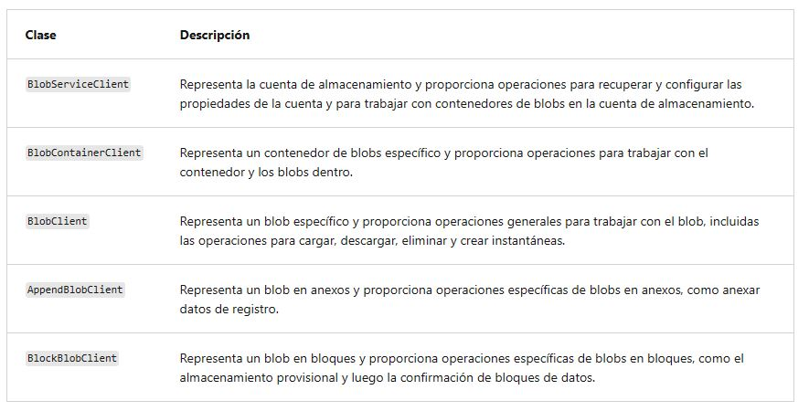

<h1 align="center"><ins>RUTA 3: DESARROLLO DE SOLUCIONES QUE USAN BLOB STORAGE</ins></h1>
<h2 align="center">MÓDULO 3 - TRABAJO CON AZURE BLOB STORAGE</h2>

### Exploración de la biblioteca cliente de Azure Blob Storage

Las bibliotecas cliente de Azure Storage para .NET ofrecen una interfaz práctica para realizar llamadas a Azure Storage. La versión más reciente de la biblioteca cliente de Azure Storage es la versión 12.x. Microsoft recomienda usar la versión 12.x para las nuevas aplicaciones.

Esta tabla enumera las clases básicas con una breve descripción:

Los siguientes paquetes contienen las clases que se usan para trabajar con recursos de datos de Blob Storage:

- Azure.Storage.Blobs: contiene las clases principales (objetos de cliente) que puede usar para operar en el servicio, los contenedores y los blobs.
- Azure.Storage.Blobs.Specialized: contiene clases que puede usar para llevar a cabo operaciones específicas de un tipo de blob, como blobs en bloques.
- Azure.Storage.Blobs.Models: todas las demás clases de utilidad, estructuras y tipos de enumeración.

### Creación de un objeto de cliente

Trabajar con cualquier recurso de Azure mediante el SDK comienza con la creación de un objeto de cliente. En esta sección, aprenderá a crear objetos de cliente para interactuar con los tres tipos de recursos en el servicio de almacenamiento: cuentas de almacenamiento, contenedores y blobs.

Cuando la aplicación crea un objeto de cliente, se pasa un URI que hace referencia al punto de conexión al constructor del cliente. Puede construir manualmente la cadena de punto de conexión, como se muestra en los ejemplos de este artículo, o bien puede consultar el punto de conexión en tiempo de ejecución mediante la biblioteca de administración de Azure Storage.

Los ejemplos de código de esta unidad usan DefaultAzureCredential para autenticarse en Azure a través de una entidad de seguridad de Azure Active Directory (Azure AD). El proceso de autenticación incluye la obtención de un token de acceso para la autorización. Este token de acceso se pasa como una credencial cuando se crea una instancia del cliente y la credencial persiste durante toda la duración del cliente. La entidad de seguridad de Azure AD que solicita el token debe tener asignado un rol RBAC de Azure adecuado que conceda acceso a los datos de blobs.

#### Creación de un objeto BlobServiceClient

Un objeto BlobServiceClient autorizado permite a su aplicación interactuar con los recursos a nivel de la cuenta de almacenamiento. BlobServiceClient proporciona métodos para recuperar y configurar propiedades de cuenta, así como enumerar, crear y eliminar contenedores dentro de la cuenta de almacenamiento. Este objeto de cliente es el punto de partida para interactuar con los recursos de la cuenta de almacenamiento.

En el ejemplo siguiente se muestra cómo se crea un objeto BlobServiceClient:

#### Creación de un objeto BlobContainerClient

Puede usar un objeto BlobServiceClient para crear un nuevo objeto BlobContainerClient. Un objeto BlobContainerClient permite interactuar con un recurso de contenedor específico. BlobContainerClient proporciona métodos para crear, eliminar o configurar un contenedor, e incluye métodos para enumerar, cargar y eliminar los blobs que contiene.

En el ejemplo siguiente se muestra cómo crear un cliente de contenedor a partir de un objeto BlobServiceClient para interactuar con un recurso de contenedor específico:

Si el trabajo está limitado a un único contenedor, puede optar por crear un objeto BlobContainerClient directamente sin usar BlobServiceClient.

#### Creación de un objeto BlobClient

Para interactuar con un recurso de blob específico, cree un objeto BlobClient a partir de un cliente de servicio o un cliente de contenedor. Un objeto BlobClient permite interactuar con un recurso de blob específico.

En el ejemplo siguiente se muestra cómo crear un cliente de blobs para interactuar con un recurso de blob específico:

### Administración de metadatos y propiedades de contenedor mediante .NET

Los contenedores de blobs admiten propiedades del sistema y metadatos definidos por el usuario, además de los datos que contienen.

- Propiedades del sistema: en cada recurso de almacenamiento de blobs existen propiedades del sistema. Algunas se pueden leer o establecer, mientras que otras son de solo lectura. En segundo plano, algunas propiedades del sistema corresponden a ciertos encabezados HTTP estándar. La biblioteca cliente de Azure Storage para .NET mantiene estas propiedades automáticamente.

- Metadatos definidos por el usuario: los metadatos definidos por el usuario se componen de uno o más pares nombre-valor que especifica para un recurso de almacenamiento de blobs. Puede usar metadatos para almacenar valores adicionales con el recurso. Los valores de metadatos se proporcionan para uso personal y no afectan a cómo se comporta el recurso.

Los pares de nombre/valor de metadatos son encabezados HTTP válidos y, por tanto, deben cumplir todas las restricciones que controlan los encabezados HTTP. Los nombres de los metadatos deben ser nombres válidos de encabezado HTTP e identificadores de C# válidos, y solo pueden contener caracteres ASCII y no distinguir entre mayúsculas y minúsculas. Los valores de los metadatos que contengan caracteres distintos de ASCII deben estar codificados en Base64 o con direcciones URL.

#### Recuperación de las propiedades del contenedor

Para recuperar las propiedades de contenedor, llame a uno de los métodos siguientes de la clase BlobContainerClient:

- GetProperties
- GetPropertiesAsync

En el ejemplo de código siguiente se capturan las propiedades del sistema de un contenedor y se escriben algunos valores de propiedad en una ventana de la consola:

#### Establecimiento y recuperación de metadatos

Puede especificar metadatos como uno o más pares nombre-valor en un recurso de blob o contenedor. Para establecer metadatos, agregue pares nombre-valor a un objeto IDictionary y, a continuación, llame a uno de los métodos siguientes de la clase BlobContainerClient para escribir los valores:

- SetMetadata
- SetMetadataAsync

El nombre de los metadatos debe cumplir las convenciones de nomenclatura para los identificadores de C#. Los nombres de los metadatos conservan las mayúsculas y minúsculas con las que se crearon, pero no las distinguen cuando se establecen o se leen. Si se envían dos o más encabezados de metadatos con el mismo nombre para un recurso, Blob Storage separa con comas y concatena los dos valores y devuelve el código de respuesta HTTP 200 (OK).

El ejemplo de código siguiente establece los metadatos en un contenedor.

Los métodos GetProperties y GetPropertiesAsync se usan para recuperar metadatos además de propiedades como se ha mostrado anteriormente.

En el ejemplo de código siguiente se recuperan los metadatos de un contenedor.

### Establecimiento y recuperación de propiedades y metadatos para recursos de blob mediante REST

Los contenedores y los blobs admiten metadatos personalizados, representados como encabezados HTTP. Los encabezados de metadatos se pueden establecer en una solicitud que crea un nuevo recurso de contenedor o de blob, o en una solicitud que crea explícitamente una propiedad en un recurso existente.

#### Formato de los encabezados de metadatos

Los encabezados de metadatos son pares nombre-valor. El formato del encabezado es: **x-ms-meta-name:string-value**

A partir de la versión 2009-09-19, los nombres de los metadatos deben cumplir las reglas de nomenclatura de los Identificadores de C#.

Los nombres no distinguen mayúsculas de minúsculas. Tenga en cuenta que los nombres de los metadatos conservan las mayúsculas y minúsculas iniciales, pero no distinguen entre mayúsculas y minúsculas cuando se establecen o se leen. Si se envían dos o más encabezados de metadatos con el mismo nombre para un recurso, Blob service devuelve el código de estado 400 (Bad Request).

Los metadatos constan de pares nombre-valor. El tamaño total de todos los pares de metadatos puede ser de hasta 8 KB.

Los pares nombre-valor de metadatos son encabezados HTTP válidos y, como tales, deben cumplir todas las restricciones que regulan el uso de los encabezados HTTP.

#### Operaciones con metadatos

Los metadatos de un recurso de blob o de un recurso contenedor se pueden recuperar o establecer directamente, sin devolver ni modificar el contenido del recurso.

Tenga en cuenta que los valores de metadatos solo se pueden leer o escribir en su totalidad; no se admiten actualizaciones parciales. Cuando se establecen los metadatos de un recurso, se sobrescriben los valores de metadatos existentes para dicho recurso.

##### Recuperación de propiedades y metadatos
Las operaciones GET y HEAD recuperan los encabezados de metadatos para el contenedor o el blob especificado. Estas operaciones devuelven solo los encabezados; no devuelven ningún cuerpo de respuesta. La sintaxis del URI para recuperar los encabezados de metadatos de un contenedor es la siguiente:

GET/HEAD https://myaccount.blob.core.windows.net/mycontainer?restype=container  

La sintaxis del URI para recuperar los encabezados de metadatos de un blob es la siguiente:

GET/HEAD https://myaccount.blob.core.windows.net/mycontainer/myblob?comp=metadata

##### Establecer encabezados de metadatos
La operación PUT establece los encabezados de metadatos del contenedor o blob especificado, sobrescribiendo los metadatos existentes en el recurso. Cuando se llama a PUT sin incluir encabezados en la solicitud, se borran todos los metadatos existentes en el recurso.

La sintaxis del URI para establecer los encabezados de metadatos de un contenedor es la siguiente:

PUT https://myaccount.blob.core.windows.net/mycontainer?comp=metadata&restype=container

La sintaxis del URI para establecer los encabezados de metadatos de un blob es la siguiente:

PUT https://myaccount.blob.core.windows.net/mycontainer/myblob?comp=metadata

#### Propiedades HTTP estándar para contenedores y blobs

Los contenedores y los blobs también admiten determinadas propiedades HTTP estándar. Las propiedades y los metadatos se representan como encabezados HTTP estándar; la diferencia entre ellos está en el nombre de los encabezados. Los nombres de los encabezados de metadatos están formados por el prefijo de encabezado x-ms-meta- y un nombre personalizado. Los nombres de propiedades utilizan nombres de encabezado HTTP estándar, según se especifica en la sección 14, que trata sobre definiciones de campos de encabezado, de la Especificación del protocolo HTTP/1.1.

Los encabezados HTTP estándar admitidos en los contenedores son los siguientes:

- ETag
- Last-Modified

Los encabezados HTTP estándar admitidos en los contenedores son los blobs:

- ETag
- Last-Modified
- Content-Length
- Content-Type
- Content-MD5
- Content-Encoding
- Content-Language
- Cache-Control
- Origin
- Range