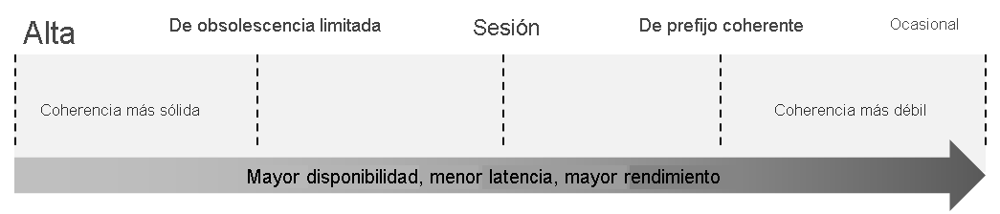

<h1 align="center"><ins>RUTA 4: DESARROLLO DE SOLUCIONES QUE USAN AZURE COSMOS DB</ins></h1>
<h2 align="center">MÓDULO 1 - EXPLORACIÓN DE AZURE COSMOS DB</h2>

### Identificación de las principales ventajas de Azure Cosmos DB

Azure Cosmos DB es una base de datos NoSQL totalmente administrada diseñada para proporcionar una latencia baja, una escalabilidad elástica del rendimiento, una semántica bien definida para la coherencia de los datos y una alta disponibilidad.

Puede configurar sus bases de datos para que se distribuyan de manera global y estén disponibles en cualquiera de las regiones de Azure. Para reducir la latencia, coloque los datos en la ubicación más cercana a la de los usuarios. Elegir las regiones requeridas depende del alcance global de la aplicación y de dónde se encuentran los usuarios.

Con Azure Cosmos DB, puede agregar o quitar las regiones asociadas con su cuenta en cualquier momento. La aplicación no necesita pausarse o volver a implementarse para agregar o quitar una región.

#### Ventajas clave de distribución global

Con el novedoso protocolo de replicación de arquitectura multimaestro, todas las regiones admiten lecturas y escrituras. La funcionalidad de arquitectura multimaestro también habilita lo siguiente:

- Escalabilidad de escritura y lectura elásticas ilimitada.
- 99,999 % de disponibilidad de lectura y escritura en todo el mundo.
- Garantía de lecturas y escrituras atendidas en menos de 10 milisegundos en el percentil 99.

La aplicación puede realizar casi en tiempo real lecturas y escrituras en todas las regiones que eligió para la base de datos. De manera interna, Azure Cosmos DB controla la replicación de datos entre regiones de una manera que garantiza el nivel de coherencia elegido.

Ejecutar una base de datos en varias regiones aumenta la disponibilidad de la base de datos. Si alguna región no está disponible, otras regiones gestionan automáticamente las solicitudes de la aplicación. Azure Cosmos DB ofrece el 99,999 % de disponibilidad de lectura y escritura para las bases de datos de varias regiones.

### Exploración de la jerarquía de recursos

La cuenta de Azure Cosmos DB es la unidad fundamental de distribución global y alta disponibilidad. La cuenta de Azure Cosmos DB contiene un nombre DNS único y puede administrar una cuenta mediante Azure Portal, la CLI de Azure o mediante el uso de diferentes SDK específicos del idioma. Para distribuir globalmente los datos y el rendimiento entre varias regiones de Azure, puede agregar y quitar regiones de Azure en su cuenta en cualquier momento.

#### Elementos de una cuenta de Azure Cosmos DB

En Azure Cosmos DB, un contenedor es la unidad fundamental de escalabilidad. Prácticamente puede tener un rendimiento aprovisionado (RU/s) y un almacenamiento ilimitado en un contenedor. Azure Cosmos DB realiza particiones de forma transparente en el contenedor mediante la clave de partición lógica que especifique para escalar elásticamente el rendimiento y el almacenamiento aprovisionados.

Actualmente, puede crear un máximo de 50 cuentas de Azure Cosmos DB en una suscripción de Azure (este es un límite flexible que se puede aumentar a través de una solicitud de soporte técnico). Después de crear una cuenta en su suscripción a Azure, puede administrar los datos en la cuenta mediante la creación de bases de datos, contenedores y elementos.

En la siguiente imagen se muestra la jerarquía de diferentes entidades en una cuenta de Azure Cosmos DB:

Imagen en la que se muestra la jerarquía de las entidades de Azure Cosmos DB: las cuentas de base de datos se encuentran en la parte superior, las bases de datos se agrupan en cuentas y los contenedores, en bases de datos.

#### Bases de datos de Azure Cosmos DB

Puede crear una o varias bases de datos de Azure Cosmos DB en su cuenta. Una base de datos es análoga a un espacio de nombres. Una base de datos es la unidad de administración de un conjunto de contenedores de Azure Cosmos DB.

#### Contenedores de Azure Cosmos DB

Un contenedor de Azure Cosmos DB es la unidad de escalabilidad del rendimiento y almacenamiento aprovisionados. Un contenedor se divide de forma horizontal y luego se replica en varias regiones. Los elementos que se agregan al contenedor se agrupan automáticamente en particiones lógicas, que se distribuyen entre particiones físicas, en función de la clave de partición. El rendimiento de un contenedor se distribuye uniformemente entre las particiones físicas.

Al crear un contenedor, debe configurar el rendimiento de uno de los siguientes modos:

- Modo de rendimiento aprovisionado dedicado: el rendimiento aprovisionado en un contenedor está reservado exclusivamente para ese contenedor y lo respaldan los Acuerdos de Nivel de Servicio.

- Modo de rendimiento aprovisionado compartido: estos contenedores comparten el rendimiento aprovisionado con los demás contenedores de la misma base de datos (excepto aquellos contenedores que han sido configurados con un rendimiento aprovisionado dedicado). En otras palabras, el rendimiento aprovisionado en la base de datos se comparte entre todos los contenedores de "rendimiento compartidos".

Un contenedor es un contenedor de elementos sin esquemas. Los elementos de un contenedor pueden tener esquemas arbitrarios. Por ejemplo, un elemento que representa a una persona y otro elemento que representa un automóvil se pueden colocar en el mismo contenedor. De forma predeterminada, todos los elementos que agregue a un contenedor se indexan automáticamente sin requerir ningún índice explícito ni administración de esquema.

#### Elementos de Azure Cosmos DB

En función de la API que use, un elemento de Azure Cosmos DB puede representar un documento de una colección, una fila de una tabla, o un nodo o un borde de un grafo.

### Exploración de los niveles de coherencia

Azure Cosmos DB se aproxima a la coherencia de datos como un espectro de opciones en lugar de como dos extremos. La coherencia fuerte y la posible coherencia están en los extremos del espectro, pero existen muchas opciones de coherencia en todo el espectro. Los desarrolladores pueden usar estas opciones para elegir opciones precisas y compensaciones pormenorizadas con respecto a la alta disponibilidad y al rendimiento.

Azure Cosmos DB ofrece cinco niveles bien definidos. De más fuerte a más débil, los niveles son:

- Alta
- Uso vinculado
- Sesión
- Prefijo coherente
- Ocasional

Cada nivel proporciona equilibrio entre la disponibilidad y el rendimiento. En la imagen siguiente se muestran los distintos niveles de coherencia como un espectro.

Los niveles de coherencia son independientes de la región y están garantizados para todas las operaciones, independientemente de la región desde la que se realizan las operaciones de lectura y escritura, del número de regiones asociadas con la cuenta de Azure Cosmos DB o de si la cuenta está configurada para una o varias regiones de escritura.

La coherencia de lectura se aplica a una operación de lectura limitada a un intervalo de claves de partición o una partición lógica. Un cliente remoto o un procedimiento almacenado pueden emitir la operación de lectura.

### Selección del nivel de coherencia adecuado

Cada uno de los modelos de coherencia se puede usar para escenarios reales específicos. Cada uno de ellos proporciona una disponibilidad y un rendimiento precisos, y están respaldados por acuerdos de nivel de servicio completos. Las siguientes consideraciones sencillas le ayudan a tomar la decisión correcta en muchos escenarios comunes.

#### Configuración del nivel de coherencia predeterminado

Puede configurar el nivel de coherencia predeterminado de su cuenta de Azure Cosmos DB en cualquier momento. El nivel de coherencia predeterminado configurado en su cuenta se aplica a todas las bases de datos y contenedores de Azure Cosmos DB de esa cuenta. Todas las operaciones de lectura y consulta que se emitan con arreglo a un contenedor o una base de datos usan el nivel de coherencia especificado de forma predeterminada.

La coherencia de lectura se aplica a una sola operación de lectura limitada a una partición lógica. Un cliente remoto o un procedimiento almacenado pueden emitir la operación de lectura.

#### Garantías asociadas a los niveles de coherencia

Azure Cosmos DB garantiza que el 100 por ciento de las solicitudes de lectura cumplan con la garantía de coherencia del nivel de coherencia que elija. Las definiciones precisas de los cinco niveles de coherencia de Azure Cosmos DB que usan el lenguaje de especificación TLA+ se proporcionan en el repositorio azure-cosmos-tla de GitHub.

##### Coherencia fuerte
La coherencia fuerte ofrece una garantía de linearización. La linearización hace referencia a la capacidad de servir solicitudes simultáneamente. Se garantiza que las lecturas devuelven la versión más reciente de un elemento. Un cliente nunca ve una escritura no confirmada ni parcial. Se garantiza que los usuarios siempre leerán la escritura confirmada más reciente.

##### Coherencia de obsolescencia limitada
En la obsolescencia limitada se garantiza que las lecturas respetan la garantía de prefijo coherente. Las lecturas pueden ir con retraso respecto a las escrituras en un máximo de versiones "K" (es decir, "actualizaciones") de un elemento o en el intervalo de tiempo "T" , lo que se lea primero. En otras palabras, cuando elige la obsolescencia limitada, la "obsolescencia" se puede configurar de dos maneras:

- El número de versiones (K) del elemento
- El intervalo de tiempo (T) que las lecturas pueden retrasarse con respecto a las escrituras

En el caso de una cuenta de una sola región, el valor mínimo de K y T es de 10 operaciones de escritura o de 5 segundos. En el caso de cuentas de varias regiones, el valor mínimo de K y T es de 100 000 operaciones de escritura o de 300 segundos.

##### Coherencia de sesión
En la coherencia de sesión, en una sesión de cliente individual, se garantiza que las lecturas respetan las garantías de prefijo coherente, lecturas monotónicas, escrituras monotónicas, lectura de la escritura y escritura tras las lecturas. Esto da por hecho una sesión de "escritor" individual o el uso compartido del token de sesión para varios escritores.

##### Coherencia de prefijo coherente
En prefijo coherente, las actualizaciones hechas como escrituras de documentos únicos ven la coherencia final. Novedades hechas como un lote dentro de una transacción, se devuelven coherentes con la transacción en la que se confirmaron. Las operaciones de escritura dentro de una transacción de varios documentos siempre están visibles juntas.

Supongamos que se realizan dos operaciones de escritura en los documentos Doc1 y Doc2, dentro de las transacciones T1 y T2. Cuando el cliente hace una lectura en cualquier réplica, el usuario ve "Doc1 v1 y Doc2 v1" o " Doc1 v2 y Doc2 v2", pero nunca "Doc1 v1 y Doc2 v2" o "Doc1 v2 y Doc2 v1" en la misma operación de lectura o consulta.

##### Coherencia final
En la coherencia final, no hay ninguna garantía de ordenación para las lecturas. En ausencia de escrituras adicionales, las réplicas terminarán por converger.

La coherencia final es la forma más débil de coherencia, ya que un cliente puede leer los valores que son más antiguos que los que había leído antes. La coherencia final es ideal cuando la aplicación no requiere ninguna garantía de ordenación. Algunos ejemplos son el recuento de retweets, el número de Me gusta o comentarios no encadenados.

### Exploración de las API admitidas

Azure Cosmos DB ofrece varias API de base de datos, entre las que se incluyen las siguientes:

- Azure Cosmos DB para NoSQL
- Azure Cosmos DB for MongoDB
- Azure Cosmos DB para PostgreSQL
- Azure Cosmos DB for Apache Cassandra
- Azure Cosmos DB for Table
- Azure Cosmos DB for Apache Gremlin
  
Con estas API, puede modelar datos reales mediante documentos, clave-valor, grafos y modelos de datos de familia de columnas. Estas API permiten que las aplicaciones traten Azure Cosmos DB como si fueran otras tecnologías de bases de datos, sin la sobrecarga de los enfoques de administración y escalado.

#### Consideraciones al elegir una API

La API para NoSQL es nativa de Azure Cosmos DB.

Las API para MongoDB, PostgreSQL, Cassandra, Gremlin y Table implementan el protocolo de conexión de los motores de base de datos de código abierto. Estas API son más adecuadas si se cumplen las condiciones siguientes:

- Si tiene aplicaciones existentes de MongoDB, PostgreSQL, Cassandra o Gremlin.
- Si no quiere reescribir toda la capa de acceso a datos.
- Si quiere usar el ecosistema para desarrolladores de código abierto, los controladores de cliente, la experiencia y los recursos de su base de datos.

#### API para NoSQL

La API para NoSQL de Azure Cosmos DB almacena datos en formato de documento. Ofrece la mejor experiencia integral, ya que se tiene control total sobre la interfaz, el servicio y las bibliotecas cliente del SDK. Toda nueva característica que se implantada en Azure Cosmos DB primero está disponible en las cuentas de la API para NoSQL. Las cuentas NoSQL permiten realizar consultas mediante la sintaxis del Lenguaje de consulta estructurado (SQL).

#### API para MongoDB

La API para MongoDB de Azure Cosmos DB almacena los datos en una estructura de documentos a través del formato BSON. Es compatible con el protocolo de conexión de MongoDB; sin embargo, no usa ningún código nativo relacionado con MongoDB. La API para MongoDB es una excelente opción si desea usar el ecosistema y las aptitudes más amplios de MongoDB, sin poner en peligro el uso de características de Azure Cosmos DB.

#### API para PostgreSQL
Azure Cosmos DB for PostgreSQL es un servicio administrado para ejecutar PostgreSQL a cualquier, con la superpotencia del código abierto de Citus de tablas distribuidas. Almacena datos en un único nodo o distribuidos en una configuración de varios nodos.

#### API para Apache Cassandra

La API para Cassandra de Azure Cosmos DB almacena los datos en el esquema orientado a columnas. Apache Cassandra ofrece un enfoque de escalado horizontal y altamente distribuido para almacenar grandes volúmenes de datos, al tiempo que ofrece un enfoque flexible para un esquema orientado a columnas. La API para Cassandra de Azure Cosmos DB se alinea con esta filosofía relativa a las bases de datos NoSQL distribuidas. Esta API para Cassandra es compatible con el protocolo de conexión nativo de Apache Cassandra.

#### API para Apache Gremlin

La API para Gremlin de Azure Cosmos DB permite a los usuarios realizar consultas de grafos y almacenar datos como bordes y vértices.

Use la API para Gremlin en los escenarios que:

- Impliquen datos dinámicos
- Impliquen datos con relaciones complejas
- Impliquen datos demasiado complejos para modelar con bases de datos relacionales
- Desee usar el ecosistema y las aptitudes de Gremlin existentes

#### API para Table

La API para Table de Azure Cosmos DB almacena datos en formato clave-valor. Si actualmente usa Azure Table Storage, es posible que observe algunas limitaciones en la latencia, el escalado, el rendimiento, la distribución global, la administración de índices y el bajo rendimiento de las consultas. La API para Table supera estas limitaciones y se recomienda migrar la aplicación si quiere aprovechar las ventajas de Azure Cosmos DB. La API para Table solo admite escenarios OLTP.

### Detección de las unidades de solicitud

Con Azure Cosmos DB, paga por el rendimiento que aprovisiona y el almacenamiento que consume cada hora. Se debe aprovisionar el rendimiento para garantizar que siempre haya suficientes recursos del sistema disponibles para la base de datos de Azure Cosmos.

Azure Cosmos DB normaliza el costo de todas las operaciones de base de datos y este se expresa en unidades de solicitud (o RU, para abreviar). Una unidad de solicitud representa los recursos del sistema, como CPU e IOPS, y la memoria que se necesitan para realizar las operaciones de base de datos que admite Azure Cosmos DB.

El costo de realizar una lectura puntual, que consiste en obtener un solo elemento por su identificador y el valor de clave de partición, para un elemento de 1 kB es de 1 RU. A todas las demás operaciones de base de datos se les asigna de forma similar un costo en términos de unidades de solicitud. Con independencia de qué API use para interactuar con el contenedor de Azure Cosmos, los costos siempre se miden por RU. Si la operación de base de datos es una escritura, una lectura puntual o una consulta, los costos siempre se miden en RU.

En la siguiente imagen se muestra el concepto de unidades de solicitud a grandes rasgos:

El tipo de cuenta de Azure Cosmos DB que usa determina el modo en que se cobrarán las RU consumidas. Hay tres modos en los que se puede crear una cuenta:

- Modo de rendimiento aprovisionado: en este modo, el aprovisionamiento del número de RU para la aplicación se realiza por segundos en incrementos de 100 RU/segundo. Para escalar el rendimiento aprovisionado para la aplicación, puede aumentar o disminuir el número de RU en cualquier momento, en incrementos o decrementos de 100 RU. Puede realizar los cambios mediante programación o en Azure Portal. Puede aprovisionar el rendimiento en el nivel de granularidad del contenedor y la base de datos.

- Modo sin servidor: en este modo, no es necesario aprovisionar rendimiento al crear recursos en una cuenta de Azure Cosmos DB. Al final del período de facturación, se le factura el número de unidades de solicitud consumidas por las operaciones de base de datos.

- Modo de escalabilidad automática: en este modo, puede escalar de forma automática e instantánea el rendimiento (RU/s) de la base de datos o del contenedor en función de su uso. Esta operación de escalado no afecta a la disponibilidad, la latencia, la capacidad de proceso o el rendimiento de la carga de trabajo. Este modo es adecuado para cargas de trabajo críticas que tienen patrones de tráfico variables o imprevisibles y requieren SLA para el alto rendimiento y la escala.