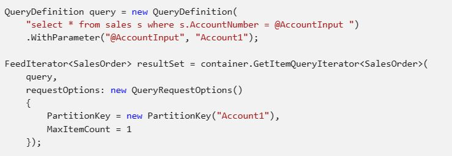
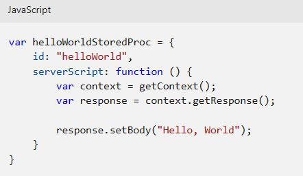
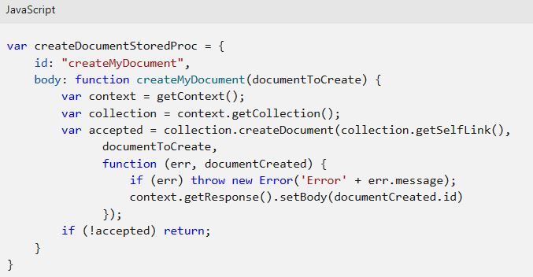
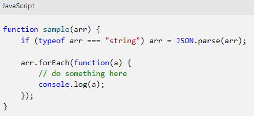
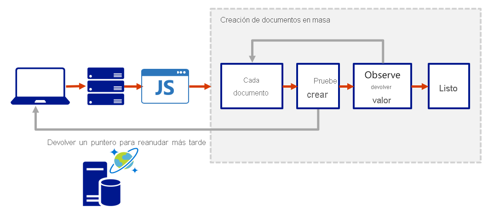
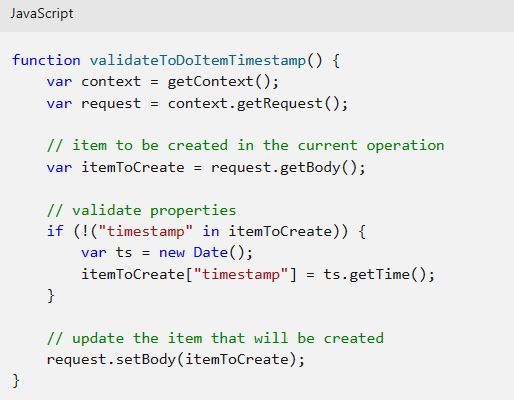
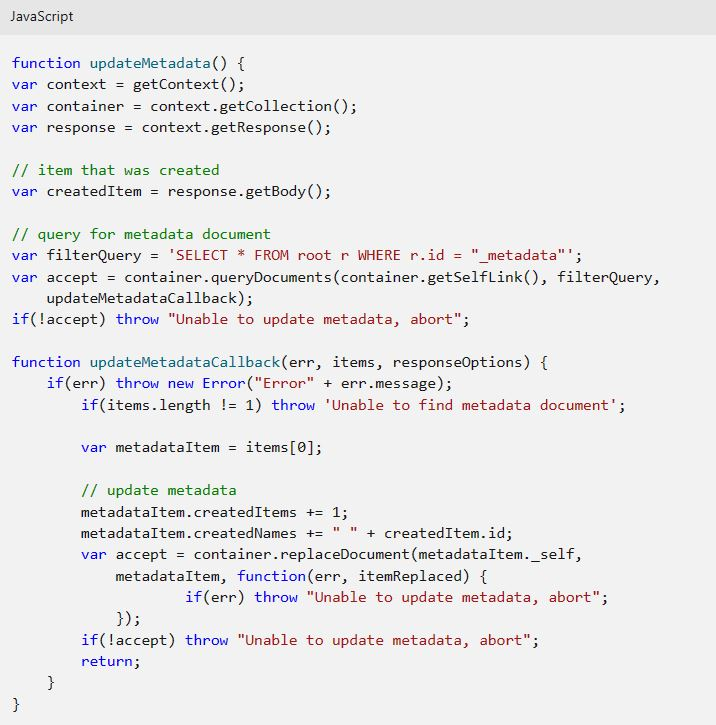
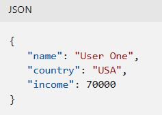
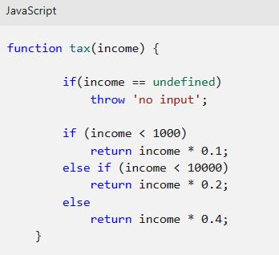
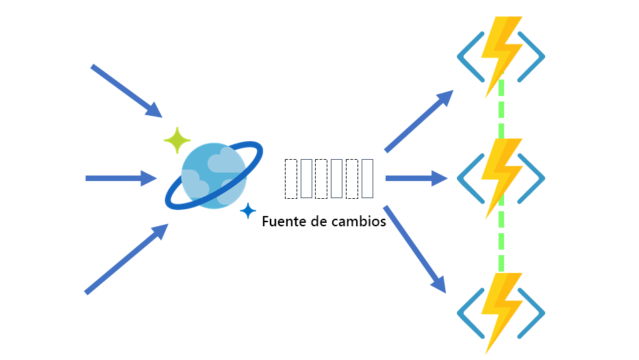

<h1 align="center"><ins>RUTA 4: DESARROLLO DE SOLUCIONES QUE USAN AZURE COSMOS DB</ins></h1>
<h2 align="center">MÓDULO 2 - TRABAJO CON AZURE COSMOS DB</h2>

### Exploración del SDK v3 de Microsoft .NET para Azure Cosmos DB

Esta unidad se centra en el SDK v3 de .NET de Azure Cosmos DB para la API para NoSQL. (paquete de NuGet Microsoft.Azure.Cosmos). Si está familiarizado con la versión anterior del SDK de .NET, puede que ya conozca los términos "recopilación" y "documento".

El repositorio **azure-cosmos-dotnet-v3** GitHub incluye las soluciones de ejemplo de .NET más recientes. Utilice estas soluciones para realizar CRUD (crear, leer, actualizar y eliminar) y otras operaciones comunes en los recursos de Azure Cosmos DB.

Dado que Azure Cosmos DB admite varios modelos de API, la versión 3 del SDK de .NET usa los términos genéricos "contenedor" y "elemento". Un contenedor puede ser una colección, un grafo o una tabla. Un elemento puede ser un documento, un borde o vértice, o una fila, y es el contenido dentro de un contenedor.

A continuación se muestran ejemplos en los que se enseñan algunas de las operaciones clave con las que debe estar familiarizado. Para ver más ejemplos, visite el vínculo de GitHub que se muestra anteriormente. En los ejemplos siguientes se usa la versión asincrónica de los métodos.

#### CosmosClient

Crea un nuevo elemento CosmosClient con una cadena de conexión. El elemento CosmosClient es seguro para subprocesos. Se recomienda mantener una única instancia de CosmosClient por duración de la aplicación, que permite una administración de la conexión y un rendimiento eficaces.

CosmosClient client = new CosmosClient(endpoint, key);

#### Ejemplos de base de datos

##### Crear una base de datos
CosmosClient.CreateDatabaseIfNotExistsAsync comprueba si existe una base de datos y, si no, la crea. Solo se usa el elemento id de la base de datos para comprobar si hay una base de datos existente.

// An object containing relevant information about the response  
DatabaseResponse databaseResponse = await client.CreateDatabaseIfNotExistsAsync(databaseId, 10000);

##### Lectura de una base de datos por identificador
Lee una base de datos del servicio Azure Cosmos DB como una operación asincrónica.

DatabaseResponse readResponse = await database.ReadAsync();

##### Eliminación de una base de datos
Elimina una base de datos como una operación asincrónica.

await database.DeleteAsync();

#### Ejemplos de contenedor

##### Crear un contenedor
El método Database.CreateContainerIfNotExistsAsync comprueba si existe un contenedor y, si no, lo crea. Solo se usa el elemento id del contenedor para comprobar si hay un contenedor existente.

// Set throughput to the minimum value of 400 RU/s  
ContainerResponse simpleContainer = await database.CreateContainerIfNotExistsAsync(
    id: containerId,
    partitionKeyPath: partitionKey,
    throughput: 400);

##### Obtención de un contenedor por el identificador
Container container = database.GetContainer(containerId);  
ContainerProperties containerProperties = await container.ReadContainerAsync();

##### Eliminación de un contenedor
Elimina un contenedor como una operación asincrónica.

await database.GetContainer(containerId).DeleteContainerAsync();

#### Ejemplos de elementos

##### Crear un elemento
Use el método Container.CreateItemAsync para crear un elemento. El método requiere un objeto serializable JSON que debe contener una propiedad id y un elemento partitionKey.

ItemResponse<SalesOrder> response = await container.CreateItemAsync(salesOrder, new PartitionKey(salesOrder.AccountNumber));

##### Lectura de un elemento
Use el método Container.ReadItemAsync para leer un elemento. El método requiere el tipo para serializar el elemento en junto con una propiedad id y un elemento partitionKey.

string id = "[id]";  
string accountNumber = "[partition-key]";  
ItemResponse<SalesOrder> response = await container.ReadItemAsync(id, new PartitionKey(accountNumber));  

##### Consulta de un elemento
El método Container.GetItemQueryIterator crea una consulta para los elementos de un contenedor en una base de datos de Azure Cosmos mediante una instrucción SQL con valores con parámetros. Devuelve FeedIterator.

### Creación de procedimientos almacenados

Azure Cosmos DB ofrece una ejecución transaccional integrada del lenguaje de JavaScript que le permite escribir procedimientos almacenados, desencadenadores y funciones definidas por el usuario (UDF) . Para llamar a un procedimiento almacenado, desencadenador o función definida por el usuario, debe registrarlos. Para obtener más información, consulte How to work with stored procedures, triggers, user-defined functions in Azure Cosmos DB (Trabajo con procedimientos almacenados, desencadenadores y funciones definidas por el usuario en Azure Cosmos DB).

Nota: Esta unidad se centra en los procedimientos almacenados; en la siguiente unidad se tratan los desencadenadores y las funciones definidas por el usuario.

#### Escritura de procedimientos almacenados

Los procedimientos almacenados pueden crear, actualizar, leer, consultar y eliminar elementos dentro de un contenedor de Azure Cosmos. Los procedimientos almacenados se registran por colección y pueden funcionar en cualquier documento o dato adjunto presente en esa colección.

Este es un sencillo procedimiento almacenado que devuelve una respuesta "Hola mundo".

El objeto de contexto proporciona acceso a todas las operaciones que se pueden realizar en Azure Cosmos DB, y acceso a los objetos de solicitud y respuesta. En este caso, usará el objeto de respuesta para establecer el cuerpo de la respuesta que se devolverá al cliente.

#### Creación de un elemento con el procedimiento almacenado

Cuando se crea un elemento mediante el procedimiento almacenado, se inserta en el contenedor de Azure Cosmos y se devuelve un identificador para el elemento recién creado. La creación de un elemento es una operación asincrónica y depende de las funciones de devolución de llamada de JavaScript. La función de devolución de llamada tiene dos parámetros:

- El objeto de error en caso de que se produzca un error en la operación
- Un valor devuelto
  
Dentro de la devolución de llamada, puede controlar la excepción o lanzar un error. En caso de que no se proporcione una devolución de llamada y haya un error, el sistema en tiempo de ejecución de Azure Cosmos DB genera un error.

El procedimiento almacenado también incluye un parámetro para establecer la descripción, que es un valor booleano. Cuando el parámetro se establece en true y falta la descripción, el procedimiento almacenado iniciará una excepción. En caso contrario, el resto del procedimiento almacenado continúa ejecutándose.

Este procedimiento almacenado toma como entrada documentToCreate, el cuerpo de un documento que se va a crear en la colección actual. Todas estas operaciones son asíncronas y dependen de las devoluciones de llamadas de función de JavaScript. La función de devolución de llamada tiene dos parámetros, uno para el objeto de error en caso de que falle la operación y otro para el objeto creado. Dentro de la devolución de llamada, los usuarios pueden controlar la excepción o lanzar un error. En caso de que no se proporcione una devolución de llamada y haya un error, el sistema en tiempo de ejecución de DocumentDB inicia un error.

#### Matrices como parámetros de entrada para procedimientos almacenados

Al definir un procedimiento almacenado en Azure Portal, los parámetros de entrada siempre se envían como una cadena al procedimiento almacenado. Incluso si pasa una matriz de cadenas como entrada, la matriz se convierte en cadena y se envía al procedimiento almacenado. Para solucionar este problema, puede definir una función en el procedimiento almacenado para analizar la cadena como una matriz. El código siguiente muestra cómo analizar un parámetro de entrada de cadena como una matriz:

#### Ejecución vinculada

Todas las operaciones de Azure Cosmos DB deben completarse en un período de tiempo limitado. Los procedimientos almacenados tienen una cantidad limitada de tiempo para ejecutarse en el servidor. Todas las funciones de recopilación devuelven un valor booleano que representa si esa operación se completa, o no.

#### Transacciones en procedimientos almacenados

Puede implementar las transacciones en los elementos dentro de un contenedor mediante el uso de un procedimiento almacenado. Las funciones de JavaScript pueden implementar un modelo basado en continuación para procesar por lotes o reanudar la ejecución. El valor de continuación puede ser cualquier valor de su elección y las aplicaciones pueden usar este valor para reanudar una transacción desde un nuevo punto de partida. En el diagrama siguiente se muestra cómo se puede usar el modelo de continuación de transacciones para repetir una función del lado servidor hasta que la función finalice toda la carga de trabajo de procesamiento.

### Creación de desencadenadores y funciones definidas por el usuario

Azure Cosmos DB admite desencadenadores previos y posteriores. Los desencadenadores previos se ejecutan antes de modificar un elemento de la base de datos, y los desencadenadores posteriores se ejecutan después de modificar un elemento de la base de datos. Los desencadenadores no se ejecutan automáticamente, sino que deben especificarse para cada operación de base de datos en la que quiere que se ejecuten. Después de definir un desencadenador, debe registrarlo mediante los SDK de Azure Cosmos DB.

Para obtener ejemplos de cómo registrar un desencadenador y llamar a él, vea desencadenadores previos y posteriores.

#### Desencadenadores previos

En el ejemplo siguiente se muestra cómo se usa un desencadenador previo para validar las propiedades de un elemento de Azure Cosmos que se está creando, agrega una propiedad timestamp a un elemento recién agregado si no contiene una.

Los desencadenadores previos no pueden tener parámetros de entrada. El objeto solicitado en el desencadenador se utiliza para manipular el mensaje de solicitud asociado con la operación. En el ejemplo anterior, el desencadenador previo se ejecuta al crear un elemento de Azure Cosmos, y el cuerpo del mensaje de la solicitud contiene el elemento que se creará en formato JSON.

Cuando se registran los desencadenadores, puede especificar las operaciones que se pueden ejecutar con ellos. Este desencadenador se debería crear con un valor TriggerOperation de TriggerOperation.Create, lo que significa que no se permite usar el desencadenador en una operación de reemplazo.

Para obtener ejemplos de cómo registrar y llamar a un desencadenador previo, consulte el artículo sobre desencadenadores previos.

#### Desencadenadores posteriores

En el ejemplo siguiente se muestra un desencadenador posterior. Este desencadenador consulta el elemento de metadatos y lo actualiza con detalles del elemento recién creado.

Es importante tener en cuenta la ejecución transaccional de los desencadenadores en Azure Cosmos DB. El desencadenador posterior se ejecuta como parte de la misma transacción para el propio elemento subyacente. Una excepción durante la ejecución del desencadenador posterior producirá un error de toda la transacción. Todo lo que esté confirmado se revierte y se devuelve una excepción.

#### Funciones definidas por el usuario

En el ejemplo siguiente se crea una UDF para calcular los impuestos sobre la renta para diferentes niveles de renta. A continuación, se usaría esta función definida por el usuario dentro de una consulta. Para los fines de este ejemplo, suponga hay un contenedor denominado "Ingresos" con las siguientes propiedades:

Lo siguiente es una definición de función para calcular los impuestos sobre la renta para diferentes niveles de renta:

### Exploración de la fuente de cambios en Azure Cosmos DB

La fuente de cambios de Azure Cosmos DB es un registro persistente de cambios en un contenedor en el orden en que se producen. La compatibilidad con la fuente de cambios en Azure Cosmos DB se proporciona al observar si hay algún cambio en un contenedor de Azure Cosmos DB. A continuación, muestra la lista ordenada de los documentos que han cambiado en el orden en el que se modificaron. Los cambios se conservan y se pueden procesar de manera asincrónica e incremental, y la salida se puede distribuir entre uno o varios consumidores para procesarse en paralelo.

#### Fuente de cambios y operaciones diferentes

Actualmente, verá todas las inserciones y actualizaciones en la fuente de cambios. No se puede filtrar la fuente de cambios para un tipo de operación específico. Actualmente, la fuente de cambios no registra las operaciones de eliminación. Como solución alternativa, puede agregar un marcador flexible en los elementos que se van a eliminar. Por ejemplo, puede agregar un atributo en el elemento denominado "deleted", establecer su valor en "true" y, luego, definir un valor de período de vida (TTL) en el elemento. Al establecer el TTL se garantiza que el elemento se elimine automáticamente.

#### Lectura de la fuente de cambios de Azure Cosmos DB

Puede trabajar con la fuente de cambios de Azure Cosmos DB mediante un modelo de inserción o un modelo de extracción. Con un modelo de inserción, el procesador de fuente de cambios envía el trabajo a un cliente que tiene la lógica de negocios para procesarlo. Sin embargo, el procesador de fuente de cambios se encarga de la complejidad de comprobar el trabajo y almacenar el estado del último trabajo procesado.

Con un modelo de extracción, el cliente tiene que extraer el trabajo del servidor. En este caso, el cliente no solo tiene lógica de negocios para procesar el trabajo, sino que también almacena el estado del último trabajo procesado. De este modo, se encarga del equilibrio de carga entre varios clientes que procesan el trabajo en paralelo, así como de los errores.

Nota: Se recomienda usar el modelo de inserción porque no tendrá que preocuparse por sondear la fuente de cambios para futuros cambios, almacenar el estado del último cambio procesado y otras ventajas.

La mayoría de los escenarios que usan la fuente de cambios de Azure Cosmos DB usarán una de las opciones del modelo de inserción. Sin embargo, hay algunas situaciones en las que es preferible el control de bajo nivel adicional del modelo de extracción. Entre ellas se incluyen las siguientes:

- Leer cambios de una clave de partición determinada.
- Controlar el ritmo con el que el cliente recibe los cambios para procesarlos.
- Realizar una lectura única de los datos existentes en la fuente de cambios (por ejemplo, para realizar una migración de datos).

#### Lectura de la fuente de cambios con un modelo de inserción

Hay dos formas de leer desde la fuente de cambios con un modelo de inserción: los desencadenadores de Azure Functions para Azure Cosmos DB y la biblioteca de procesadores de fuente de cambios. Azure Functions usa el procesador de fuente de cambios en segundo plano, por lo que ambas son formas similares de leer la fuente de cambios. Simplemente, piense en Azure Functions como una plataforma de hospedaje para el procesador de fuente de cambios, no como una forma totalmente diferente de leer la fuente de cambios. Azure Functions usa el procesador de fuente de cambios en segundo plano, ejecuta en paralelo de forma automática el procesamiento de los cambios en las particiones del contenedor.

##### Azure Functions
Puede crear pequeñas funciones reactivas de Azure Functions que se desencadenarán automáticamente en cada nuevo evento en la fuente de cambios de su contenedor de Azure Cosmos DB. Con el desencadenador de Azure Functions para Azure Cosmos DB, puede usar el escalado del procesador de fuente de cambios y la funcionalidad de detección de eventos confiable sin necesidad de mantener ninguna infraestructura de trabajo.

##### Procesador de fuente de cambios
El procesador de fuente de cambios es parte de los SDK .NET V3 and Java V4 de Azure Cosmos DB. Simplifica el proceso de lectura de la fuente de cambios y distribuye el procesamiento de eventos entre varios consumidores de manera eficaz.

Hay cuatro componentes principales en la implementación del procesador de fuente de cambios:

1. El contenedor supervisado: el contenedor supervisado tiene los datos a partir de los cuales se genera la fuente de cambios. Todas las inserciones y actualizaciones realizadas en el contenedor supervisado se reflejan en la fuente de cambios del contenedor.

2. El contenedor de concesión: el contenedor de concesión actúa como un almacenamiento de estado y coordina el procesamiento de la fuente de cambios entre varios trabajadores. El contenedor de concesión se puede almacenar en la misma cuenta que el contenedor supervisado o en una cuenta independiente.

3. Instancia de proceso: una instancia de proceso hospeda el procesador de fuente de cambios para escuchar los cambios. En función de la plataforma, podría representarse mediante una máquina virtual, un pod de Kubernetes, una instancia de Azure App Service, una máquina física real. Tiene un identificador único al que se hace referencia como nombre de instancia a lo largo de este artículo.

4. El delegado: el delegado es el código que define lo que usted, el desarrollador, desea hacer con cada lote de cambios que el procesador de la fuente de cambios lea.

Al implementar el procesador de fuente de cambios, el punto de entrada siempre es el contenedor supervisado, desde una instancia de Container a la que llama GetChangeFeedProcessorBuilder.

Se muestran 2 códigos extensos con ejemplos. No los copio porque por un lado no entran en una captura de pantalla y por otro tampoco estoy entendiendo este tema.

Después, defina el nombre de instancia de proceso o el identificador único con WithInstanceName; debe ser único y diferente en cada instancia de proceso que va a implementar y, por último, cuál es el contenedor para mantener el estado de concesión con WithLeaseContainer.

La llamada a Build le proporcionará la instancia del procesador que puede iniciar mediante una llamada a StartAsync.

El ciclo de vida normal de una instancia de host es:

1. Leer la fuente de cambios.
2. Si no hay ningún cambio, mantenerse suspendida durante un período de tiempo predefinido (personalizable con WithPollInterval en Builder) e ir a n.º 1.
3. Si hay cambios, enviarlos al delegado.
4. Cuando el delegado termina de procesar los cambios correctamente, se actualiza el almacén de concesión con el último punto en el tiempo procesado y se vuelve al primer paso.