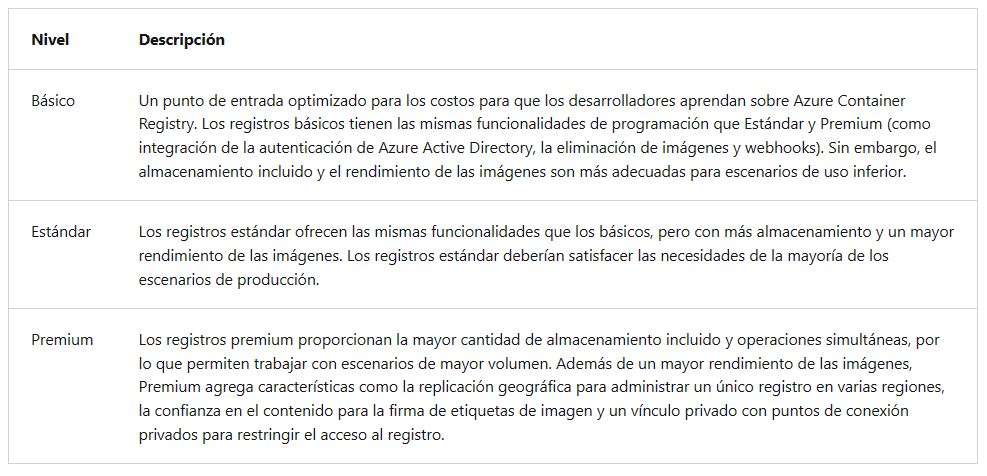
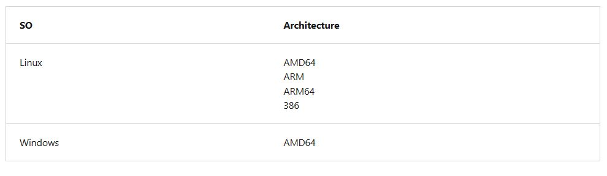
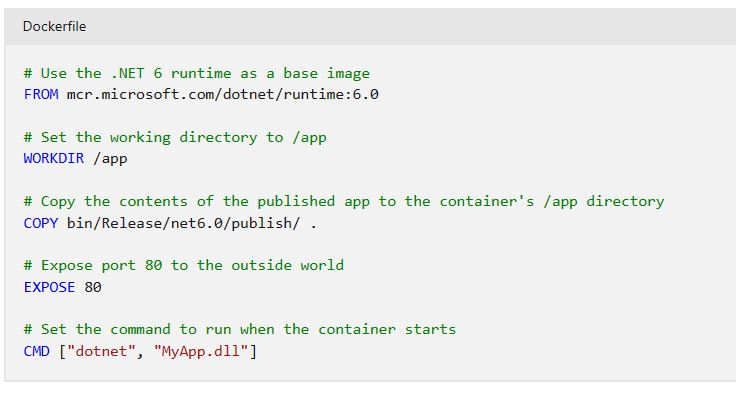

<h1 align="center"><ins>RUTA 5: IMPLEMENTACIÓN DE SOLUCIONES EN CONTENEDORES</ins></h1>
<h2 align="center">MÓDULO 1 - ADMINISTRACIÓN DE IMÁGENES DE CONTENEDOR EN AZURE CONTAINER REGISTRY</h2>

### Información sobre Azure Container Registry

Use el servicio Azure Container Registry (ACR) con las canalizaciones de implementación y desarrollo de contenedores existentes, o bien use Azure Container Registry Tasks para compilar imágenes de contenedor en Azure. Compile a petición o automatice completamente las compilaciones con desencadenadores como las confirmaciones del código fuente y las actualizaciones de la imagen de base.

#### Casos de uso

Extraiga imágenes desde un registro de contenedor de Azure a varios destinos de implementación:

- Sistemas de orquestación escalables que administran aplicaciones en contenedores en clústeres de hosts, incluidos Kubernetes, DC/OS y Docker Swarm.
- Servicios de Azure que admiten la creación y ejecución de aplicaciones a escala, incluidos Azure Kubernetes Service (AKS), App Service, Batch, Service Fabric y otros.
  
Los desarrolladores también pueden insertar en un registro de contenedor como parte de un flujo de trabajo de desarrollo de contenedor. Por ejemplo, puede dirigir un registro de contenedor desde una herramienta de entrega e integración continuas como Azure Pipelines o Jenkins.

Configure ACR Tasks para que recompile automáticamente imágenes de aplicaciones cuando se actualicen sus imágenes base o automatice las compilaciones de imágenes cuando el equipo guarde el código en un repositorio de Git. Cree tareas de varios pasos para automatizar la compilación, prueba y aplicación de revisiones de varias imágenes de contenedor en paralelo en la nube.

#### Niveles del servicio Azure Container Registry

Azure Container Registry está disponible en varios niveles de servicio. Estos niveles ofrecen precios predecibles y varias opciones para alinearse con la capacidad y los patrones de uso de su registro de Docker privado en Azure.

#### Imágenes y artefactos admitidos

Las imágenes se agrupan en un repositorio y cada una es una instantánea de solo lectura de un contenedor compatible con Docker. Los registros de contenedor de Azure pueden incluir imágenes de Windows y de Linux. Además de las imágenes de contenedor de Docker, Azure Container Registry almacena los formatos de contenido relacionados, como los gráficos de Helm y las imágenes creadas para la especificación de formato de imagen de Open Container Initiative (OCI).

#### Compilaciones de imágenes automatizadas

Use Azure Container Registry Tasks (ACR Tasks) para simplificar la creación, la prueba, el envío de cambios y la implementación de imágenes en Azure. Configure las tareas de compilación para automatizar el sistema operativo del contenedor y la canalización de aplicaciones de revisión de marcos, y compile imágenes de forma automática cuando el equipo guarde el código en el control de origen.

### Exploración de las funcionalidades de almacenamiento

Los niveles de Azure Container Registry, ya sea Básico, Estándar o Premium, se gozan de características avanzadas de almacenamiento de Azure, como el cifrado en reposo y redundancia geográfica para proteger la seguridad de los datos de la imagen.

- **Cifrado en reposo:** todas las imágenes de contenedor del registro se cifran en reposo. Azure cifra automáticamente una imagen antes de almacenarla y la descifra sobre la marcha cuando usted o sus aplicaciones y servicios extraen la imagen.

- **Almacenamiento regional:** Azure Container Registry almacena datos en la región donde se crea el registro, para ayudar a los clientes a cumplir los requisitos de cumplimiento y residencia de datos. En todas las regiones excepto el Sur de Brasil y el Sudeste Asiático, Azure también puede almacenar los datos del registro en una región emparejada en la misma geografía. En las regiones del Sur de Brasil y del Sudeste Asiático, los datos del registro siempre se limitan a la región, para adaptarse a los requisitos de residencia de datos para esas regiones.

Si se produce una interrupción regional, los datos del registro pueden dejar de estar disponibles y no se recuperan automáticamente. Los clientes que quieran tener sus datos de registro almacenados en varias regiones para conseguir un mejor rendimiento en distintas zonas geográficas o que quieran tener resistencia en caso de una interrupción regional deben habilitar la replicación geográfica.

- **Redundancia de zona:** es una característica del nivel Premium y usa zonas de disponibilidad de Azure para replicar el registro en un mínimo de tres zonas independientes en cada región habilitada.

- **Almacenamiento escalable:** Azure Container Registry permite crear tantos repositorios, imágenes, capas o etiquetas como necesite, hasta el límite de almacenamiento del registro.

Unas cifras altas de etiquetas y repositorios pueden afectar al rendimiento del registro. Elimine periódicamente los repositorios, etiquetas e imágenes que no use como parte de su rutina de mantenimiento del registro. Los recursos del registro eliminados, como repositorios, imágenes y etiquetas, no pueden recuperarse después de la eliminación.

### Compilación y administración de contenedores con tareas

ACR Tasks es un conjunto de características que se encuentran en Azure Container Registry. Proporciona la creación de imágenes de contenedor basadas en la nube para plataformas como Linux, Windows y Azure Resource Manager, y puede automatizar la aplicación de revisiones de sistema operativo y marco para los contenedores de Docker. ACR Tasks permite compilaciones automatizadas activadas por actualizaciones de código fuente, actualizaciones de la imagen base de un contenedor o temporizadores.

#### Escenarios de tareas

ACR Tasks admite varios escenarios para compilar y mantener imágenes de contenedor y otros artefactos.

- Tarea rápida: compile e inserte una sola imagen de contenedor en un registro de contenedor a petición en Azure, sin tener que realizar una instalación local del motor de Docker. Considere que docker build, es docker push en la nube.

- Tareas desencadenadas automáticamente: habilite uno o varios desencadenadores para compilar una imagen:

1. Desencadenar al actualizar el código fuente
2. Desencadenar al actualizar la imagen base
3. Desencadenar de acuerdo con una programación

- Tarea de varios pasos: amplíe la funcionalidad de inserción y compilación de una única imagen de ACR Tasks con flujos de trabajo basados en varios contenedores y varios pasos.

Cada tarea de ACR tiene un contexto de código fuente asociado (la ubicación de un conjunto de archivos de código fuente que se usa para compilar una imagen de contenedor u otro artefacto). Los ejemplos de contextos incluyen un repositorio GIT o un sistema de archivos local.

#### Tarea rápida

Antes de confirmar la primera línea de código, la característica de tareas rápidas de ACR Tasks puede proporcionar una experiencia de desarrollo integrado mediante la descarga de compilaciones de imágenes de contenedor en Azure. Con tareas rápidas, puede comprobar sus definiciones de compilación automatizadas y detectar posibles problemas antes de confirmar el código.

Usando el formato conocido docker build, el comando az acr build de la CLI de Azure toma un contexto (el conjunto de archivos que se van a compilar), lo envía a ACR Tasks y, de forma predeterminada, inserta la imagen compilada en su registro tras completarse.

#### Desencadenamiento de una tarea al actualizar el código fuente

Desencadene una compilación de imágenes de contenedor o una tarea de varios pasos cuando se confirme el código, o bien se actualice o realice una solicitud de incorporación de cambios, en un repositorio de Git en GitHub o Azure DevOps Services. Por ejemplo, configure una tarea de compilación con el comando az acr task create de la CLI de Azure especificando un repositorio GIT y, opcionalmente, una rama y un Dockerfile. Cuando el equipo actualiza el código en el repositorio, un webhook creado por ACR Tasks desencadena una compilación de la imagen de contenedor definida en el repositorio.

#### Desencadenar al actualizar la imagen base

Puede configurar una instancia de ACR Tasks para realizar el seguimiento de una dependencia de una imagen base al compilar una imagen de aplicación. Cuando la imagen base actualizada se inserta en el registro, o una imagen base se actualiza en un repositorio público, como en Docker Hub, ACR Tasks puede compilar automáticamente cualquier imagen de aplicación basada en ella.

#### Programación de una tarea

Puede programar una tarea mediante la configuración de uno o más desencadenadores de temporizador al crear o actualizar la tarea. La programación de una tarea resulta útil para ejecutar cargas de trabajo de contenedor según una programación definida o para ejecutar operaciones de mantenimiento o pruebas en imágenes insertadas periódicamente en el registro.

#### Tareas de varios pasos

Las tareas de varios pasos, definidas en un archivo YAML especifican operaciones de compilación e inserción individuales para imágenes de contenedor u otros artefactos. También pueden definir la ejecución de uno o más contenedores, donde cada paso utiliza el contenedor como su entorno de ejecución. Por ejemplo, puede crear una tarea de varios pasos que automatice lo siguiente:

1. Crear una imagen de aplicación web
2. Ejecutar el contenedor de aplicaciones web
3. Crear una imagen de prueba de aplicación web
4. Ejecutar el contenedor de prueba de aplicaciones web, que realiza pruebas en el contenedor de aplicaciones en ejecución
5. Si se superan las pruebas, compilar un paquete de archivo de gráfico de Helm
6. Realizar una acción helm upgrade con el nuevo paquete de archivo de gráfico de Helm

#### Plataformas de imagen

De forma predeterminada, ACR Tasks compila imágenes para el sistema operativo Linux y la arquitectura AMD64. Especifique la etiqueta --platform para compilar imágenes de Windows o imágenes de Linux para otras arquitecturas. Especifique el sistema operativo y, opcionalmente, una arquitectura admitida en formato de arquitectura o sistema operativo (por ejemplo,--platform Linux/arm). En el caso de las arquitecturas ARM, especifique opcionalmente una variante en formato de sistema operativo,arquitectura o variante (por ejemplo,--platform Linux/arm64/v8):

### Exploración de los elementos de un Dockerfile

Un Dockerfile es un script que contiene una serie de instrucciones que se usan para compilar una imagen de Docker. Los Dockerfile suelen incluir la siguiente información:

- La imagen base o primaria que usamos para crear la nueva imagen.
- Los comandos para actualizar el sistema operativo base e instalar otro software.
- Los artefactos de compilación que se incluirán, como una aplicación desarrollada.
- Los servicios que se expondrán, como la configuración de red y del almacenamiento.
- El comando que se ejecutará cuando se inicie el contenedor.

#### Creación de un archivo Dockerfile

El primer paso para crear un Dockerfile es elegir una imagen base que sirva como base para la aplicación. Por ejemplo, si va a compilar una aplicación .NET, puede elegir una imagen de Microsoft .NET como base.

Vamos a recorrer cada línea para ver lo que hace:

- FROM mcr.microsoft.com/dotnet/runtime:6.0: este comando establece la imagen base en el entorno de ejecución de .NET 6, que es necesario para ejecutar aplicaciones de .NET 6.
- WORKDIR /app: establece el directorio de trabajo en /app, que es donde se copian los archivos de la aplicación.
- COPY bin/Release/net6.0/publish/ .: copia el contenido de la aplicación publicada en el directorio /app del contenedor. Se supone que la aplicación de .NET 6 ya se ha compilado y publicado en el directorio bin/Release/net6.0/publish.
- EXPOSE 80: expone el puerto 80, que es el puerto HTTP predeterminado, al mundo exterior. Cambie esta línea en consecuencia si la aplicación escucha en un puerto diferente.
- CMD ["dotnet", "MyApp.dll"]: el comando que se va a ejecutar cuando se inicie el contenedor. En este caso, estamos ejecutando el comando dotnet con el nombre del archivo DLL de nuestra aplicación (MyApp.dll). Cambie esta línea para que coincida con el nombre de las aplicaciones y el punto de entrada.
  
No vamos a tratar la especificación de archivo de Dockerfile. Visite la referencia de Dockerfile para obtener más información. En cada uno de estos pasos se crea una imagen de contenedor en caché a medida que compilamos la imagen de contenedor final. Estas imágenes temporales se superponen encima de la anterior y se presentan como una sola imagen una vez completados todos los pasos.