<h2 align="center"><ins>PREGUNTAS AZ-204 RUTAS MICROSOFT LEARN</ins></h2> 

<b>1. ¿Cuál de las siguientes categorías de plan de App Service proporciona las capacidades máximas de escalabilidad horizontal?</b>
- Proceso dedicado.
- Aislado.  &emsp; &emsp; &emsp; &emsp; <b>CORRECTO</b>
- Proceso compartido.

"La categoría Aislado proporciona aislamiento de red y proceso, y tiene la capacidad máxima de escalabilidad horizontal."

<b>2. ¿Cuál de las siguientes características de red de App Service puede usarse para controlar el tráfico de red saliente?</b>
- Dirección asignada a las aplicaciones.
- Conexiones híbridas.  &emsp; &emsp; &emsp; &emsp; <b>CORRECTO</b>
- Puntos de conexión del servicio.

"Las conexiones híbridas son una característica de red saliente."

<b>3. ¿En cuál de las siguientes categorías de configuración de la aplicación establecería el idioma y la versión del SDK?</b>
- Configuración de la aplicación. **ERROR AL CONTESTAR:** Esta categoría se una para configurar opciones que pasan a la aplicación en el entorno de ejecución.
- Asignaciones de ruta de acceso.
- Configuración general.  &emsp; &emsp; &emsp; &emsp; <b>CORRECTO</b>

"La categoría de configuración general se usa para configurar las opciones de pila, la plataforma, la depuración y el certificado de cliente entrante."

<b>4. ¿Cuál de los siguientes tipos de registro de aplicaciones se admite en la plataforma Linux?</b>
- Registro del servidor web.
- Seguimiento de solicitudes con error.
- Registro de implementación.  &emsp; &emsp; &emsp; &emsp; <b>CORRECTO</b>

<b>5. ¿Cuál de estas afirmaciones describe mejor el escalado automático?</b>
- El escalado automático requiere la supervisión activa de la carga de trabajo de un sistema por parte de un administrador.
- El escalado automático es una solución para escalar y reducir horizontalmente.  &emsp; &emsp; &emsp; &emsp; <b>CORRECTO</b>
- El escalado vertical y la reducción vertical proporcionan una mejor disponibilidad que el escalado automático.

"El sistema puede escalar horizontalmente cuando las métricas de recursos especificadas indican un aumento del uso y reducir horizontalmente cuando estas métricas disminuyan."

<b>6. ¿Cuál de estos escenarios sería adecuado para el escalado automático?</b>
- El número de usuarios que requieren acceso a una aplicación varía según una programación periódica. Por ejemplo, más usuarios usan el sistema los viernes que otros días de la semana.  &emsp; &emsp; &emsp; &emsp; <b>CORRECTO</b>
- El sistema está sujeto a un flujo repentino de solicitudes que hace que el sistema se detenga.
- Su organización ofrece una promoción y espera ver un aumento del tráfico en el sitio web durante las próximas dos semanas.

"Los cambios en la carga de la aplicación que son predecibles son buenos candidatos para el escalado automático."

<b>7. De forma predeterminada todas las solicitudes que realiza el cliente a la direción URL de producción de la aplicación (http://<app_name>.azurewebsites.net) se enrutan al espacio de producción. Se puede enrutar automáticamente parte del tráfico a otra ranura. ¿Cuál es la regla de enrutamiento predeterminada que se aplica a las nuevas ranuras de implementación?</b>
- 0%.  &emsp; &emsp; &emsp; &emsp; <b>CORRECTO</b>
- 10%.
- 20%.

"De forma predeterminada, a las ranuras nuevas se les da una regla de enrutamiento de 0%."

<b>8. Algunos elementos de configuración siguen al contenido en los intercambios (no son específicos de la ranura), mientras que otros permanecen en la misma ranura después de este (específicos). ¿Cuáles de los siguientes valores se intercambian?</b>
- Extremos de publicación.
- Contenido de WebJobs.  &emsp; &emsp; &emsp; &emsp; <b>CORRECTO</b>
- Programadores de WebJobs.

<b>9. ¿Cuál de las siguients opciones de hospedaje de Azure Functions es mejor cuando se requiere poder predecir el escalado y los costos?</b>
- Plan Premium de Functions.
- Plan dedicado.  &emsp; &emsp; &emsp; &emsp; <b>CORRECTO</b>
- Plan de consumo.

"Los planes dedicados se ejecutan en App Service, que admite la configuración de reglas de escalado automático en función del uso predictivo."

<b>10. Una organización quiere implementar un flujo de trabajo sin servidor para resolver un problema empresarial. Uno de los requisitos e que la solución debe usar un modelo de desarrollo orientado al diseñador (declarativo). ¿Cuál de las opciones siguientes cumple los requisitos?</b>
- Azure Functions.
- Azure Logic Apps.  &emsp; &emsp; &emsp; &emsp; <b>CORRECTO</b>
- Trabajos Web.

"Azure Logic Apps permite cargas de trabajo sin servidor y usa un modelo de desarrollo orientado al diseñador (declarativo)."

<b>11. ¿Cuál de las siguientes opciones es necesaria para que se ejecute una función?</b>
- Enlace.
- Desencadenador.  &emsp; &emsp; &emsp; &emsp; <b>CORRECTO</b>
- Desencadenadores y enlaces.

"Un desencadenador define cómo se invoca una función y cada función debe tener exactamente un desencadenador."

<b>12. ¿Cuál de las siguientes opciones admite las configuraciones de dirección in y out?</b>
- Enlaces.  &emsp; &emsp; &emsp; &emsp; <b>CORRECTO</b>
- Desencadenador.
- Valor de conexión.
  
 <h2 align="center"><ins>PREGUNTAS AZ-204 FREE EXAMS</ins></h2> 

<b>1. You manage an Azure App Service web app named app1. App1 is registered as an application in Azure Active Directory (Azure AD). You need to ensure that Azure AD signed-in user information can be retrieved by app1 by using Microsoft Graph. What should you configure?</b>
- appRoles.
- Application permissions.
- GroupMembershipClaims.
- Delegated permissions.  &emsp; &emsp; &emsp; &emsp; <b>CORRECTO</b>

"This item test the candidate's knowlegde of accessing user data from Microsoft Graph, which is part of implementing user authentication and authorization. Delegated permissions are used by apps that have a signed-in user present. For these apps, either the user or an administrator consents to the permissions that the app requests and the app can be assigned to users, groups or service principals. Application permissions are used by apps that run without a signed-in user present. For example, apps that run as background services or daemons. An administrator can only permit application permissions. GroupMembershipClaims is an attribute in the application manifest of the registered application that configures the groups claim issued in a user or OAuth 2.0 access token that the app expects. AppRoles, application permissions and GroupMembershipClaims will not allow signed-in user information to be retrieved in the code."

<b>2. You manage an Azure App Service web app named app1. App1 is registered as a multi-tenant application in an Azure Active Directory (Azure AD) tenant named tenant1. You need to grant app1 the permission to access the Microsoft Graph API in tenant1. Which service principal should you use?</b>
- Legacy.
- System-assigned managed identity.
- Application.  &emsp; &emsp; &emsp; &emsp; <b>CORRECTO</b>
- User-assigned managed identity.

"This item test the candidate's knowlegde of accessing user data from Microsoft Graph, which is part of implementing user authentication and authorization. An Azure AD application is defined by its one and only application object, which resides in the Azure AD tenant where the application was registered (known as the application's home tenant). The application service principal is a legacy app, which is an app created before app registrations were introduced or an app created through legacy experiences. Managed identities eliminate the need to manage credentials in code. A system-assigned managed identity is restricted to one per resource and is tied to the lifecycle of the resource. Managed identities for Azure resources eliminate the need to manage credentials in code. A user-assigned managed identity can be created and assigned to one or more instances of an Azure service. The legacy, system-assigned managed identity, and user-assigned managed identity cannot be used to assign permission for app1 in tenant1 to access the Microsoft Graph API."

<b>3. You develop a multitenant web application named App1. You plan to register App1 with multiple Azure Active Directory (Azure AD) tenants. You need to identify the relationship between the application objects and security principals associated with App1. Which relationship should you identify?</b>
- App1 will have multiple application objects and multiple service principals.
- App1 will have multiple application objects and a single service principal.
- App1 will have a single application object and multiple service principals.  &emsp; &emsp; &emsp; &emsp; <b>CORRECTO</b>
- App1 will have a single application object and a single service principal.

"This item tests the candidate's knowledge of configuring authentication of multitenant applications, which is a common scenario when implementing authentication. App1 will have a single application object and multiple service principals."

<b>4. You plan to generate a shared access signature (SAS) token for read access to a blob in a storage account. You need to secure the token from being compromised. What should you use?</b>
- Primary account key.
- Secondary account key.
- Azure AD credentials assigned the Contributor role.  &emsp; &emsp; &emsp; &emsp; <b>CORRECTO</b>
- Azure AD credentials assigned the Reader role.

"This item test the candidate's knowledge of Azure Storage shared access signatures (SAS). Azure AD credentials are required to generate the SAS token. The account used must have the Microsoft.Storage/storageAccounts/blobServices/generateUserDelegationKey permission, which is present in the following built-in roles: Contributor, Storage Account Contributor, Storage Blob Data Contributor, Storage Blob Data Owner, Storage Blob Data Reader and Storage Blob Delegator. The account key can be used to generate the SAS token, but it can be more easily compromised."

<b>5. You have 10 applications running in Azure App Service. You need to ensure the applications have access to items stored in Azure App Configuration by using a common configuration. Passwords or keys must not be used. Which solution should you use?</b>
- System-assigned managed identities.
- User-assigned managed identity.  &emsp; &emsp; &emsp; &emsp; <b>CORRECTO</b>
- Service principal with permissions to Azure App Configuration.
- Developer's credentials in code.

"This item test the candidate's knowlegde of managed identities. User-assigned managed identities are a way to reuse the permissions across applications. User-assigned managed identities associate the managed identity to the new applications, with no keys or passwords. System-assigned managed identities use a new identity for each application, which does not meet the common configuration requirement. A service principal has keys that no need to be rotated. The developer does not run the application, so the developer's identity cannot be assumed."

<b>6. You need to group keys in Azure App Configuration. What are two possible ways to achieve this goal?</b>
- Use Azure role-based access control. Grant the Read permission to read keys that belong to the application.
- Organize keys by using key prefixes.  &emsp; &emsp; &emsp; &emsp; <b>CORRECTO</b>
- Use managed identity. Grant the Read permission to read keys that belong to the application.
- Organize keys by using labels.  &emsp; &emsp; &emsp; &emsp; <b>CORRECTO</b>

"This item test the candidate's knowledge of best practices when working with keys in Azure App Configuration. Key prefixes are the beginning parts of keys. A set of keys can be grouped by using the same prefix in names. Labels are an attribute on keys. Labels are used to create variants of a key. For example, labels can be assigned to multiple versions of a key. Authorizing role-based access control to read Azure App Configuration is not a valid way to group keys. Authorizing a managed identity to read Azure App Configuration is not a valid way to group keys."

 <h2 align="center"><ins>PREGUNTAS AZ-204 EXAMTOPICS</ins></h2> 
<h3 align="center"><ins>QUESTION SET 1</h3> 

<b>1. You have two Hyper-V hosts named Host1 and Host2. Host1 has an Azure virtual machine named VM1 that was deployed by using a custom Azure Resource Manager template. You need to move VM1 to Host2. What should you do?</b>
- From the Update management blade, click Enable.
- From the Overwiew blade, move VM1 to a different subscription.
- From the Redeploy blade, click Redeploy.  &emsp; &emsp; &emsp; &emsp; <b>CORRECTO</b>
- From the Profile blade, modify the usage location.

"When you redeploy a VM, it moves the VM to a new node within the Azure infrastructure and the powers it back on, retaining all your configuration options and associated resources."SET 1

<b>2. You have downloaded an Azure Resource Manager template to deploy numerous virtual machines. The template is based on a current virtual machine, but must be adapted to reference an administrative password. You need to make sure that the password is not stored in plain text. You are preparing to create the necessary components to achieve your goal. Which of the following should you create to achieve you goal?</b>
- An Azure Key Vault.  &emsp; &emsp; &emsp; &emsp; <b>CORRECTO</b>
- An Azure Storage account.
- Azure Active Directory (AD) Identity Protection.
- An access policy.  &emsp; &emsp; &emsp; &emsp; <b>CORRECTO</b>
- An Azure policy.
- A backup policy.

<b>3.Your company has an Azure Kubernetes Service (AKS) cluster that you manage from an Azure AD-joined device. The cluster is located in a resource group. Developers have created an application named MyApp. MyApp was packaged into a container image. You need to deploy the YAML manifest file for the application. Solution: You install the Azure CLI on the device and run the "kubectl apply f myapp.yaml" command. Does this meet the goal?</b>
- Yes.  &emsp; &emsp; &emsp; &emsp; <b>CORRECTO</b>
- No.

"kubectl apply -f myapp.yaml applies a configuration change to a resource from a file or stdin"

<b>4. Your company has an Azure Kubernetes Service (AKS) cluster that you manage from an Azure AD-joined device. The cluster is located in a resource group. Developers have created an application named MyApp. MyApp was packaged into a container image. You need to deploy the YAML manifest file for the application. Solution: You install the docker client on the device and run the "docker run -it microsoft/azure-cli:0.10.17" command. Does this meet the goal?</b>
- Yes.
- No.  &emsp; &emsp; &emsp; &emsp; <b>CORRECTO</b>

<b>5. Your company has a web app named WebApp1. You use the WebJobs SDK to design a triggered App Service background task that automatically invokes a function in the code every time new data is received in a queue. You are preparing to configure the service processes a queue data item. Which of the following is the service you should use?</b>
- Logic Apps.
- WebJobs.  &emsp; &emsp; &emsp; &emsp; <b>CORRECTO</b>
- Flow.
- Functions.

<b>6. Your company has an Azure subscription. You need to deploy a number of Azure virtual machines to the subscription by using Azure Resource Manager (ARM) templates. The virtual machines will be included in a single availability set. You need to ensure that the ARM template allows for as many virtual machines as possible to remain accessible in the event of fabric failure or maintenance. Which of the following is the value that you should configure for the platformFaultDomainCount property?</b>
- <label>10.</label>
- <label>30.</label>
- Min Value.
- Max Value.  &emsp; &emsp; &emsp; &emsp; <b>CORRECTO</b>
  
"The number os fault domains for managed availability sets varies by region - either two or three per region."

<b>7. Your company has an Azure subscription. You need to deploy a number of Azure virtual machines to the subscription by using Azure Resource Manager (ARM) templates. The virtual machines will be included in a single availability set. You need to ensure that the ARM template allows for as many virtual machines as possible to remain accessible in the event of fabric failure or maintenance. Which of the following is the value that you should configure for the platformUpdateDomainCount property?</b>
- <label>10.</label>
- <label>20.</label>
- <label>30.</label>
- <label>40.</label>  &emsp; &emsp; &emsp; &emsp; <b>CORRECTO</b>

"Each virtual machine in your availability set is assigned an update domain and a fault domain by the underlying Azure platform. For a given availability set, five non-user-configurable update domains are assigned by default (Resource Manager deployments can then be increased to provide up to 20 update domains) to indicate groups of virtual machines and underlying physical hardware that can be rebooted at the same time."

<b>8. You are creating an Azure Cosmos DB account that makes use of the SQL API. Data will be added to the account every day by a web application. You need to ensure that an email notification is sent when information is received from IoT devices, and that compute cost is reduced. You decide to deploy a function app. Which of the following should you configure the function app to use?</b>
- Azure Cosmos DB connector.
- SendGrid action.
- Consumption plan.  &emsp; &emsp; &emsp; &emsp; <b>CORRECTO</b>
- Azure Event Hubs binding.
- SendGrid binding.  &emsp; &emsp; &emsp; &emsp; <b>CORRECTO</b>

<b>9. This question requires that you evaluate the underlined text to determine if it is correct.
You company has an on-premises deployment of MongoDB, and an Azure Cosmos DB account that makes use of the MongoDB API.
You need to devise a strategy to migrate MongoDB to the Azure Cosmos DB account.
You include the Data Management Gateway tool in your migration strategy.
Instructions: Review the underlined text. If it makes the statement correct, select `No change required.` If the statement is incorrect, select the answer choice that makes the statement correct.</b>
- No change required.
- Mongorestore.  &emsp; &emsp; &emsp; &emsp; <b>CORRECTO</b>
- Azure Storage Explorer.
- AzCopy.

<b>10. You are developing an e-Commerce Web App. You want to use Azure Key Vault to ensure that sign-ins to the e-Commerce Web App are secured by using Azure App Service authentication and Azure Active Directory (AAD). What should you do on the e-Commerce Web App</b>
- Run the az keyvault secret command.
- Enable Azure AD Connect.
- Enable Managed Service Identity (MSI).  &emsp; &emsp; &emsp; &emsp; <b>CORRECTO</b>
- Create an Azure AD service principal.

"A managed identity from Azure Active Directory allows your app to easily access other AAD-protected resources such as Azure Key Vault."

<b>11. This question requires that you evaluate the underlined text to determine if it is correct.
Your Azure Active Directory Azure (Azure AD) tenant has an Azure subscription linked to it.
Your developer has created a mobile application that obtains Azure AD access tokens using the OAuth 2 implicit grant type.
The mobile application must be registered in Azure AD.
You require a redirect URI from the developer for registration purposes.
Instructions: Review the underlined text. If it makes the statement correct, select `No change is needed.` If the statement is incorrect, select the answer choice that makes the statement correct.</b>
- No change required.  &emsp; &emsp; &emsp; &emsp; <b>CORRECTO</b>
- A secret.
- A login hint.
- A client ID.

"For Native Applications you need to provide a Redirect URI, which Azure AD will use to return token responses."

<b>12. You are creating an Azure key vault using PowerShell. Objects deleted from the key vault must be kept for a set period of 90 days.
Which two of the following parameters must be used in conjunction to meet the requirement? (Choose two)</b>
- EnabledForDeployment.
- EnablePurgeProtection.  &emsp; &emsp; &emsp; &emsp; <b>CORRECTO</b>
- EnabledForTemplateDeployment.
- EnableSoftDelete.  &emsp; &emsp; &emsp; &emsp; <b>CORRECTO</b>

<b>13. You have an Azure Active Directory (Azure AD) tenant. You want to implement multi-factor authentication by making use of a conditional access policy. The conditional access policy must be applied to all users when they access the Azure portal. Which three settings should you configure?</b>

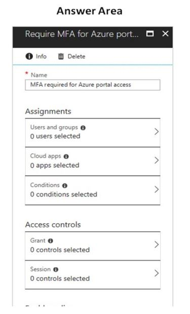
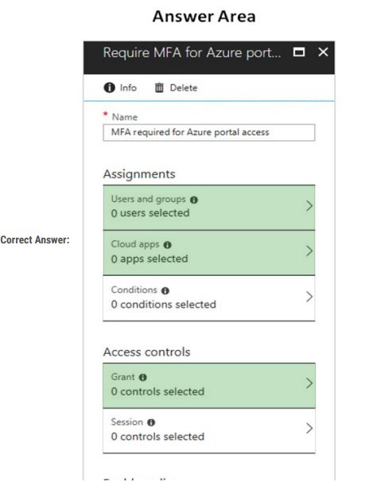

"The conditional access policy must be applied or assigned to Users and Groups.  
The conditional access policy must be applied when users access the Azure portal, which is a cloud app. That is: Microsoft Azure Management.  
Access control must require multi-factor authentication when granting access."

<b>14. You manage an Azure SQL database that allows for Azure AD authentication. You need to make sure that database developers can connect to the SQL database via Microsoft SQL Server Management Studio (SSMS). You also need to make sure the developers use their on-premises Active Directory account for authentication. Your strategy should allow for authentication prompts to be kept to a minimum. Which of the following should you implement?</b>
- Azure AD token.
- Azure Multi-Factor authentication.
- Active Directory integrated authentication.  &emsp; &emsp; &emsp; &emsp; <b>CORRECTO</b>
- OATH software tokens.

"Azure AD can be the initial Azure AD managed domain. Azure AD can also be an on-premises Active Directory Domain Services that is federated with the Azure AD. Using an Azure AD identity to connect using SSMS or SSDT. The following procedures show you how to connect to a SQL database with an Azure AD identity using SQL Server Management Studio or SQL Server Database. Use this method if you are logged in to Windows using your Azure Active Directory credentials from a federated domain. 
1. Start Management Studio or Data Tools and in the Connect to Server (or Connect to Database Engine) dialog box, in the Authentication box, select Active.  

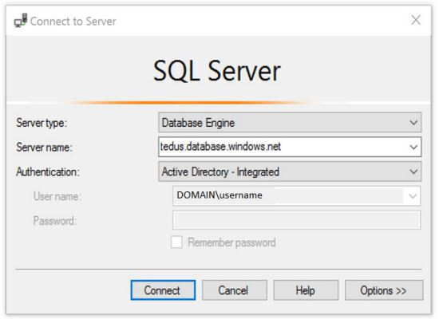

2. Select the Options button, and on the Connection Properties page, in the Connect to database box, type the name of the user database you want to connect to (The AD domain name or tenant ID option is only supported for Universal with MFA connection options, otherwise it is greyed out)."

<b>15. You are developing an application to transfer data between on-premises file servers and Azure Blob storage. The application stores keys, secrets, and certificates in Azure Key Vault and makes use of the Azure Key Vault APIs. You want to configure the application to allow recovery of an accidental deletion of the key vault or key vault objects for 90 days after deletion. What should you do?</b>
- Run the Add-AzKeyVaultKey cmdlet.
- Run the az keyvault update --enable-soft-delete true --enable-purge-protection true CLI.  &emsp; &emsp; &emsp; &emsp; <b>CORRECTO</b>
- Implement virtual network service endpoints for Azure Key Vault.
- Run the az keyvault update --enable-soft-delete false CLI.

"When soft-delete is enabled, resources marked as deleted resources are retained for a specified period (90 days by default). The service further provides a mechanism for recovering the deleted object, essentially undoing the deletion. Purge protection is an optional Key Vault behavior and is not enabled by default. Purge protection can only be enabled once soft-delete is enabled. When purge protection is on, a vault or an object in the deleted state cannot be purged until the retention period has passed. Soft-deleted vaults and objects can still be recovered, ensuring that the retention policy will be followed. The default retention period is 90 days, but it is possible to set the retention policy interval to a value from 7 to 90 days through the Azure portal. Once the retention policy interval is set and saved it cannot be changed for that vault."

<b>16. You have developed a Web App for your company. The Web App provides services and must run in multiple regions. You want to be notified whenever the Web App uses more than 85 percent of the available CPU cores over a 5 minute perior. Your solution must minimize costs. Which command should you use?</b>

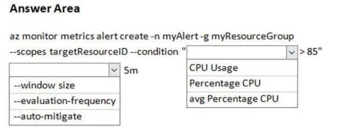
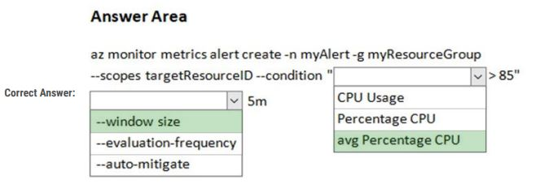

<b>17. The question is included in a number of questions that depicts the identical set-up. However, every question has a distinctive result. Establish if the solution satisfies the requirements:  
You are configuring a web app that delivers streaming video to users. The application makes use of continuous integration and deployment. You need to ensure that the application is highly available and that the users streaming experience is constant. You also want to configure the application to store data in a geographic location that is nearest to the user.  
Solution: You include the use of Azure Redis Cache in your design. Does the solution meet the goal?</b>
- Yes.
- No.  &emsp; &emsp; &emsp; &emsp; <b>CORRECTO</b>

<b>18. The question is included in a number of questions that depicts the identical set-up. However, every question has a distinctive result. Establish if the solution satisfies the requirements:  
You are configuring a web app that delivers streaming video to users. The application makes use of continuous integration and deployment. You need to ensure that the application is highly available and that the users streaming experience is constant. You also want to configure the application to store data in a geographic location that is nearest to the user.  
Solution: You include the use of an Azure Content Delivery Network (CDN) in your design. Does the solution meet the goal?</b>
- Yes.  &emsp; &emsp; &emsp; &emsp; <b>CORRECTO</b>
- No.

<b>19. The question is included in a number of questions that depicts the identical set-up. However, every question has a distinctive result. Establish if the solution satisfies the requirements:  
You are configuring a web app that delivers streaming video to users. The application makes use of continuous integration and deployment. You need to ensure that the application is highly available and that the users streaming experience is constant. You also want to configure the application to store data in a geographic location that is nearest to the user.  
Solution: You include the use of a Storage Area Network (SAN) in your design. Does the solution meet the goal?</b>
- Yes.
- No.  &emsp; &emsp; &emsp; &emsp; <b>CORRECTO</b>

<b>20. You develop a Web App on a tier D1 app service plan. You notice that page load times increase during periods of peak traffic. You want to implement automatic scaling when CPU load is above 80 percent. Your solution must minimize costs. What should you do first?</b>
- Enable autoscaling on the Web App.
- Switch to the Premium App Service tier plan.
- Switch to the Standard App Service tier plan.  &emsp; &emsp; &emsp; &emsp; <b>CORRECTO</b>
- Switch to the Azure App Services consumption plan.

"Configure the web App to the Standard App Service Tier. The Standard tier supports auto-scaling, and we should minimize the costs. We can then enable autoscaling on the web app, add a scale rule and add a Scale condition."

<b>21. Your company's Azure subscription includes an Azure Log Analytics workspace. Your company has a hundred on-premises servers that run either Windows Server 2012 R2 or Windows Server 2016, and is linked to the Azure Log Analytics workspace. The Azure Log Analytics workspace is set uo to gather performance counters associated with security from these linked servers. You must configure alerts based on the information gathered by the Azure Log Analytics workspace. You have to make sure that alert rules allow for dimensions, and that alert creation time should be kept to a minimum. Furthermore, a single alert notification must be created when the alert is created and when the alert is resolved. You need to make use of the necessary signal type when creating the alert rules. Which of the following is the option you should use?</b>
- The Activity log signal type.
- The Application Log signal type.
- The Metric signal type.  &emsp; &emsp; &emsp; &emsp; <b>CORRECTO</b>
- The Audit Log signal type.

"Metric alerts in Azure Monitor provide a way to get notified when one of your metrics cross a threshold. Metric alerts work on a range of multidimensional platform metrics, Application Insights standard and custom metrics. Note: Signals are emitted by the target resource and can be of several types. Metric, Activity log, Application Insights and Log."

<b>22. Your are developing a .NET Core MVC application that allows customers to research independent holiday accommodation providers. You want to implement Azure Search to allow the application to search the index by using various criteria to locate documents related to accommodation. You want the application to allow customers to search the index by using regular expressions. What should you do?</b>
- Configure the SearchMode property of the SeachParameters class.
- Configure the QueryType property of the SearchParameters class.  &emsp; &emsp; &emsp; &emsp; <b>CORRECTO</b>
- Configure the Facets property of the SearchParameters class.
- Configure the Filter property of the SearchParamenters class.

"The SearchParameters QueryType Property gets or sets a value that specifies the syntax of the search query. The default is 'simple'. Use 'full' if your query uses the Lucene query syntax. You can write queries against Azure Search based on the rich Lucene Query Parser syntax for specialized query forms: wildcard, fuzzy search, proximity search, regular expressions are a few examples."

<b>23. You are a developer at your company. You need to update the definitions for an existing Logic App. What should you use?</b>
- The Enterprise Integration Pack (EIP).
- The Logic App Code View.  &emsp; &emsp; &emsp; &emsp; <b>CORRECTO</b>
- The API Connections.
- The Logic Apps Designer.

"Edit JSON Azure Portal:  
1. Sign in to the Azure Portal.  
2. From the left menu, choose All services. In the search box, find "logic apps", and then from the results, select you logic app.  
3. On your logic app's menu, under Development Tools, select Logic App Code View.  
4. The Code View editor opens and shows your logic app definition in JSON format."

<b>24. The question is included in a number of questions that depicts the identical set-up. However, every question has a distinctive result. Establish if the solution satisfies the requirements:  
You are developing a solution for a public facing API. The API back end is hosted in an Azure App Service instance. You have implemented a RESTful service for the API back end. You must configure back-end authentication for the API Management service instance.  
Solution: You configure Basic gateway credentials for the Azure resource. Does the solution meet the goal?</b>
- Yes.
- No.  &emsp; &emsp; &emsp; &emsp; <b>CORRECTO</b>

"API Management allows to secure access to the back-end service of an API using client certificates."

<b>25. The question is included in a number of questions that depicts the identical set-up. However, every question has a distinctive result. Establish if the solution satisfies the requirements:  
You are developing a solution for a public facing API. The API back end is hosted in an Azure App Service instance. You have implemented a RESTful service for the API back end. You must configure back-end authentication for the API Management service instance.  
Solution: You configure Client cert gateway credentials for the HTTP(s) endpoint. Does the solution meet the goal?</b>
- Yes.
- No.  &emsp; &emsp; &emsp; &emsp; <b>CORRECTO</b></b>

"The API back end is hosted in an Azure App Service instance. It is an Azure resource and not an HTTP(s) endpoint."

<b>26. The question is included in a number of questions that depicts the identical set-up. However, every question has a distinctive result. Establish if the solution satisfies the requirements:  
You are developing a solution for a public facing API. The API back end is hosted in an Azure App Service instance. You have implemented a RESTful service for the API back end. You must configure back-end authentication for the API Management service instance.  
Solution: You configure Basic gateway credentials for the HTTP(s) endpoint. Does the solution meet the goal?</b>
- Yes.
- No.  &emsp; &emsp; &emsp; &emsp; <b>CORRECTO</b></b>

"API Management allows to secure access to the back-end service of an API using client certificates. Furthermore, the API back end is hosted in an Azure App Service instance. It is an Azure resource and not an HTTP(s) endpoint."

<b>27. The question is included in a number of questions that depicts the identical set-up. However, every question has a distinctive result. Establish if the solution satisfies the requirements:  
You are developing a solution for a public facing API. The API back end is hosted in an Azure App Service instance. You have implemented a RESTful service for the API back end. You must configure back-end authentication for the API Management service instance.  
Solution: You configure Client cert gateway credentials for the Azure resource. Does the solution meet the goal?</b>
- Yes.  &emsp; &emsp; &emsp; &emsp; <b>CORRECTO</b></b>
- No.

"API Management allows to secure access to the back-end service of an API using client certificates."

<b>28. You are developing a .NET Core MVC application that allows customers to research independent holiday accommodation providers. You want to implement Azure Search to allow the application to search the index by using various criteria to locate documents related to accommodation venues. You want the application to list holiday accommodation venues that fall within a specific price range and are within a specified distance to an airport. What should you do?</b>
- Configure the SearchMode property of the SearchParameters class.
- Configure the QueryType property of the SearchParameters class.
- Configure the Facets property of the SearchParameters class.
- Configure the Filter property of the SearchParameters class.  &emsp; &emsp; &emsp; &emsp; <b>CORRECTO</b></b>

"The Filter property gets or sets the OData $filter expression to apply to the search query."

<b>29. You are a developer at your company. You need to edit the workflows for an existing Logic App. What should you use?</b>
- The Enterprise Integration Pack (EIP).  &emsp; &emsp; &emsp; &emsp; <b>CORRECTO</b></b>
- The Logic App Code View.
- The API Connections.
- The Logic Apps Designer.

"For business-to-business (B2B) solutions and seamless communication between organizations, you can build automated scalable enterprise integration workflows by using the Enterprise Integration Pack (EIP) with Azure Logic App."

<b>30. You are a developer for a company that provides a bookings management service in the tourism industry. You are implementing Azure Search for the tour agencies listed in your company's solution. You create the index in Azure Search. You now need to use the Azure Search .NET SDK to import the relevant data into the Azure Search service. Which three actions should you perform in sequence?</b>
- Create a DataSource instance and set its Container property to the DataContainer.
- Create an IndexBatch that contains the documents which must be added.  &emsp; &emsp; &emsp; &emsp; <b>STEP 2</b></b>
- Set the DataSources property of the SearchServiceClient.
- Create a SearchIndexClient object to connect to the search index. &emsp; &emsp; &emsp; &emsp; <b>STEP 1</b></b>
- Call the Documents.Index method of the SearchIndexClient and pass the IndexBatch. &emsp; &emsp; &emsp; &emsp; <b>STEP 3</b></b>
- Call the Documents.Seggest method of the SearchIndexClient and pass the DataSource.

"1. The index needs to be populated. To do this, we will need a SearchIndexClient. Thre are to ways to obtain one: by constructing it, or by calling Indexex.GetClient on the SearchServiceClient. Here we will use the first method.  
2. Create the indexBatch with the documents.  
Something like:  
var hotels = new Hotel[];  
{  
new Hotel()  
{  
HotelId = "3",  
BaseRate = 129.99,  
Description = "Close to town hall and the river"  
}  
};  
var batch = IndexBatch.Upload(hotels);  
3. The next step is to populate the newly-created index  
Example:  
var batch = IndexBatch.Upload(hotels);  
try  
{  
indexClient.Documents.Index(batch);  
}  

<b>31. You are developing an application that applies a set of governance policies for internal and external services, as well as for applications. You develop a stateful ASP.NET Core 2.1 web application named PolicyApp and deploy it to an Azure App Service Web App. The PolicyApp reacts to events from Azure Event Grid and performs policy actions based on those events. You have the following requirements:
- Authentication events must be used to monitor users when they sign in and sign out.
- All authentication events must be processed by PolicyApp.
- Sign outs must be processed as fast as possible.  
What should you do?</b>
- Create a new Azure Event Grid subscription for all authentication events. Use the subscription to process sign-out events.
- Create a separate Azure Event Grid handler for sign-in and sign-out events.
- Create separate Azure Event Grid topics and subscriptions for sign-in and sign-out events.
- Add a subject prefix to sign-out events. Create an Azure Event Grid subscription. Configure the subscription to use the subjectBeginsWith filter.

<b>32. You are developing a C++ application that compiles to a native application named process.exe. The application accepts images as input and returns images in one of the following image formats: GIF, PNG, or JPEG. You must deploy the application as an Azure Function. You need to configure the function and host json files. How should you complete the json files?</b>

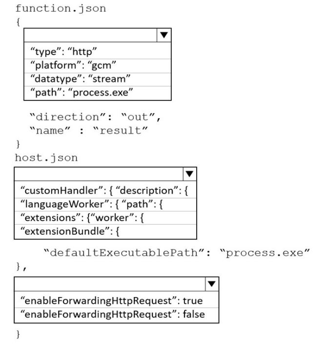
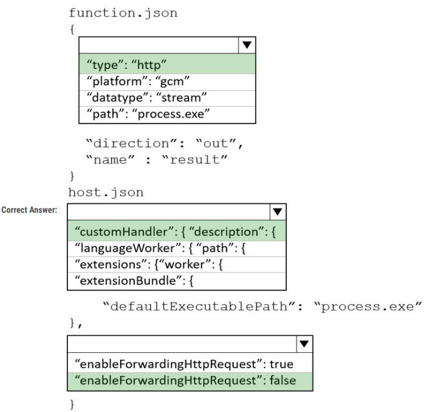

<b>33. You are developing an Azure Static Web app that contains training materials for a tool company. Each tool’s training material is contained in a static web page that is linked from the tool’s publicly available description page. A user must be authenticated using Azure AD prior to viewing training. You need to ensure that the user can view training material pages after authentication. How should you complete the configuration file?</b>

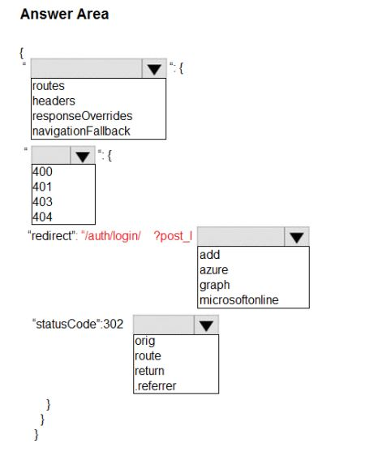
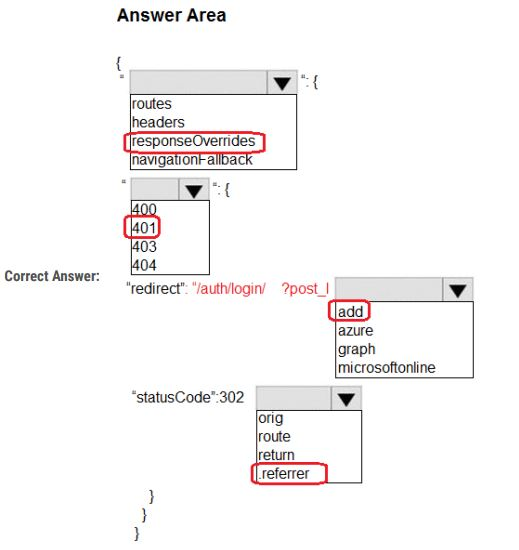

<b>34. You are authoring a set of nested Azure Resource Manager templates to deploy Azure resources. You author an Azure Resource Manager template named mainTemplate.json that contains the following linked templates: linkedTemplate1.json, linkedTemplate2.json. You add parameters to a parameters template file named mainTemplate.parameters.json. You save all templates on a local device in the C:\templates\ folder.  
You have the following requirements:
- Store the templates in Azure for later deployment.
- Enable versioning of the templates.
- Manage access to the templates by using Azure RBAC.
- Ensure that users have read-only access to the templates.
- Allow users to deploy the templates.  
You need to store the templates in Azure. How should you complete the command? </b>

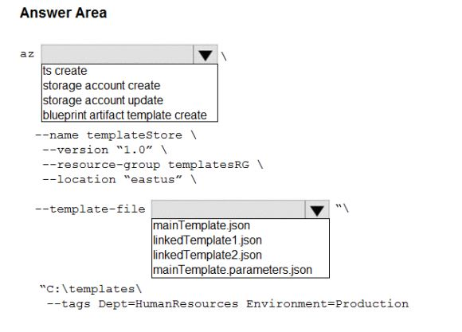
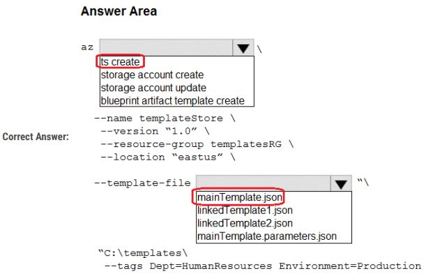

<b>35. You are developing a service where customers can report news events from a browser using Azure Web PubSub. The service is implemented as an Azure Function App that uses the JSON WebSocket subprotocol to receive news events. You need to implement the bindings for the Azure Function App. How should you configure the binding?</b>

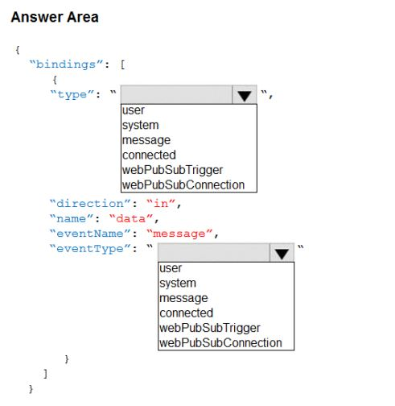
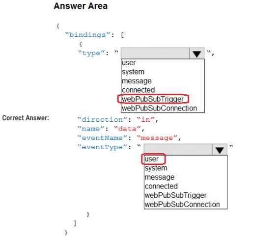

<b>36. You are building a software-as-a-service (SaaS) application that analyzes DNA data that will run on Azure virtual machines (VMs) in an availability zone. The data is stored on managed disks attached to the VM. The performance of the analysis is determined by the speed of the disk attached to the VM. You have the following requirements:
- The application must be able to quickly revert to the previous day’s data if a systemic error is detected.
- The application must minimize downtime in the case of an Azure datacenter outage.  
You need to provision the managed disk for the VM to maximize performance while meeting the requirements. Which type of Azure Managed Disk should you use?</b>

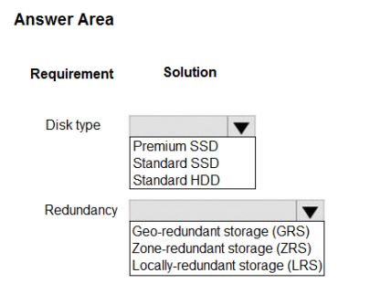
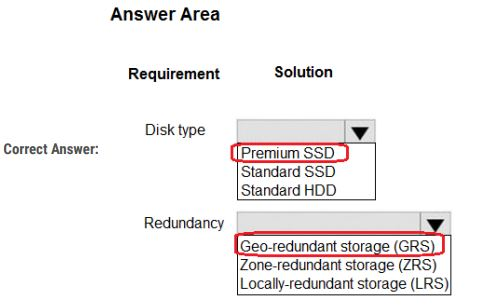

<b>37. You are developing an application that includes two Docker containers. The application must meet the following requirements:
- The containers must not run as root.
- The containers must be deployed to Azure Container Instances by using a YAML file.
- The containers must share a lifecycle, resources, local network, and storage volume.
- The storage volume must persist through container crashes.
- The storage volume must be deployed on stop or restart of the containers.  
You need to configure Azure Container Instances for the application. Which configuration values should you use?</b>

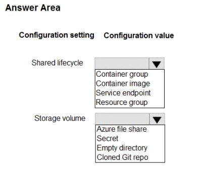
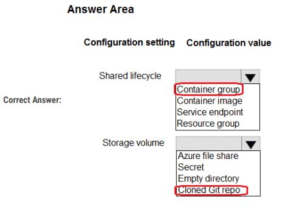

<h3 align="center"><ins>QUESTION SET 2</h3>

<b>1. You are implementing a software as a service (SaaS) ASP.NET Core web service that will run as an Azure Web App. The web service will use an on-premises SQL Server database for storage. The web service also includes a WebJob that processes data updates. Four customers will use the web service.
- Each instance of the WebJob processes data for a single customer and must run as a singleton instance.
- Each deployment must be tested by using deployment slots prior to serving production data.
- Azure costs must be minimized.
- Azure resources must be located in an isolated network.  
You need to configure the App Service plan for the Web App. How should you configure the App Service plan? </b>

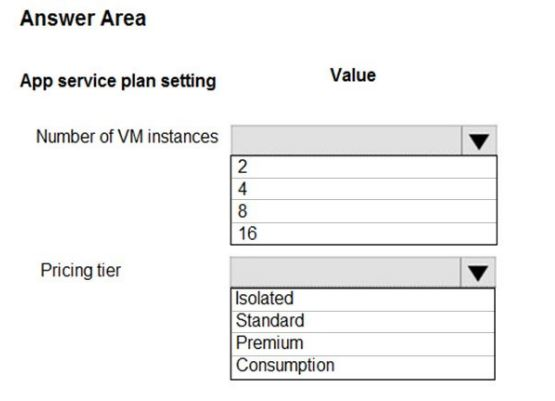
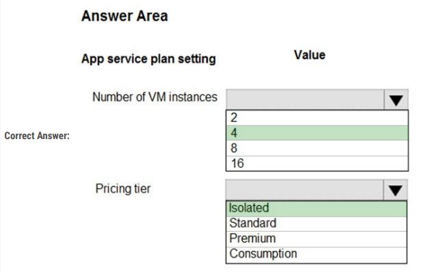

"Number of VM instances: 4 - You are not charged extra for deployment slots.  
Pricing tier: Isolated - The App Service Environment (ASE) is a powerful feature offering of the Azure App Service that gives network isolation and improved scale capabilities. Ti is essentially a deployment of the Azure App Service into a subnet of a customer's Azure Virtual Network (VNet)."

<b>2. You are a developer for a software as a service (SaaS) company that uses an Azure Function to process orders. The Azure Function currently runs on an Azure Function app that is triggered by an Azure Storage queue. You are preparing to migrate the Azure Function to Kubernetes using Kubernetes-based Event Driven Autoscaling (KEDA). You need to configure Kubernetes Custom Resource Definitions (CRD) for the Azure Function.
Which CRDs should you configure? To answer, drag the appropriate CRD types to the correct locations. Each CRD type may be used once, more
than once, or not at all.</b>

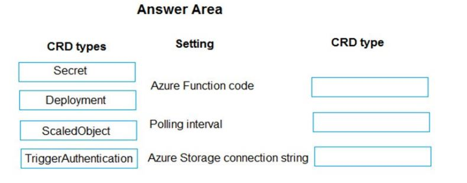
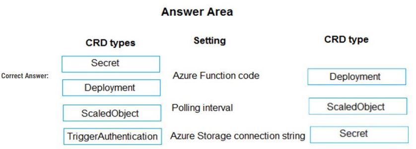

<b>3. You are creating a CLI script that creates an Azure web app and related services in Azure App Service. The web app uses the following variables:
- $gitrpo = https://github.com/Contos/webapp
- $webappname = Webapp1103  
You need to automatically deploy code from GitHub to the newly created web app. How should you complete the script?</b>

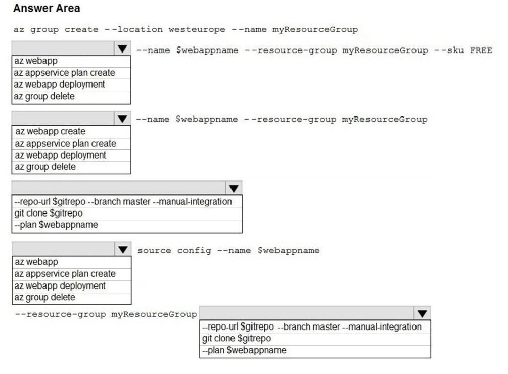
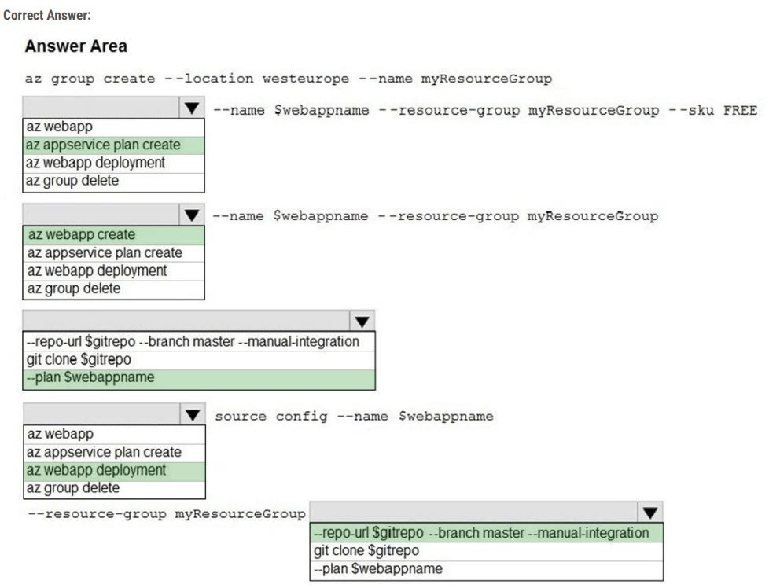

"Box 1: az appservice plan create - The azure group creates command successfully returns JSON result. Now we can use resource group to create app service plan.  
Box 2: az webapp create.  
Box 3: --plan $webappname - with the serviceplan we created in step 1.  
Box 4: az webapp deployment - Continuous delivery with GitHub."