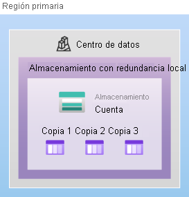
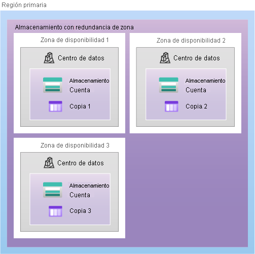
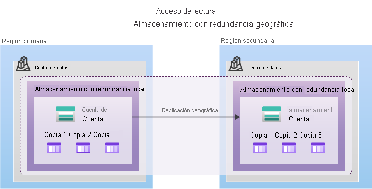

<h1 align="center"><ins>RUTA 2: DESCRIPCIÓN DE LA ARQUITECTURA Y LOS SERVICIOS DE AZURE</ins></h1>
<h2 align="center">MÓDULO 3 - DESCRIPCIÓN DE LOS SERVICIOS DE ALMACENAMIENTO DE AZURE</h2>

### Descripción de las cuentas de almacenamiento de Azure

Una cuenta de almacenamiento proporciona un espacio de nombres único para los datos de Azure Storage al que se puede acceder desde cualquier lugar del mundo a través de HTTP o HTTPS. Los datos de esta cuenta son seguros, de alta disponibilidad, duraderos y escalables de forma masiva.

Al crear la cuenta de almacenamiento, primero seleccionará el tipo de cuenta de almacenamiento. El tipo de cuenta determina los servicios de almacenamiento y las opciones de redundancia, y afecta a los casos de uso. A continuación se muestra una lista de opciones de redundancia que se describirán más adelante en este módulo:

- Almacenamiento con redundancia local (LRS)
- Almacenamiento con redundancia geográfica (GRS)
- Almacenamiento con redundancia geográfica con acceso de lectura (RA-GRS).
- Almacenamiento con redundancia de zona (ZRS)
- Almacenamiento con redundancia de zona geográfica (GZRS)
- Almacenamiento con redundancia de zona geográfica con acceso de lectura (RA-GZRS)

<b>Tipo - Servicios admitidos - Opciones de redundancia - Uso</b>

De uso general estándar v2:	Blob Storage (incluido Data Lake Storage), Queue Storage, Table Storage y Azure Files - LRS, GRS, RA-GRS, ZRS, GZRS, RA-GZRS - Tipo de cuenta de almacenamiento estándar para blobs, archivos, colas y tablas. Se recomienda para la mayoría de los escenarios con Azure Storage. Si desea compatibilidad con el sistema de archivos de red (NFS) en Azure Files, utilice el tipo de cuenta de recursos compartidos de archivos Premium.

Blobs en bloques Premium: Blob Storage (incluido Data Lake Storage)	- LRS, ZRS - Tipo de cuenta de almacenamiento Prémium para blobs en bloques y blobs en anexos. Se recomiendan para escenarios con altas tasas de transacciones, que utilizan objetos más pequeños o que requieren una latencia de almacenamiento constantemente baja.

Recursos compartidos de archivos Prémium: Azure Files - LRS, ZRS - Tipo de cuenta de almacenamiento Prémium solo para recursos compartidos de archivos. Se recomienda para empresas y aplicaciones de escalado de alto rendimiento. Use este tipo de cuenta si desea una cuenta de almacenamiento que admita recursos compartidos de archivos de Bloque de mensajes del servidor (SMB) y NFS.

Blobs en páginas Premium: Solo blobs en páginas	- LRS - Tipo de cuenta de almacenamiento prémium solo para blobs en páginas.

### Descripción de la redundancia de almacenamiento de Azure

Azure Storage siempre almacena varias copias de los datos, con el fin de protegerlos de eventos planeados y no planeados, lo que incluye errores transitorios del hardware, interrupciones del suministro eléctrico o cortes de la red, y desastres naturales. La redundancia garantiza que la cuenta de almacenamiento cumple sus objetivos de disponibilidad y durabilidad, aunque se produzcan errores.

A la hora de decidir qué opción de redundancia es la más adecuada para su escenario, intente buscar un equilibrio entre bajo costo y alta disponibilidad. Entre los factores que ayudan a determinar qué opción de redundancia debe elegir se incluye:

- Cómo se replican los datos en la región primaria.
- Si los datos se replican en una segunda ubicación que está alejada geográficamente de la región primaria, para protegerse frente a desastres regionales.
- Si la aplicación necesita acceso de lectura a los datos replicados en la región secundaria en caso de que la región primaria deje de estar disponible.

#### Redundancia en la región primaria

Los datos de una cuenta de Azure Storage siempre se replican tres veces en la región primaria. Azure Storage ofrece dos opciones para replicar los datos en la región primaria, el almacenamiento con redundancia local (LRS) y el almacenamiento con redundancia de zona (ZRS).

##### Almacenamiento con redundancia local
El almacenamiento con redundancia local (LRS) replica los datos tres veces dentro de un único centro de datos en la región primaria. LRS ofrece una durabilidad mínima de 11 nueves (99,999999999 %) de los objetos en un año determinado.

LRS es la opción de redundancia de costo más bajo y ofrece la menor durabilidad en comparación con otras opciones. LRS protege los datos frente a errores en la estantería de servidores y en la unidad. No obstante, si se produce un desastre como un incendio o una inundación en el centro de datos, es posible que todas las réplicas de una cuenta de almacenamiento con LRS se pierdan o no se puedan recuperar. Para mitigar este riesgo, Microsoft recomienda el uso del almacenamiento con redundancia de zona (ZRS), el almacenamiento con redundancia geográfica (GRS) o el almacenamiento con redundancia de zona geográfica (GZRS).

##### Almacenamiento con redundancia de zona
Para las regiones con zona de disponibilidad habilitada, el almacenamiento con redundancia de zona (ZRS) replica los datos de Azure Storage sincrónicamente en tres zonas de disponibilidad de Azure en la región primaria. ZRS proporciona a los objetos de datos de Azure Storage una durabilidad de al menos 12 nueves (99,9999999999 %) durante un año determinado.

Con ZRS, los datos son accesibles para las operaciones de escritura y lectura incluso si una zona deja de estar disponible. No es necesario volver a montar los recursos compartidos de archivos de Azure de los clientes conectados. Si alguna zona deja de estar disponible, Azure realiza las actualizaciones de la red, como el redireccionamiento de DNS. Estas actualizaciones pueden afectar a la aplicación si se accede a los datos antes de que se completen dichas actualizaciones.

Microsoft recomienda usar ZRS en la región primaria para escenarios que requieren de alta disponibilidad. También se recomienda ZRS para restringir la replicación de datos dentro de un país o región para cumplir los requisitos de gobernanza de datos.

#### Redundancia en una región secundaria

En el caso de las aplicaciones que requieren de alta durabilidad, puede optar por copiar los datos de la cuenta de almacenamiento en una región secundaria que esté a cientos de kilómetros de distancia de la región primaria. Si los datos de la cuenta de almacenamiento se copian en una región secundaria, los datos serán duraderos incluso en caso de un error catastrófico que impida que se recuperen los datos de la región primaria.

Azure Storage ofrece dos opciones para copiar los datos en una región secundaria: almacenamiento con redundancia geográfica (GRS) y almacenamiento con redundancia de zona geográfica (GZRS). GRS es similar a ejecutar LRS en dos regiones, y GZRS es similar a ejecutar ZRS en la región primaria y LRS en la región secundaria.

De manera predeterminada, los datos de la región secundaria no están disponibles para el acceso de lectura o escritura a menos que haya una conmutación por error a la región secundaria. Si la región primaria deja de estar disponible, puede conmutar por error a la región secundaria. Una vez completada la conmutación por error, la región secundaria se convierte en la región primaria y se pueden leer y escribir datos de nuevo.

Importante: Dado que los datos se replican en la región secundaria de forma asincrónica, un error que afecte a la región primaria puede producir la pérdida de datos si no se puede recuperar dicha región. El intervalo entre las escrituras más recientes en la región primaria y la última escritura en la región secundaria se conoce como objetivo de punto de recuperación (RPO). El RPO indica momento concreto en que se pueden recuperar los datos. Normalmente, Azure Storage tiene un RPO inferior a 15 minutos, aunque actualmente no hay ningún contrato de nivel de servicio sobre el tiempo que se tarda en replicar los datos en la región secundaria.

##### Almacenamiento con redundancia geográfica
GRS copia los datos de manera sincrónica tres veces dentro de una ubicación física única en la región primaria mediante LRS. Luego copia los datos de forma asincrónica en una única ubicación física en la región secundaria (el par de regiones) mediante LRS. GRS proporciona a los objetos de datos de Azure Storage una durabilidad de al menos 16 nueves (99,99999999999999 %) durante un año determinado.

##### Almacenamiento con redundancia de zona geográfica
GZRS combina la alta disponibilidad que proporciona la redundancia entre zonas de disponibilidad con la protección frente a interrupciones regionales que proporciona la replicación geográfica. Los datos de una cuenta de almacenamiento de GZRS se almacenan en tres zonas de disponibilidad de Azure en la región primaria (de manera similar a ZRS) y también se replican en una región geográfica secundaria para protegerlos frente a desastres regionales. Microsoft recomienda el uso de GZRS en aplicaciones que requieran de coherencia, durabilidad y disponibilidad máximas, además de rendimiento excelente y resistencia para la recuperación ante desastres.

GZRS está diseñado para proporcionar una durabilidad mínima de 16 nueves (99,99999999999999 %) de los objetos en un año determinado.

#### Acceso de lectura a los datos de la región secundaria
El almacenamiento con redundancia geográfica (con GRS o GZRS) replica los datos en otra ubicación física de la región secundaria para protegerlos frente a los apagones regionales. Sin embargo, los datos están disponibles para su lectura solo si el cliente o Microsoft inician una conmutación por error de la región primaria a la secundaria. Sin embargo, si habilita el acceso de lectura a la región secundaria, los datos siempre están disponibles, incluso cuando la región primaria se ejecuta de forma óptima. Para obtener acceso de lectura a la región secundaria, habilite el almacenamiento con redundancia geográfica con acceso de lectura (RA-GRS) o el almacenamiento con redundancia de zona geográfica con acceso de lectura (RA-GZRS).

Importante: Recuerde que es posible que los datos de la región secundaria no estén actualizados debido al RPO.

### Descripción de los servicios de almacenamiento de Azure

La plataforma de Azure Storage incluye los servicios de datos siguientes:

- Blobs de Azure: un almacén de objetos que se puede escalar de forma masiva para datos de texto y binarios. También incluye compatibilidad con el análisis de macrodatos a través de Data Lake Storage Gen2.
- Azure Files: recursos compartidos de archivos administrados para implementaciones locales y en la nube.
- Colas de Azure: un almacén de mensajería para mensajería confiable entre componentes de aplicación.
- Azure Disks: volúmenes de almacenamiento en el nivel de bloque para máquinas virtuales de Azure.

#### Ventajas de Azure Storage

- Duradero y altamente disponible. La redundancia garantiza que los datos estén seguros en caso de producirse errores de hardware transitorios. También puede optar por replicar datos entre centros de datos o regiones geográficas para obtener protección adicional frente a catástrofes locales o desastres naturales. Los datos replicados de esta manera permanecen con una alta disponibilidad en caso de que se produzca una interrupción inesperada.
- Seguro. Todos los datos escritos en una cuenta de Azure Storage se cifran mediante el servicio. Azure Storage proporciona un control pormenorizado sobre quién tiene acceso a los datos.
- Escalable. Azure Storage está diseñado para poderse escalar de forma masiva para satisfacer las necesidades de rendimiento y almacenamiento de datos de las aplicaciones de hoy en día.
- Administrado. Azure controla automáticamente el mantenimiento, las actualizaciones y los problemas críticos del hardware.
- Accesible. Es posible acceder a los datos de Azure Storage desde cualquier parte del mundo a través de HTTP o HTTPS. Microsoft proporciona bibliotecas cliente para Azure Storage en diversos lenguajes, incluidos .NET, Java, Node.js, Python, PHP, Ruby, Go y otros, así como una API REST consolidada. Azure Storage admite la escritura en Azure PowerShell o la CLI de Azure. Y Azure Portal y el Explorador de Azure Storage ofrecen soluciones visuales sencillas para trabajar con los datos.

#### Blob Storage

Azure Blob Storage es una solución de almacenamiento de objetos para la nube. Puede almacenar grandes cantidades de datos, como datos de texto o binarios. Azure Blob Storage es no estructurado, lo que significa que no hay ninguna restricción en cuanto a los tipos de datos que puede contener. Blob Storage puede administrar miles de cargas simultáneas, cantidades enormes de datos de vídeo, archivos de registro en constante crecimiento y es accesible desde cualquier lugar con conexión a Internet.

Los blobs no están limitados a formatos de archivo comunes. Un blob podría contener gigabytes de datos binarios transmitidos desde un instrumento científico, un mensaje cifrado para otra aplicación o datos en un formato personalizado para una aplicación que se está desarrollando. Una ventaja del almacenamiento en blobs con respecto al almacenamiento en disco es que no requiere que los desarrolladores piensen en discos o los administren. Los datos se cargan como blobs y Azure se encarga de las necesidades de almacenamiento físico.

Blob Storage resulta muy conveniente para lo siguiente:

- Visualización de imágenes o documentos directamente en un explorador.
- Almacenamiento de archivos para acceso distribuido.
- Streaming de audio y vídeo.
- Almacenamiento de datos para copia de seguridad y restauración, recuperación ante desastres y archivado.
- Almacenamiento de datos para el análisis en local o en un servicio hospedado de Azure.

##### Acceso a Blob Storage
Se puede acceder a los objetos de Blob Storage desde cualquier lugar del mundo a través de HTTP o HTTPS. Los usuarios o las aplicaciones cliente pueden acceder a los blobs mediante direcciones URL, la API REST de Azure Storage, Azure PowerShell, la CLI de Azure o una biblioteca cliente de Azure Storage. Las bibliotecas de cliente de almacenamiento están disponibles para varios lenguajes, como .NET, Java, Node.js, Python, PHP y Ruby.

##### Niveles de Blob Storage
Los datos almacenados en la nube pueden crecer a un ritmo exponencial. Para administrar los costos de las crecientes necesidades de almacenamiento, resulta útil organizar los datos en función de atributos como la <b>frecuencia de acceso</b> y el <b>período de retención</b> planeada. Azure Storage ofrece diferentes niveles de acceso para el almacenamiento de blobs, lo que le ayuda a almacenar datos de objetos de la manera más rentable. Entre los niveles de acceso disponibles se incluyen:

- Nivel de acceso frecuente: optimizado para almacenar datos a los que se accede con frecuencia (por ejemplo, imágenes para el sitio web).
- Nivel de acceso esporádico: optimizado para datos a los que se accede con poca frecuencia y que se almacenan al menos durante 30 días (por ejemplo, las facturas de los clientes).
- Nivel de acceso de archivo: conveniente para datos a los que raramente se accede y que se almacenan durante al menos 180 días con requisitos de latencia flexibles (por ejemplo, copias de seguridad a largo plazo).

Las siguientes consideraciones se aplican a los distintos niveles de acceso:

- Solo los niveles de acceso frecuente y esporádico se pueden establecer en el nivel de cuenta. El nivel de acceso de archivo no está disponible en el nivel de cuenta.
- Los niveles frecuente, esporádico y de archivo se pueden establecer en el nivel de blob durante la carga o después de esta.
- Los datos del nivel de acceso esporádico pueden tolerar una disponibilidad ligeramente inferior, pero aun así requieren una gran durabilidad, una latencia de recuperación y unas características de rendimiento similares a las de los datos de acceso frecuente. En el caso de los datos de acceso esporádico, un contrato de nivel de servicio (SLA) con una disponibilidad ligeramente inferior y unos costos de acceso mayores, en comparación con los datos de acceso frecuente, es aceptable a cambio de unos costos de almacenamiento menores.
- El almacenamiento de archivo almacena datos sin conexión y ofrece los menores costos de almacenamiento, pero los mayores costos de acceso y rehidratación de datos.
  
#### Azure Files

Azure Files ofrece recursos compartidos de archivos totalmente administrados en la nube a los que se puede acceder mediante los protocolos SMB (Bloque de mensajes del servidor) o NFS (Network File System) estándar del sector. Los recursos compartido de archivos de Azure Files se pueden montar simultáneamente mediante implementaciones locales o en la nube. A los recursos compartidos de archivos SMB de Azure se puede acceder desde clientes Windows, Linux y macOS. A los recursos compartidos de archivos NFS de Azure Files se puede acceder desde clientes Linux y macOS. Además, los recursos compartidos de archivos SMB de Azure Files se pueden almacenar en la caché de los servidores de Windows Server con Azure File Sync, lo que permite un acceso rápido allí donde se utilizan los datos.

##### Ventajas clave de Azure Files:
- Acceso compartido: los recursos compartidos de Azure Files admiten los protocolos SMB y NFS estándar del sector, lo que significa que puede reemplazar perfectamente los recursos compartidos de archivos en local por recursos compartidos de archivos de Azure sin preocuparse de compatibilidad de aplicaciones.
- Totalmente administrado: los recursos compartidos de Azure Files pueden crearse sin necesidad de administrar ni el hardware ni un sistema operativo. Esto significa que no tiene que tratar con la aplicación de actualizaciones de seguridad críticas en el sistema operativo del servidor ni ocuparse de reemplazar discos duros defectuosos.
- Scripts y herramientas: se pueden usar cmdlets de PowerShell y la CLI de Azure para crear, montar y administrar recursos compartidos de archivos de Azure como parte de la administración de las aplicaciones de Azure. Los recursos compartidos de archivos de Azure se pueden crear y administrar mediante Azure Portal y el Explorador de Azure Storage.
- Resistencia: Azure Files se creó desde sus orígenes para estar siempre disponible. Reemplazar los recursos compartidos de archivos en el entorno local por Azure Files significa que ya no tendrá que levantarse en mitad de la noche para tratar con problemas de red o interrupciones del suministro eléctrico local.
- Capacidad de programación intuitiva: las aplicaciones que se ejecutan en Azure pueden tener acceso a los datos en el recurso compartido mediante las API de E/S del sistema de archivos. Por tanto, los desarrolladores pueden aprovechar el código y los conocimientos que ya tienen para migrar las aplicaciones actuales. Además de las API de E/S del sistema, puede usar las Bibliotecas de cliente de Azure Storage o la API de REST de Azure Storage.

#### Queue Storage

Azure Queue Storage es un servicio para almacenar grandes cantidades de mensajes, Una vez que están almacenados, se puede acceder a los mensajes desde cualquier lugar del mundo mediante llamadas autenticadas con HTTP o HTTPS. Una cola puede contener tantos mensajes como el espacio que tenga la cuenta de almacenamiento (pueden ser millones). Cada mensaje individual de la cola puede llegar a tener un tamaño máximo de 64 KB. Las colas se utilizan normalmente para crear un trabajo pendiente del trabajo que se va a procesar de forma asincrónica.

Queue Storage se puede combinar con funciones de proceso como Azure Functions para realizar una acción cuando se recibe un mensaje. Por ejemplo, supongamos que quiere realizar una acción después de que un cliente cargue un formulario en el sitio web. Podría hacer que el botón enviar en el sitio web desencadene un mensaje en Queue Storage. Después, podría usar Azure Functions para desencadenar una acción una vez recibido el mensaje.

#### Disk Storage

El almacenamiento en disco o los discos administrados de Azure son volúmenes de almacenamiento de nivel de bloque que administra Azure para su uso con máquinas virtuales de Azure. Conceptualmente, son iguales que un disco físico, pero están virtualizados, lo que ofrece mayor resistencia y disponibilidad que un disco físico. Con los discos administrados, lo único que debe hacer es aprovisionar el disco. 

### Identificación de las opciones de migración de datos de Azure

Ahora que comprende las distintas opciones de almacenamiento dentro de Azure, es importante comprender también cómo obtener los datos y la información en Azure. Azure admite la migración en tiempo real de la infraestructura, las aplicaciones y los datos mediante Azure Migrate, así como la migración asincrónica de datos mediante Azure Data Box.

#### Azure Migrate

Azure Migrate es un servicio que le ayuda a migrar desde un entorno local a la nube. Azure Migrate funciona como centro para ayudarle a administrar la valoración y la migración del centro de datos local a Azure. Ofrece lo siguiente:

- Plataforma de migración unificada: un único portal para iniciar, ejecutar y realizar un seguimiento de la migración a Azure.
- Rango de herramientas: Rango de herramientas para la evaluación y migración Las herramientas de Azure Migrate incluyen Azure Migrate: Discovery y assessment y Azure Migrate: Server Migration. Azure Migrate también se integra con otros servicios y herramientas de Azure, así como con ofertas de proveedores de software independientes (ISV).
- Assessment and migration (Evaluación y migración): en el centro de Azure Migrate, puede evaluar y migrar la infraestructura local a Azure.

##### Herramientas integradas
Además de trabajar con herramientas de ISV, el centro de Azure Migrate también incluye las siguientes herramientas para ayudar con la migración:

- Azure Migrate: Discovery and assessment (Azure Migrate: detección y evaluación). Detecte y evalúe servidores locales que se ejecutan en VMware, Hyper-V y servidores físicos para preparar la migración a Azure.
- Azure Migrate: Server Migration (Azure Migrate: migración del servidor). Migre máquinas virtuales de VMware, máquinas virtuales de Hyper-V, servidores físicos, otros servidores virtualizados y máquinas virtuales de la nube pública a Azure.
- Data Migration Assistant. Data Migration Assistant es una herramienta independiente para evaluar servidores de SQL Server. Ayuda a identificar posibles problemas que bloquean la migración. Identifica características no admitidas, nuevas características que puede aprovechar después de la migración y la ruta de acceso correcta para la migración de la base de datos.
- Azure Database Migration Service. Migre bases de datos locales a máquinas virtuales de Azure en las que se ejecutan SQL Server, Azure SQL Database o instancias administradas de SQL.
- Web app migration assistant (Asistente de migración de aplicación web). Azure App Service Migration Assistant es una herramienta independiente para evaluar sitios web locales para la migración a Azure App Service. Use Migration Assistant para migrar aplicaciones web de .NET y PHP a Azure.
- Azure Data Box. Use los productos de Azure Data Box para trasladar grandes cantidades de datos sin conexión a Azure.

#### Azure Data Box

Azure Data Box es un servicio de migración física que ayuda a transferir grandes cantidades de datos de forma rápida, económica y confiable. La transferencia de datos segura se acelera mediante el envío de un dispositivo de almacenamiento propietario de Data Box que tiene una capacidad de almacenamiento utilizable máxima de 80 terabytes. Data Box se transporta hacia y desde el centro de datos a través de un transportista regional. Una caja resistente asegura y protege Data Box de daños durante el trayecto.

Puede pedir el dispositivo Data Box a través de Azure Portal para importar o exportar datos desde Azure. Una vez recibido el dispositivo, puede configurarlo rápidamente mediante la interfaz de usuario web local y conectarlo a la red. Una vez que haya terminado de transferir los datos (ya sea dentro o fuera de Azure), simplemente devuelva Data Box. Si va a transferir datos a Azure, los datos se cargan de forma automática una vez que Microsoft vuelve a recibir Data Box. El servicio de Data Box se encarga de realizar el seguimiento de todo el proceso en Azure Portal.

##### Casos de uso
Data Box es ideal para transferir tamaños de datos con más de 40 TB en escenarios sin conectividad de red limitada. El movimiento de datos puede ser único, periódico o una transferencia de datos masiva inicial seguida de transferencias periódicas.

Estos son los distintos escenarios donde se puede usar Data Box para importar datos en Azure.

- Migración única: cuando se mueve gran cantidad de datos locales a Azure.
- Traslade una biblioteca multimedia de cintas sin conexión a Azure para crear una biblioteca multimedia en línea.
- Migre la granja de máquinas virtuales, SQL Server y las aplicaciones a Azure.
- Traslade los datos históricos a Azure para un análisis exhaustivo y generar informes con HDInsight.
- Transferencia masiva inicial: cuando se realiza una transferencia masiva inicial con Data Box (inicialización) seguida de transferencias incrementales a través de la red.
- Cargas periódicas: cuando se genera periódicamente una gran cantidad de datos y es necesario moverlos a Azure.

Estos son los distintos escenarios donde se puede usar Data Box para exportar datos a Azure.

- Recuperación ante desastres: cuando se restaura una copia de los datos de Azure en una red local. En un escenario de recuperación ante desastres habitual, se exporta una gran cantidad de datos de Azure se exporta a Data Box. Microsoft luego los envía a Data Box y, en poco tiempo, los datos se restauran en un entorno local.
- Requisitos de seguridad: cuando necesita poder exportar datos de Azure debido a los requisitos de seguridad o de la administración pública.
- Migración de vuelta al entorno local o a otro proveedor de servicios en la nube: cuando quiera mover todos los datos de vuelta al entorno local o a otro proveedor de servicios en la nube, exporte los datos a través de Data Box para migrar las cargas de trabajo.
Una vez que los datos del pedido de importación se cargan en Azure, los discos del dispositivo se limpian, según las normas NIST 800-88r1. Si el pedido es de exportación, los discos se borran una vez que el dispositivo llega al centro de datos de Azure.

### Identificación de las opciones de movimiento de archivos de Azure

Además de la migración a gran escala mediante servicios como Azure Migrate y Azure Data Box, Azure también tiene herramientas diseñadas para ayudarle a mover o interactuar con archivos individuales o grupos de archivos pequeños. Entre esas herramientas se encuentran AzCopy, Explorador de Azure Storage y Azure File Sync.

#### AzCopy

AzCopy es una utilidad de línea de comandos que puede usar para copiar blobs o archivos a una cuenta de almacenamiento o desde una cuenta de almacenamiento. Con AzCopy, puede copiar archivos entre cuentas de almacenamiento, cargarlos, descargarlos e incluso sincronizarlos. AzCopy incluso se puede configurar para trabajar con otros proveedores de nube para ayudar a mover archivos entre nubes.

Importante: La sincronización de blobs o archivos con AzCopy es una sincronización unidireccional. Al sincronizar, designó el origen y el destino, y AzCopy copiará archivos o blobs en esa dirección. No se sincroniza bidireccionalmente en función de las marcas de tiempo u otros metadatos.

#### Explorador de Azure Storage

Explorador de Azure Storage es una aplicación independiente que proporciona una interfaz gráfica para administrar archivos y blobs en la cuenta de Azure Storage. Funciona en sistemas operativos Windows, macOS y Linux y usa AzCopy en el back-end para realizar todas las tareas de administración de archivos y blobs. Con Explorador de Storage, puede cargar en Azure, descargar desde Azure o moverse entre cuentas de almacenamiento.

#### Azure File Sync

Azure File Sync es una herramienta que permite centralizar los archivos compartidos en Azure Files y mantener la flexibilidad, el rendimiento y la compatibilidad de un servidor de archivos de Windows. Es casi como convertir el servidor de archivos de Windows en una red de entrega de contenido en miniatura. Una vez que instale Azure File Sync en el servidor local de Windows, se mantendrá sincronizado bidireccionalmente con los archivos en Azure de forma automática.

Con Azure File Sync, puede:

- Usar cualquier protocolo disponible en Windows Server para acceder a sus datos de forma local, como SMB, NFS y FTPS.
- Tener todas las cachés que necesite en todo el mundo.
- Reemplazar un servidor local con errores instalando Azure File Sync en un nuevo servidor del mismo centro de datos.
- Configurar la nube por niveles para que los archivos a los que se accede con más frecuencia se repliquen localmente, mientras que los archivos a los que se accede con poca frecuencia se mantienen en la nube hasta que se soliciten.