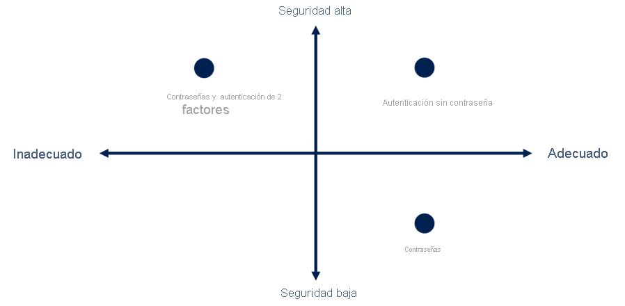
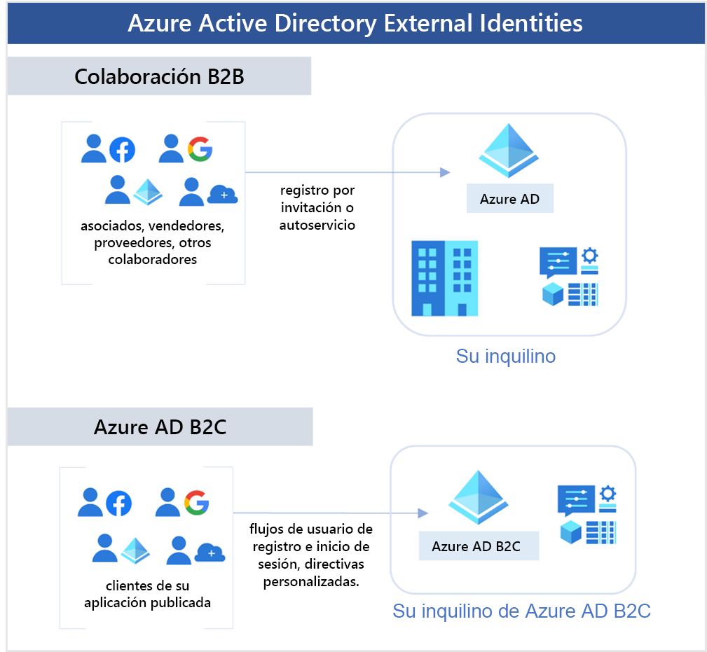
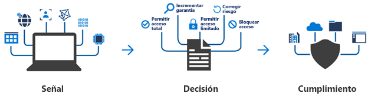
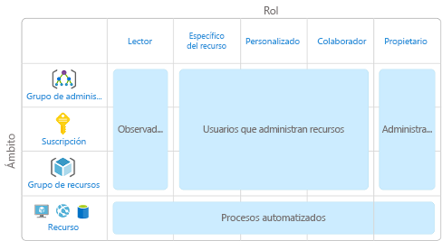
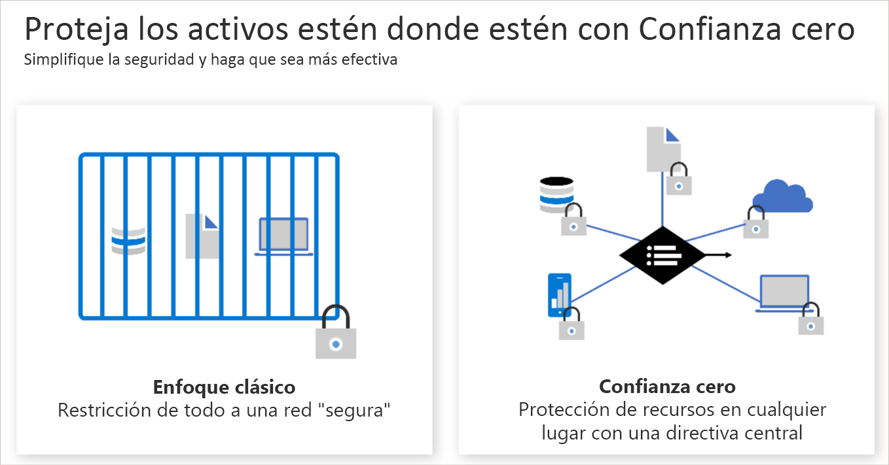
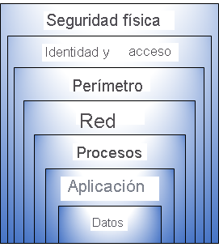
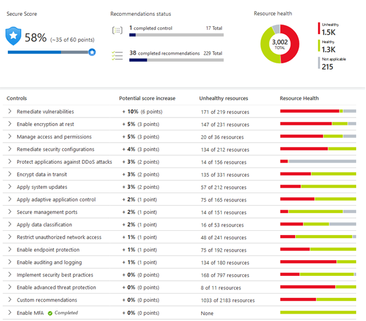

<h1 align="center"><ins>RUTA 2: DESCRIPCIÓN DE LA ARQUITECTURA Y LOS SERVICIOS DE AZURE</ins></h1>
<h2 align="center">MÓDULO 3 - DESCRIPCIÓN DE LA IDENTIDAD, EL ACCESO Y LA SEGURIDAD EN AZURE</h2>

### Descripción de los servicios de directorio de Azure

Azure Active Directory (Azure AD) es un servicio de directorio que le permite iniciar sesión y acceder tanto a las aplicaciones en la nube de Microsoft como a las aplicaciones en la nube que desarrolle. 

En el caso de los entornos locales, Active Directory ejecutado en Windows Server proporciona un servicio de administración de acceso e identidades que administra su organización. Azure AD es un servicio de administración de acceso e identidades basado en la nube de Microsoft. Con Azure AD, usted controla las cuentas de identidad, pero Microsoft garantiza que el servicio esté disponible globalmente. 

Si protege las identidades de forma local con Active Directory, Microsoft no supervisa los intentos de inicio de sesión. Si conecta Active Directory con Azure AD, Microsoft puede detectar intentos de inicio de sesión sospechosos para ayudarle a proteger su entorno sin costo adicional. Por ejemplo, Azure AD puede detectar intentos de inicio de sesión desde ubicaciones inesperadas o dispositivos desconocidos.

#### ¿Quién usa Azure AD?

Azure AD es para:

- Administradores de TI. Los administradores pueden usar Azure AD para controlar el acceso a las aplicaciones y los recursos en función de sus requisitos empresariales.
- Desarrolladores de aplicaciones. Con Azure AD, los desarrolladores pueden agregar funcionalidad a las aplicaciones que compilan mediante un enfoque basado en estándares. Por ejemplo, pueden agregar funcionalidad de SSO a una aplicación o habilitar una aplicación para que funcione con las credenciales existentes de un usuario.
- Usuarios. Los usuarios pueden administrar sus identidades y realizar acciones de mantenimiento como el autoservicio de restablecimiento de contraseña.
- Suscriptores de servicios en línea. Los suscriptores de Microsoft 365, Microsoft Office 365, Azure y Microsoft Dynamics CRM Online ya usan Azure AD para autenticarse en su cuenta.

#### ¿Qué hace Azure AD?

Azure AD proporciona servicios como:

- Autenticación: esto incluye la comprobación de la identidad para acceder a aplicaciones y recursos. También incluye funciones como el autoservicio de restablecimiento de contraseña, la autenticación multifactor, una lista personalizada de contraseñas prohibidas y servicios de bloqueo inteligente.
- Inicio de sesión único: gracias al inicio de sesión único (SSO), los usuarios tienen que recordar un solo nombre de usuario y una sola contraseña para acceder a varias aplicaciones. Una sola identidad está asociada a un usuario, lo que simplifica el modelo de seguridad. Cuando los usuarios cambian de rol o dejan una organización, las modificaciones de acceso se asocian a esa identidad, lo que reduce considerablemente el esfuerzo necesario para cambiar o deshabilitar cuentas.
- Administración de aplicaciones: con Azure AD, puede administrar las aplicaciones en la nube y locales. Características como Application Proxy, las aplicaciones SaaS, el portal Aplicaciones y el inicio de sesión único proporcionan una mejor experiencia de usuario.
- Administración de dispositivos: además de cuentas de usuarios individuales, Azure AD admite el registro de dispositivos. El registro permite administrar los dispositivos a través de herramientas como Microsoft Intune. También permite que las directivas de acceso condicional basadas en dispositivos limiten los intentos de acceso a solo aquellos que proceden de dispositivos conocidos, independientemente de la cuenta de usuario solicitante.

#### ¿Puedo conectar mi AD local con Azure AD?

Si tuviera un entorno local que ejecuta Active Directory y una implementación en la nube mediante Azure AD, tendría que mantener dos conjuntos de identidades. Pero puede conectar Active Directory con Azure AD, lo que permite una experiencia de identidad coherente entre la nube y el entorno local.

Un método de conectar Azure AD con el AD local es usar Azure AD Connect. Azure AD Connect sincroniza las identidades de usuario entre la instalación local de Active Directory y Azure AD. Azure AD Connect sincroniza los cambios entre ambos sistemas de identidades, para que pueda usar características como SSO, la autenticación multifactor y el autoservicio de restablecimiento de contraseña en ambos sistemas.

#### ¿Qué es Azure Active Directory Domain Services?

Azure Active Directory Domain Services (Azure AD DS) es un servicio que proporciona servicios de dominio administrados como, por ejemplo, unión a un dominio, directivas de grupo, protocolo ligero de acceso a directorios (LDAP) y autenticación Kerberos o NTLM. Al igual que Azure AD le permite usar servicios de directorio sin tener que mantener la infraestructura que lo admite, gracias a Azure AD DS obtiene la ventaja de los servicios de dominio sin necesidad de implementar, administrar y aplicar revisiones a los controladores de dominio (DC) en la nube.

Un dominio administrado de Azure AD DS le permite ejecutar aplicaciones heredadas en la nube que no pueden usar métodos de autenticación modernos o cuando no quiere que las búsquedas de directorio regresen siempre a un entorno de AD DS local. Esas aplicaciones heredadas se pueden migrar mediante "lift-and-shift" del entorno local a un dominio administrado, sin necesidad de administrar el entorno de AD DS en la nube.

Azure AD DS se integra con el inquilino de Azure AD existente. Esta integración permite a los usuarios iniciar sesión en los servicios y las aplicaciones conectados al dominio administrado con sus credenciales existentes. También puede usar grupos y cuentas de usuario existentes para proteger el acceso a los recursos. Estas características proporcionan una migración mediante lift-and-shift más fluida de los recursos locales a Azure.

##### ¿Cómo funciona Azure AD DS?
Cuando cree un dominio administrado de Azure AD DS, defina un espacio de nombres único. Este espacio de nombres es el nombre de dominio. Después, se implementan dos controladores de dominio de Windows Server en la región de Azure seleccionada. Esta implementación de controladores de dominio se conoce como "conjunto de réplicas".

No es necesario administrar, configurar ni actualizar estos controladores de dominio. La plataforma Azure administra los controladores de dominio como parte del dominio administrado, incluidas las copias de seguridad y el cifrado en reposo mediante Azure Disk Encryption.

##### ¿La información está sincronizada?
Un dominio administrado está configurado para realizar una sincronización unidireccional de Azure AD a Azure AD DS. Puede crear los recursos directamente en el dominio administrado, pero no se vuelven a sincronizar con Azure AD. En un entorno híbrido con un entorno de AD DS local, Azure AD Connect sincroniza la información de identidad con Azure AD, que se sincroniza posteriormente con el dominio administrado.

Las aplicaciones, los servicios y las máquinas virtuales de Azure que se conectan al dominio administrado pueden usar las características de Azure AD DS comunes, como unión a un dominio, directiva de grupo, LDAP y autenticación Kerberos o NTLM.

### Descripción de los métodos de autenticación de Azure

La autenticación es el proceso de establecimiento de la identidad de una persona, servicio y dispositivo. Requiere que la persona, el servicio o el dispositivo proporcionen algún tipo de credencial para demostrar quiénes son. Azure admite varios métodos de autenticación, incluidas las contraseñas estándar, el inicio de sesión único (SSO), la autenticación multifactor (MFA) y el acceso sin contraseña.

Desde hace tiempo, la seguridad y la comodidad parecían estar en conflicto entre sí. Afortunadamente, las nuevas soluciones de autenticación proporcionan seguridad y comodidad.

En el diagrama siguiente se muestra el nivel de seguridad en comparación con la comodidad. Observe que la autenticación sin contraseña es alta seguridad y alta comodidad, mientras que las contraseñas por sí mismas son de baja seguridad pero alta comodidad.

#### ¿Qué es el inicio de sesión único?

El inicio de sesión único (SSO) permite a los usuarios iniciar sesión una vez y utilizar esa credencial para acceder a varios recursos y aplicaciones de distintos proveedores. Para que el inicio de sesión único funcione, las distintas aplicaciones y proveedores deben confiar en el autenticador inicial.

Más identidades significan más contraseñas para recordar y cambiar. Las directivas de contraseñas pueden variar entre las aplicaciones. A medida que aumentan los requisitos de complejidad, cada vez resultan más difíciles de recordar para los usuarios. Cuantas más contraseñas tenga que administrar un usuario, mayor será el riesgo de que se produzca alguna incidencia de seguridad relacionada con las credenciales.

Con SSO, tan solo debe recordar un ID y una contraseña. El acceso a todas las aplicaciones se concede a una única identidad que está asociada a un usuario, lo que simplifica el modelo de seguridad. A medida que los usuarios cambian los roles o dejan una organización, el acceso está asociado a una única identidad. Este cambio reduce considerablemente el esfuerzo necesario para cambiar o deshabilitar cuentas. Usar el inicio de sesión único en las cuentas permite a los usuarios administrar su identidad y al equipo de TI gestionar los usuarios con mayor facilidad.

Importante: El inicio de sesión único solo es tan seguro como el autenticador inicial, ya que todas las conexiones posteriores se basan en la seguridad del autenticador inicial.

#### ¿Qué es la autenticación multifactor?

La autenticación multifactor es el proceso de solicitar a un usuario una forma adicional (o factor) de identificación durante el proceso de inicio de sesión. La MFA ayuda a protegerse frente a las contraseñas en riesgo en situaciones en las que la contraseña se vio comprometida, pero el segundo factor no.

La autenticación multifactor proporciona seguridad adicional a las identidades, ya que se requieren dos o más elementos para una autenticación completa. Estos elementos se dividen en tres categorías:

- Algo que el usuario sabe: puede ser una pregunta de seguridad.
- Algo que el usuario tiene: se puede tratar de un código que se envía al teléfono móvil del usuario.
- Algo que el usuario es: normalmente, algún tipo de propiedad biométrica, como la huella dactilar o el escaneo facial.

La autenticación multifactor aumenta la seguridad de las identidades al limitar el impacto de la exposición de credenciales (por ejemplo, nombres de usuario y contraseñas robados). Si la autenticación multifactor está habilitada, los atacantes que tengan la contraseña de un usuario también necesitarán su teléfono o su huella dactilar para completar la autenticación.

##### ¿Qué es Azure AD Multi-Factor Authentication?
Azure AD Multi-Factor Authentication es un servicio de Microsoft que proporciona funcionalidades de autenticación multifactor. Azure AD Multi-Factor Authentication permite a los usuarios elegir una forma adicional de autenticación durante el inicio de sesión, como una llamada de teléfono o una notificación de aplicación móvil.

#### ¿Qué es la autenticación sin contraseña?

El uso de características como la autenticación multifactor constituye una excelente manera de proteger una organización. Sin embargo, sumar esta capa de seguridad adicional al hecho de tener que recordar las contraseñas suele frustrar a los usuarios. Es más probable que las personas cumplan cuando sea fácil y conveniente hacerlo. Los métodos de autenticación sin contraseña resultan más cómodos, ya que la contraseña se quita y se reemplaza por algo que se tiene más algo que se es o se sabe.

La autenticación sin contraseña debe configurarse en un dispositivo para que funcione. Por ejemplo, su ordenador es algo que tiene. Una vez que se haya registrado o inscrito, Azure ahora sabrá que está asociado a usted. Ahora que se conoce el equipo, una vez que proporcione algo que sepa o sea (por ejemplo, un PIN o una huella digital), se podrá autenticar sin usar una contraseña.

Cada organización tiene diferentes necesidades en cuanto a la autenticación. Microsoft Azure global y Azure Government ofrecen las siguientes tres opciones de autenticación sin contraseña que se integran con Azure Active Directory (Azure AD):

- Windows Hello para empresas
- Aplicación Microsoft Authenticator
- Claves de seguridad FIDO2

##### Windows Hello para empresas
Windows Hello para empresas resulta muy conveniente para los trabajadores de la información que tienen su propio equipo con Windows designado. La información biométrica y las credenciales de PIN están vinculadas directamente al equipo del usuario, lo que impide el acceso de cualquier persona que no sea el propietario. Con la integración de la infraestructura de clave pública (PKI) y la compatibilidad integrada con el inicio de sesión único (SSO), Windows Hello para empresas ofrece un método sencillo y práctico de acceder directamente a los recursos corporativos del entorno local y la nube.

##### Aplicación Microsoft Authenticator
También puede permitir que el teléfono del empleado se convierta en un método de autenticación sin contraseña. Es posible que ya esté usando la aplicación Microsoft Authenticator como una opción de autenticación multifactor cómoda sumada a una contraseña. También puede usar la aplicación Authenticator como una opción sin contraseña.

La aplicación Authenticator convierte cualquier teléfono Android o iOS en una credencial segura sin contraseña. Los usuarios pueden iniciar sesión en cualquier plataforma o explorador con este proceso: reciben una notificación en su teléfono, comprueban que el número mostrado en la pantalla coincide con el de su teléfono y, a continuación, usan datos biométricos (huella dactilar o reconocimiento facial) o el PIN para confirmarlo.

##### Claves de seguridad FIDO2
FIDO (Fast IDentity Online) Alliance ayuda a promover los estándares de autenticación abiertos y a reducir el uso de contraseñas como forma de autenticación. FIDO2 es el estándar más reciente que incorpora el estándar de autenticación web (WebAuthn).

Las claves de seguridad FIDO2 son un método de autenticación sin contraseña basado en estándares que no permite la suplantación de identidad y que puede venir en cualquier factor de forma. Fast Identity Online (FIDO) es un estándar abierto para la autenticación sin contraseña. FIDO permite a los usuarios y a las organizaciones aprovechar el estándar para iniciar sesión en sus recursos sin un nombre de usuario o una contraseña mediante una clave de seguridad externa o una clave de plataforma integrada en un dispositivo.

Los usuarios pueden registrarse y luego seleccionar una llave de seguridad de FIDO2 en la interfaz de inicio de sesión como medio principal de autenticación. Estas llaves de seguridad de FIDO2 suelen ser dispositivos USB, pero también pueden usar Bluetooth o NFC. Con un dispositivo de hardware que controla la autenticación, se aumenta la seguridad de una cuenta, ya que no hay ninguna contraseña que pueda quedar expuesta ni adivinarse.

### Descripción de identidades externas de Azure

Una identidad externa es una persona, un dispositivo, un servicio, etc. que está fuera de la organización. Azure AD External Identities hace referencia a todas las formas en que puede interactuar de forma segura con usuarios externos a su organización. Si quiere colaborar con asociados, distribuidores o proveedores, puede compartir los recursos y definir cómo los usuarios internos pueden acceder a organizaciones externas. Si es un desarrollador que crea aplicaciones orientadas al consumidor, puede administrar las experiencias de identidad de los clientes.

Las identidades externas pueden parecerse al inicio de sesión único. Con External Identities, los usuarios externos pueden "traer sus propias identidades". Tanto si tienen una identidad digital corporativa o gubernamental, como una identidad social no administrada, como Google o Facebook, pueden usar sus propias credenciales para iniciar sesión. El proveedor de identidades administra la identidad del usuario externo y el usuario administra el acceso a sus aplicaciones con Azure AD o Azure AD B2C para mantener protegidos los recursos.

Las siguientes funcionalidades componen External Identities:

- Colaboración de empresa a empresa (B2B): colabore con usuarios externos y permítales usar su identidad preferida para iniciar sesión en las aplicaciones de Microsoft u otras aplicaciones empresariales (aplicaciones SaaS, aplicaciones desarrolladas de forma personalizada, etc.). Los usuarios de colaboración B2B se representan en el directorio, normalmente como usuarios invitados.
- Conexión directa B2B: establezca una confianza mutua y en dos sentidos con otra Azure AD para una colaboración sin problemas. La conexión directa B2B actualmente es compatible con los canales compartidos de Teams, lo que permite a los usuarios externos acceder a sus recursos desde sus instancias principales de Teams. Los usuarios de conexión directa B2B no se representan en el directorio, pero son visibles desde el canal compartido de Teams y se pueden supervisar en Teams informes del centro de administración.
- Empresa a cliente de Azure AD (B2C): publique aplicaciones SaaS modernas o aplicaciones desarrolladas de forma personalizada (excepto aplicaciones de Microsoft) para consumidores y clientes, mientras usa Azure AD B2C para la administración de identidades y acceso.
En función de cómo quiera interactuar con organizaciones externas y los tipos de recursos que necesite compartir, puede usar una combinación de estas funcionalidades.

Con Azure Active Directory (Azure AD), puede habilitar fácilmente la colaboración entre distintas organizaciones mediante la característica B2B de Azure AD. Los usuarios invitados de otros inquilinos pueden ser invitados por los administradores o por otros usuarios. Esta capacidad también se aplica a las identidades sociales como las cuentas Microsoft.

También puede asegurarse fácilmente de que los usuarios invitados tengan el acceso adecuado. Puede pedir a los invitados o a quien decida en su lugar que participen en una revisión de acceso y vuelvan a certificar (o atestiguar) el acceso de los invitados. Los revisores pueden dar su aprobación para cada necesidad de acceso continuado de los usuarios, en función de las sugerencias de Azure AD. Cuando una revisión de acceso haya terminado, es posible hacer cambios y retirar la concesión de acceso a los invitados que ya no lo necesitan.

### Descripción del acceso condicional de Azure

El acceso condicional es una herramienta que usa Azure Active Directory para permitir (o denegar) el acceso a los recursos en función de señales de identidad. Estas señales incluyen quién es el usuario, dónde se encuentra y desde qué dispositivo solicita el acceso.

Con el acceso condicional, los administradores de TI pueden:

- permitir a los usuarios ser productivos en cualquier momento y lugar.
- proteger los recursos de la organización.

El acceso condicional también proporciona una experiencia de autenticación multifactor más pormenorizada para los usuarios. Por ejemplo, es posible que al usuario no se le solicite un segundo factor de autenticación si está en una ubicación conocida. Pero si sus señales de inicio de sesión son inusuales o su ubicación es inesperada, es posible que se le exija un segundo factor de autenticación.

Durante el inicio de sesión, el acceso condicional recopila señales del usuario, toma decisiones basadas en esas señales y, después, aplica esa decisión para permitir o denegar la solicitud de acceso, o bien exigir una respuesta de autenticación multifactor.

En el diagrama siguiente se muestra este flujo:

En este caso, la señal podría ser la ubicación del usuario, su dispositivo o la aplicación a la que intenta acceder.

En función de estas señales, la decisión puede ser permitir el acceso completo si el usuario inicia sesión desde su ubicación habitual. Si el usuario inicia sesión desde una ubicación inusual o una ubicación marcada como de alto riesgo, el acceso puede bloquearse por completo, o bien podría concederse después de que el usuario proporcione una segunda forma de autenticación.

La aplicación es la acción que lleva a cabo la decisión. Por ejemplo, la acción es permitir el acceso o exigir al usuario que proporcione una segunda forma de autenticación.

#### ¿Cuándo se puede usar el acceso condicional?

El acceso condicional resulta útil en los casos siguientes:

- Exija la autenticación multifactor (MFA) para acceder a una aplicación en función del rol, la ubicación o la red del solicitante. Por ejemplo, podría requerir MFA para administradores, pero no para usuarios normales o personas que se conectan desde fuera de la red corporativa.
- Para requerir el acceso a los servicios solo a través de aplicaciones cliente aprobadas. Por ejemplo, podría limitar qué aplicaciones de correo electrónico pueden conectarse al servicio de correo electrónico.
- Exija que los usuarios accedan a la aplicación solo desde dispositivos administrados. Un dispositivo administrado es un dispositivo que cumple los estándares de seguridad y cumplimiento.
- Para bloquear el acceso desde orígenes que no son de confianza, como ubicaciones desconocidas o inesperadas.

### Descripción del control de acceso basado en roles de Azure

Cuando tenemos varios equipos de TI e ingeniería, ¿cómo podemos controlar el acceso que tienen a los recursos del entorno de nube? El principio de privilegios mínimos indica que solo debe conceder acceso al nivel necesario para completar una tarea. Si solo necesita acceso de lectura a un blob de almacenamiento, solo se le debe conceder acceso de lectura a ese blob de almacenamiento. No se debe conceder acceso de escritura a ese blob ni debe tener acceso de lectura a otros blobs de almacenamiento. Es una buena práctica de seguridad seguir.

Pero, administrar ese nivel de permisos para todo el equipo se volvería tedioso. En vez de definir los requisitos de acceso detallados de cada individuo y, después, ir actualizándolos a medida que se vayan creando más recursos o se unan nuevos miembros al equipo, Azure permite controlar el acceso a través del control de acceso basado en roles de Azure (RBAC de Azure).

Azure proporciona roles integrados que describen las reglas de acceso comunes de los recursos en la nube. También podemos definir nuestros propios roles. Cada rol tiene un conjunto asociado de permisos de acceso que tienen que ver con ese rol. Cuando se asignan usuarios o grupos a uno o varios roles, reciben todos los permisos de acceso asociados.

Por lo tanto, si contrata a un nuevo ingeniero y los agrega al grupo RBAC de Azure para ingenieros, obtiene de forma automática el mismo acceso que los otros ingenieros del mismo grupo de RBAC de Azure. De forma similar, si agrega recursos adicionales y apunta RBAC de Azure en ellos, todos los usuarios de ese grupo de RBAC de Azure tendrán esos permisos en los nuevos recursos, así como en los recursos existentes.

#### ¿Cómo se aplica el control de acceso basado en roles a los recursos?

El control de acceso basado en roles se aplica a un ámbito, que es un recurso o un conjunto de recursos en los que este acceso se permite.

En este diagrama se muestra la relación entre roles y ámbitos. Un grupo de administración, una suscripción o un administrador de recursos podría tener el rol de propietario, por lo que se ha aumentado el control y la autoridad. A un observador, que no se espera que realice ninguna actualización, se le puede asignar un rol de Lector para el mismo ámbito, lo que le permitiría revisar u observar el grupo de administración, la suscripción o el grupo de recursos.

Los ámbitos pueden ser lo siguiente:

- Un grupo de administración (una colección de varias suscripciones).
- Una sola suscripción.
- Un grupo de recursos.
- Un solo recurso.

Los observadores, los usuarios que administran recursos, los administradores y los procesos automatizados muestran los tipos de usuarios o cuentas que se suelen asignar a cada uno de los distintos roles.

RBAC de Azure es jerárquico, ya que al conceder acceso en un ámbito primario, todos los ámbitos secundarios heredan esos permisos. Por ejemplo:

- Cuando asignamos el rol Propietario a un usuario en el ámbito del grupo de administración, dicho usuario podrá administrar todo el contenido de todas las suscripciones dentro de ese grupo de administración.
- Cuando asignamos el rol Lector a un grupo en el ámbito de suscripción, los miembros de dicho grupo podrán ver todos los grupos de recursos y recursos dentro de esa suscripción.

#### ¿Cómo se aplica RBAC de Azure?

RBAC de Azure se aplica a cualquier acción que se inicie en un recurso de Azure que pasa por Azure Resource Manager. Resource Manager es un servicio de administración que proporciona una forma de organizar y proteger nuestros recursos en la nube.

Normalmente, se accede a Resource Manager a través de Azure Portal, Azure Cloud Shell, Azure PowerShell y la CLI de Azure. RBAC de Azure no aplica permisos de acceso en el nivel de aplicación ni de datos. La seguridad de la aplicación debe controlarla la propia aplicación.

RBAC de Azure emplea un modelo de permisos. Cuando se le asigna un rol, RBAC de Azure le permite realizar acciones dentro del ámbito de ese rol. Si una asignación de roles nos concede permisos de lectura a un grupo de recursos y otra asignación de roles nos concede permisos de escritura al mismo grupo de recursos, tendremos permisos tanto de lectura como de escritura en ese grupo de recursos.

### Descripción del modelo de Confianza cero

Confianza cero es un modelo de seguridad que supone el peor de los escenarios posibles y protege los recursos con esa expectativa. Confianza cero presupone que hay una vulneración y comprueba todas las solicitudes como si provinieran de una red no controlada.

En la actualidad, las organizaciones necesitan un modelo de seguridad nuevo que se adapte eficazmente a la complejidad del entorno moderno, adopte los recursos móviles y proteja a personas, dispositivos, aplicaciones y datos donde quiera que se encuentren.

Para abordar este nuevo mundo informático, Microsoft recomienda encarecidamente el modelo de seguridad de Confianza cero, que se basa en estos principios rectores:

- Comprobar explícitamente: realice siempre las operaciones de autorización y autenticación en función de todos los puntos de datos disponibles.
- Usar el acceso de privilegios mínimos: limite el acceso de los usuarios con Just-in-Time y Just-Enough-Access (JIT/JEA), directivas que se adaptan al nivel de riesgo y protección de datos.
- Asumir que hay brechas: minimice el radio de expansión y el acceso a los segmentos. Comprobación del cifrado de un extremo a otro. Utilice el análisis para obtener visibilidad, impulsar la detección de amenazas y mejorar las defensas.

#### Ajuste a Confianza cero

Tradicionalmente, las redes corporativas estaban restringidas, protegidas y, por lo general, eran seguras. Solo los equipos administrados se podían unir a la red, el acceso VPN estaba estrechamente controlado y los dispositivos personales estaban restringidos o bloqueados con frecuencia.

El modelo de Confianza cero revoluciona ese escenario. En lugar de suponer que un dispositivo es seguro porque está dentro de la red corporativa, exige que todos los usuarios se autentiquen. Después, concede acceso basado en la autenticación, no en la ubicación.

### Descripción de defensa en profundidad

El objetivo de la defensa en profundidad es proteger la información y evitar que personas no autorizadas a acceder puedan sustraerla. Una estrategia de defensa en profundidad usa una serie de mecanismos para ralentizar el avance de un ataque dirigido a adquirir acceso no autorizado a los datos.

#### Capas de defensa en profundidad

Puede visualizar la defensa en profundidad como un conjunto de capas, con los datos que se van a proteger en el centro y todas las demás capas en funcionamiento para proteger esa capa de datos central.

Cada capa proporciona protección de modo que, si se produce una brecha en una capa, ya existe otra en funcionamiento para evitar una mayor exposición. Este enfoque elimina la dependencia de cualquier capa de protección única. Ralentiza un ataque y proporciona información de alertas sobre la que pueden actuar los equipos de seguridad, ya sea de forma automática o manual.

Aquí tiene una breve descripción del rol de cada capa:

- La capa de seguridad física es la primera línea de defensa para proteger el hardware informático del centro de datos.
- La capa de identidad y acceso controla el acceso a la infraestructura y al control de cambios.
- La capa perimetral usa protección frente a ataques de denegación de servicio distribuido (DDoS) para filtrar los ataques a gran escala antes de que puedan causar una denegación de servicio para los usuarios.
- La capa de red limita la comunicación entre los recursos a través de controles de acceso y segmentación.
- La capa de proceso protege el acceso a las máquinas virtuales.
- La capa de aplicación ayuda a garantizar que las aplicaciones sean seguras y estén libres de vulnerabilidades de seguridad.
- La capa de datos controla el acceso a los datos empresariales y de clientes que es necesario proteger.
  
Estas capas proporcionan una guía para ayudarle a tomar decisiones de configuración de seguridad en todas las capas de las aplicaciones. Azure proporciona herramientas y características de seguridad en todas las capas del concepto de defensa en profundidad. Veamos cada capa con más detalle:

##### Seguridad física
La protección física del acceso a los edificios y el control del acceso al hardware de proceso del centro de datos son la primera línea de defensa.

La intención de la seguridad física es proporcionar medidas de seguridad físicas contra el acceso a los recursos. Estas medidas garantizan que no se puedan omitir otras capas y se controle apropiadamente la pérdida o el robo. Microsoft usa varios mecanismos de seguridad físicos en sus centros de datos de la nube.

##### Identidad y acceso
La capa de identidad y acceso consiste en garantizar que las identidades están protegidas, que solo se otorga el acceso necesario y que se registran los cambios y los eventos de inicio de sesión.

En esta capa, es importante que realice lo siguiente:

- Controle el acceso a la infraestructura y al control de cambios.
- Use el inicio de sesión único (SSO) y la autenticación multifactor.
- Audite los eventos y los cambios.

##### Perímetro
El perímetro de la red protege frente a ataques basados en red contra los recursos. Identificar estos ataques, eliminar sus repercusiones y recibir alertas sobre ellos cuando suceden son formas importantes de proteger la red.

En esta capa, es importante que realice lo siguiente:

- Use protección contra DDoS para filtrar los ataques a gran escala antes de que puedan afectar a la disponibilidad de un sistema para los usuarios.
- Use firewalls perimetrales para identificar los ataques malintencionados contra la red y alertar sobre ellos.

##### Red
En esta capa, el enfoque está en limitar la conectividad de la red en todos los recursos para permitir solo la necesaria. Al limitar esta comunicación, se reduce el riesgo de que se propaguen los ataques a otros sistemas de la red.

En esta capa, es importante que realice lo siguiente:

- Limite la comunicación entre los recursos.
- Deniegue de forma predeterminada.
- Restrinja el acceso entrante de Internet y limite el saliente cuando sea apropiado.
- Implemente conectividad segura a las redes locales.

##### Compute
El software malintencionado, los sistemas sin revisiones aplicadas y los sistemas protegidos inadecuadamente abren el entorno a los ataques. El enfoque en esta capa es asegurarse de que sus recursos de proceso estén seguros y de que cuenta con los controles adecuados para minimizar los problemas de seguridad.

En esta capa, es importante que realice lo siguiente:

- Proteja el acceso a las máquinas virtuales.
- Implemente la protección del punto de conexión de los dispositivos y mantenga los sistemas revisados y actualizados.

##### Application
La integración de la seguridad en el ciclo de vida de desarrollo de aplicaciones ayuda a reducir el número de vulnerabilidades en el código. Todos los equipos de desarrollo deberían asegurarse de que sus aplicaciones son seguras de forma predeterminada.

En esta capa, es importante que realice lo siguiente:

- Garantice que las aplicaciones son seguras y están libres de vulnerabilidades.
- Almacene los secretos de aplicación confidenciales en un medio de almacenamiento seguro.
- Convierta la seguridad en un requisito de diseño en todo el desarrollo de aplicaciones.

##### data
Los que almacenan y controlan el acceso a los datos son responsables de asegurarse de que están protegidos correctamente. A menudo, los requisitos legales dictan los controles y procesos que deben cumplirse para garantizar la confidencialidad, la integridad y la disponibilidad de los datos.

En casi todos los casos, los atacantes intentan conseguir datos:

- Almacenados en una base de datos.
- Almacenados en discos en máquinas virtuales.
- Almacenados en aplicaciones de software como servicio (SaaS), como Office 365.
- Administrados mediante el almacenamiento en la nube.

### Descripción de Microsoft Defender for Cloud

Microsoft Defender for Cloud es una herramienta de supervisión para la administración de la posición de seguridad y la protección contra amenazas. Supervisa los entornos en la nube, locales, híbridos y multinube para ofrecer instrucciones y notificaciones destinadas a reforzar la posición de seguridad.

Defender for Cloud proporciona las herramientas necesarias para proteger los recursos, realizar un seguimiento de su posición de seguridad, protegerse frente a ciberataques y simplificar la administración de la seguridad. 

#### Protección allá donde se implemente

Dado que Defender for Cloud es un servicio nativo de Azure, muchos servicios de Azure se supervisan y protegen sin necesidad de ninguna implementación. Pero si también tiene un centro de datos local o también está funcionando en otro entorno en la nube, es posible que la supervisión de los servicios de Azure no le proporcione una imagen completa de su situación de seguridad.

Cuando sea necesario, Defender for Cloud puede implementar automáticamente un agente de Log Analytics para recopilar datos relacionados con la seguridad. En el caso de las máquinas de Azure, la implementación se controla directamente. En entornos híbridos y con varias nubes, los planes de Microsoft Defender se amplían a máquinas que no son de Azure con la ayuda de Azure Arc. Las características de la Administración de la posición de seguridad en la nube (CSPM) se amplían a máquinas de varias nubes sin necesidad de ningún agente.

##### Protecciones nativas de Azure
Defender for Cloud le permite detectar amenazas en:

- Servicios de PaaS de Azure: puede detectar amenazas dirigidas a servicios de Azure como Azure App Service, Azure SQL, la cuenta de Azure Storage y otros servicios de datos. También puede realizar la detección de anomalías en los registros de actividad de Azure mediante la integración nativa con Microsoft Defender para aplicaciones en la nube (anteriormente conocido como Microsoft Cloud App Security).
- Servicios de datos de Azure: Defender for Cloud incluye capacidades que le ayudarán a clasificar automáticamente los datos en Azure SQL. También puede obtener evaluaciones de las posibles vulnerabilidades en los servicios de Azure SQL y Azure Storage, además de recomendaciones sobre cómo mitigarlas.
- Redes: Defender for Cloud le permite limitar la exposición a los ataques por fuerza bruta. Si reduce el acceso a los puertos de las máquinas virtuales mediante el acceso de máquina virtual Just-In-Time, puede proteger la red al prevenir el acceso innecesario. Puede establecer directivas de acceso seguro en los puertos seleccionados, solo para usuarios autorizados, direcciones IP o intervalos de direcciones IP de origen permitidos y durante un período limitado.

##### Defensa de los recursos híbridos
Además de defender el entorno de Azure, puede agregar funcionalidades de Defender for Cloud a su entorno de nube híbrida para proteger los servidores que no sean de Azure. Obtenga inteligencia personalizada sobre las amenazas y alertas prioritarias según su entorno específico para que pueda centrarse en lo que más le importa.

Para ampliar la protección a las máquinas locales, implemente Azure Arc y habilite las características de seguridad mejoradas de Defender for Cloud.

##### Defensa de los recursos que se ejecutan en otras nubes
Defender for Cloud también puede proteger los recursos de otras nubes (como AWS y GCP).

Por ejemplo, si ha conectado una cuenta de Amazon Web Services (AWS) a una suscripción de Azure, puede habilitar cualquiera de estas protecciones:

- Las características de CSPM de Defender for Cloud se extienden a los recursos de AWS. Este plan sin agente evalúa los recursos de AWS según las recomendaciones de seguridad específicas de AWS e incluye los resultados en la puntuación de seguridad. También se evaluará el cumplimiento de los recursos de los estándares integrados específicos de AWS (AWS CIS, AWS PCI DSS y Procedimientos recomendados de seguridad fundamentales de AWS). La página de inventario de recursos de Defender for Cloud es una característica habilitada para varias nubes, que permite administrar los recursos de AWS junto con los de Azure.
- Microsoft Defender para contenedores amplía la detección de amenazas de contenedores y defensas avanzadas a los clústeres Linux de Amazon EKS.
- Microsoft Defender para servidores proporciona detección de amenazas y defensas avanzadas en las instancias de EC2 con Windows y Linux.

#### Evaluación, protección y defensa

Defender for Cloud cubre tres necesidades vitales a medida que administra la seguridad de los recursos y las cargas de trabajo en la nube y en el entorno local:

- Evaluación continua: conozca la posición de seguridad. Identifique y realice un seguimiento de las vulnerabilidades.
- Protección: proteja los recursos y los servicios con Azure Security Benchmark.
- Defensa: detecte y resuelva las amenazas a recursos, cargas de trabajo y servicios.

##### Evaluación continua
Defender for Cloud le ayuda a evaluar continuamente su entorno. Incluye soluciones de evaluación de vulnerabilidades para las máquinas virtuales, los registros de contenedor y los servidores de SQL.

Microsoft Defender para servidores incluye integración nativa automática con Microsoft Defender para puntos de conexión. Si ha habilitado esta integración, tendrá acceso a los hallazgos relacionados con vulnerabilidades de la administración de amenazas y vulnerabilidades de Microsoft.

Entre estas herramientas de evaluación tendrá exámenes de vulnerabilidades regulares y detallados que cubren el proceso, los datos y la infraestructura. Puede revisar los resultados de estos exámenes desde Defender for Cloud y responder a ellos.

##### Seguridad
Desde los métodos de autenticación hasta el control de acceso y el concepto de Confianza cero, la seguridad en la nube es un aspecto esencial que debe realizarse correctamente. Para estar protegido en la nube, debe asegurarse de que las cargas de trabajo son seguras. Para proteger las cargas de trabajo, necesita directivas de seguridad que se adapten a su entorno y situación. Como las directivas de Defender for Cloud se crean sobre los controles de directivas de Azure, puede obtener la gama completa y la flexibilidad de una solución de directivas de primer nivel. En Defender for Cloud, puede establecer que las directivas se ejecuten en grupos de administración, entre distintas suscripciones e incluso en un inquilino completo.

Una de las ventajas de pasar a la nube es la capacidad de crecer y escalar en función de sus necesidades, lo que agrega nuevos servicios y recursos según sea necesario. Defender for Cloud supervisa constantemente los nuevos recursos que se implementan en las cargas de trabajo. Defender for Cloud evalúa si los nuevos recursos están configurados según los procedimientos recomendados de seguridad. Si no es así, se marcan y se obtiene una lista prioritaria de recomendaciones para lo que necesita corregir. Las recomendaciones le permitirán disminuir la superficie expuesta a ataques en cada uno de los recursos.

La lista de recomendaciones está habilitada y es compatible con Azure Security Benchmark. Este punto de referencia es el conjunto de directrices específico de Azure y creado por Microsoft relativo a los procedimientos recomendados de seguridad y cumplimiento basados en marcos de cumplimiento comunes.

De este modo, Defender for Cloud le permite no solo establecer directivas de seguridad, sino también aplicar estándares de configuración segura en todos los recursos.

Para ayudarle a conocer el grado de importancia que tiene cada una de las recomendaciones en su postura global acerca de la seguridad, Defender for Cloud agrupa las recomendaciones en controles de seguridad y agrega un valor de puntuación de la seguridad a cada control. La puntuación de seguridad le proporciona un indicador a simple vista del estado de su posición de seguridad, mientras que los controles le proporcionan una lista de trabajo de las cosas que se deben tener en cuenta para mejorar la puntuación de seguridad y la posición de seguridad general.

##### Defensa
Las dos primeras áreas se centraban en evaluar, supervisar y mantener su entorno. Defender for Cloud también le permite defender su entorno proporcionando alertas de seguridad y características avanzadas de protección contra amenazas.

###### Alertas de seguridad
Cuando Defender para la nube detecta una amenaza en cualquier área del entorno, genera una alerta de seguridad. Alertas de seguridad:

- Descripción de los detalles de los recursos afectados.
- Sugerencia de pasos para la corrección.
- Suministro, en algunos casos, de una opción para desencadenar una aplicación lógica en la respuesta.
  
Tanto si Defender para la nube genera una alerta como si la recibe desde un producto de seguridad integrado, puede exportarla. La protección contra amenazas de Defender para la nube incluye el análisis de la cadena de eliminación de fusión, que correlaciona de manera automática las alertas del entorno en función del análisis Cyber Kill Chain, para ayudarle a comprender mejor todo el proceso de un ataque, dónde empezó y qué tipo de impacto tuvo en los recursos.

###### Protección contra amenazas avanzada
Defender for Cloud proporciona características avanzadas de protección contra amenazas para muchos de los recursos implementados, incluidas las máquinas virtuales, las bases de datos SQL, los contenedores, las aplicaciones web y la red. Entre las protecciones se incluyen la protección de los puertos de administración de las VM con acceso Just-in-Time y controles de aplicaciones adaptables para crear listas de permitidos con las aplicaciones que deben o no ejecutarse en las máquinas.