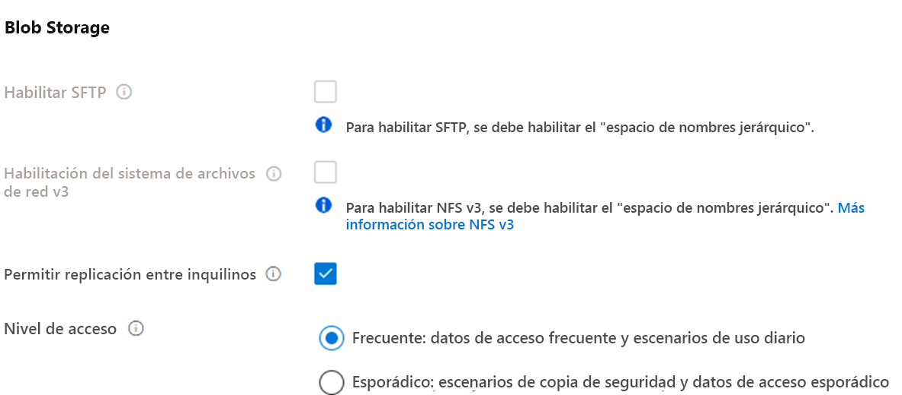
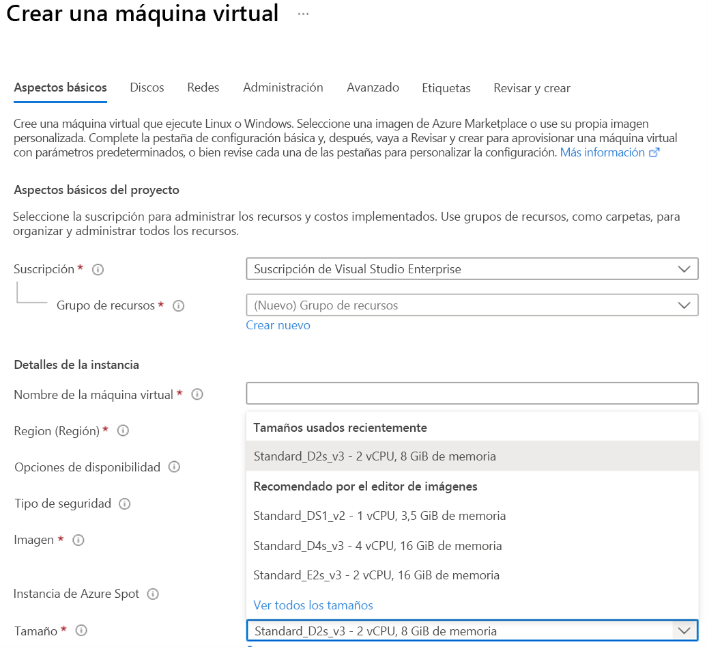
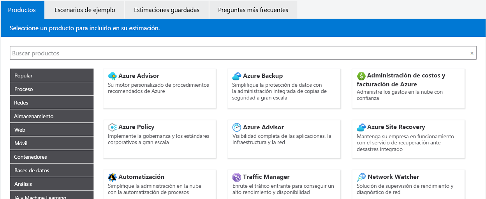
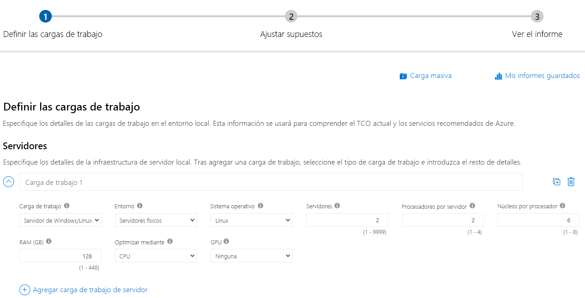
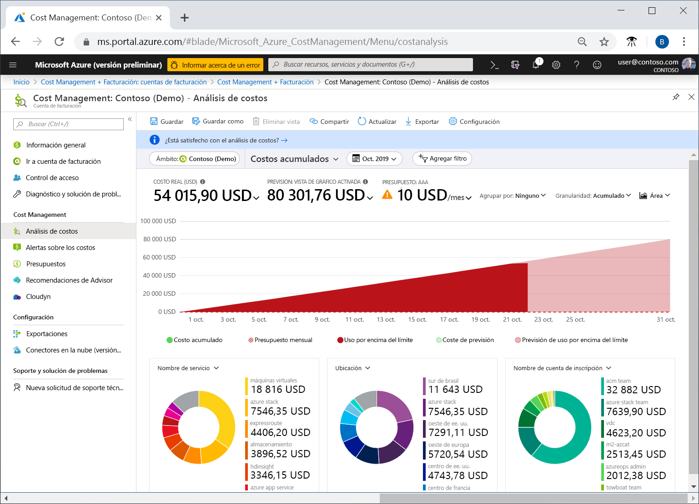

<h1 align="center"><ins>RUTA 3: DESCRIPCIÓN DE LA ADMINISTRACIÓN Y LA GOBERNANZA DE AZURE</ins></h1>
<h2 align="center">MÓDULO 1 - DESCRIPCIÓN DE LA ADMINISTRACIÓN DE COSTOS EN AZURE</h2>

### Descripción de los factores que pueden afectar a los costos en Azure

Azure desplaza los costos de desarrollo del gasto de capital (CapEx) de la construcción y mantenimiento de la infraestructura y las instalaciones a un gasto operativo (OpEx) de alquiler de la infraestructura según la necesite, ya sea de proceso, de almacenamiento, redes, etc.

Ese costo de OpEx puede verse afectado por muchos factores. Algunos de los factores que afectan son los siguientes:

- Tipo de recurso
- Consumo
- Mantenimiento
- Geografía
- Tipo de suscripción
- Azure Marketplace

#### Tipo de recurso

El tipo de recursos, la configuración del recurso y la región de Azure afectarán cuánto cuesta un recurso. Al aprovisionar un recurso de Azure, Azure crea instancias de uso medido para ese recurso. Los medidores realizan el seguimiento del uso de los recursos y generan un registro de uso que se usa para calcular la factura.

##### Ejemplos
Con una cuenta de almacenamiento, se especifica un tipo como blob, un nivel de rendimiento, un nivel de acceso, una configuración de redundancia y una región. La creación de la misma cuenta de almacenamiento en otras regiones puede mostrar otros costos y el cambio de cualquiera de las opciones de configuración también puede afectar al precio.

Con una máquina virtual (VM), es posible que tenga que considerar la posibilidad de licencias para el sistema operativo u otro software, el procesador y el número de núcleos de la máquina virtual, el almacenamiento conectado y la interfaz de red. Como sucede con el almacenamiento, el aprovisionamiento de la misma máquina virtual en otras regiones puede dar lugar a otros costos.

#### Consumo

El pago por uso ha sido siempre un tema coherente y es el modelo de pago en la nube en el que paga por los recursos que usa durante un ciclo de facturación. Si durante este ciclo usa más proceso, paga más. Si usa menos en el ciclo actual, paga menos. Es un mecanismo de precios directo que permite una máxima flexibilidad.

Pero Azure también ofrece la capacidad de comprometerse a usar una cantidad establecida de recursos en la nube de antemano y recibir descuentos por esos recursos "reservados". Muchos servicios, incluidas las bases de datos, el proceso y el almacenamiento, proporcionan la opción de comprometerse con un nivel de uso y recibir un descuento, en algunos casos de hasta el 72%.

Al reservar capacidad, se compromete a usar y pagar por una determinada cantidad de recursos de Azure durante un período determinado (normalmente uno o tres años). Con el respaldo del pago por uso, si se produce un aumento repentino de la demanda que eclipsa lo que ha reservado previamente, solo paga por los recursos adicionales que superen la reserva. Este modelo le permite reconocer ahorros importantes en cargas de trabajo confiables y coherentes, a la vez que tiene la flexibilidad de aumentar rápidamente la superficie de la nube a medida que surge la necesidad.

#### Mantenimiento

La flexibilidad de la nube permite ajustar rápidamente los recursos en función de la demanda. El uso de grupos de recursos puede ayudar a mantener todos los recursos organizados. Para controlar los costos, es importante mantener el entorno en la nube. Por ejemplo, cada vez que se aprovisiona una máquina virtual, también se aprovisionan recursos adicionales, como los de almacenamiento y redes. Si desaprovisiona la máquina virtual, es posible que esos recursos adicionales no se desaprovisionen al mismo tiempo, ya sea de forma intencionada o involuntaria. Al vigilar los recursos y asegurarse de que no mantiene los que ya no son necesarios, puede ayudar a controlar los costos de la nube.

#### Geografía

Al aprovisionar la mayoría de los recursos en Azure, debe definir una región donde se implementará el recurso. La infraestructura de Azure se distribuye de forma global, lo que le permite implementar los servicios de manera centralizada, acercarlos a los clientes o una solución intermedia. Esta implementación global tiene diferencias de precios globales. El costo de la energía, la mano de obra, los impuestos y las tarifas varían en función de la ubicación. Debido a estas variaciones, los recursos de Azure pueden diferir en los costos de implementación en función de la región.

El tráfico de red también se ve afectado por la geografía. Por ejemplo, es menos costoso mover información dentro de Europa que hacerlo de Europa a Asia o Sudamérica.

##### tráfico de red
Las zonas de facturación son un factor a la hora de determinar el costo de algunos servicios de Azure.

El ancho de banda hace referencia a los datos que entran y salen de los centros de datos de Azure. Algunas transferencias de datos entrantes (datos que se dirigen a los centros de datos de Azure) son gratis. En cuanto a las transferencias de datos salientes (datos que salen de los centros de datos de Azure), el precio de la transferencia de datos se basa en las zonas.

#### Tipo de suscripción

Algunos tipos de suscripciones de Azure también incluyen provisiones de uso que afectan a los costos.

Por ejemplo, una suscripción de evaluación gratuita de Azure proporciona acceso a una serie de productos de Azure gratis durante 12 meses. También incluye un crédito para gastar en los primeros 30 días de la suscripción. Obtendrá acceso a más de 25 productos que siempre son gratuitos (según la disponibilidad de recursos y regiones).

#### Azure Marketplace

Azure Marketplace le permite comprar soluciones y servicios basados en Azure de proveedores de terceros. Podría tratarse de un servidor con software preinstalado y configurado, o dispositivos de firewall de red administrados, o bien conectores para servicios de copia de seguridad de terceros. Al comprar productos desde Azure Marketplace, es posible que no solo pague por los servicios de Azure que usa, sino también por los servicios o la experiencia del proveedor de terceros. El proveedor establece las estructuras de facturación.

Todas las soluciones disponibles en Azure Marketplace están certificadas y son compatibles con las directivas y los estándares de Azure. Las directivas de certificación pueden variar en función del tipo de servicio o solución, y del servicio de Azure implicado. 

### Comparación de las calculadoras de precios y costo total de propiedad

Las calculadoras de precios y de costo total de propiedad (TCO) le ayudan a comprender los posibles gastos de Azure. Las dos calculadoras son accesibles desde Internet y permiten crear una configuración. Pero las dos calculadoras tienen propósitos muy diferentes.

#### Calculadora de precios

La calculadora de precios está diseñada para proporcionarle un costo estimado para el aprovisionamiento de recursos en Azure. Puede obtener una estimación de recursos individuales, crear una solución o usar un escenario de ejemplo para ver una estimación del gasto de Azure. La calculadora de precios se centra en el costo de los recursos aprovisionados en Azure.

Nota: La calculadora de precios solo tiene fines informativos. Los precios son solo una estimación. No se aprovisiona nada al agregar recursos a la calculadora de precios y no se le cobrará por ningún servicio que seleccione.

Con la calculadora de precios, puede calcular los costos de cualquier recurso aprovisionado, incluidos los de proceso, almacenamiento y red asociados. Incluso puede tener en cuenta diferentes opciones de almacenamiento, como el tipo de almacenamiento, el nivel de acceso y la redundancia.

#### Calculadora de TCO

La calculadora de TCO está diseñada para ayudarle a comparar los costos de ejecución de una infraestructura local en comparación con una infraestructura en la nube de Azure. Con la calculadora de TCO, se especifica la configuración de infraestructura actual, incluidos los servidores, las bases de datos, el almacenamiento y el tráfico de red saliente. Después, la calculadora de TCO compara los costos previstos del entorno actual con un entorno de Azure que admite los mismos requisitos de infraestructura.

Con la calculadora de TCO, escribe la configuración, agrega suposiciones como los costos de mano de obra de TI y de energía, y obtiene una estimación de la diferencia de costos para ejecutar el mismo entorno en el centro de datos actual o en Azure.

### Descripción de la herramienta Azure Cost Management

Microsoft Azure es un proveedor de nube global, lo que significa que puede aprovisionar recursos en cualquier parte del mundo. Puede aprovisionar recursos rápidamente para satisfacer una demanda repentina, para probar una nueva característica o en caso de accidente. Si aprovisiona accidentalmente nuevos recursos, es posible que no lo sepa hasta que le llegue la factura. Azure Cost Management es un servicio de Azure que ayuda a evitar esas situaciones.

#### ¿Qué es Cost Management?

Cost Management proporciona la capacidad de comprobar rápidamente los costos de los recursos de Azure, crear alertas basadas en el gasto de recursos y crear presupuestos que se pueden usar para automatizar la administración de recursos.

El análisis de costos es un subconjunto de Cost Management que proporciona una vista rápida de los costos de Azure. Con el análisis de costos, puede ver rápidamente el costo total de varias maneras diferentes, incluido por ciclo de facturación, región, recurso, etc.

Los análisis de costos se usan para explorar y analizar los costos de su organización. Puede ver los costos agregados por organización para saber dónde se acumulan estos e identificar las tendencias de gasto. Además, puede ver los costos acumulados con el tiempo para estimar las tendencias de costos mensual, trimestral o incluso anualmente con respecto a un presupuesto.

#### Alertas sobre los costos

Las alertas de costos proporcionan una única ubicación para comprobar rápidamente todos los diferentes tipos de alertas que pueden aparecer en el servicio Cost Management. Los tres tipos de alertas que pueden aparecer son las siguientes:

- Alertas de presupuesto
- Alertas de crédito
- Alertas de cuota de gasto de departamento

##### Alertas de presupuesto
Las alertas de presupuesto le envían una notificación cuando el gasto, en función del uso o coste, alcanza o supera la cantidad definida en la condición de alerta del presupuesto. Los presupuestos de Cost Management se crean mediante Azure Portal o la API de consumo de Azure.

En Azure Portal, los presupuestos se definen por el costo. Al usar Azure Consumption API, los presupuestos se definen por costo o por uso de consumo. Las alertas de presupuesto admiten presupuestos basado en costes o en uso. Las alertas de presupuesto se generan automáticamente cada vez que se cumplen las condiciones de alerta de presupuesto. Puede ver todas las alertas de costes en Azure Portal. Cada vez que se genera una alerta, aparece en las alertas de costo. También se envía un correo electrónico de alerta a los usuarios de la lista de destinatarios de alertas del presupuesto.

##### Alertas de crédito
Las alertas de crédito le avisan cuando se consumen los compromisos monetarios de crédito de Azure. Los compromisos monetarios son para organizaciones con contratos Enterprise (EA). Las alertas de crédito se generan de forma automática al 90% y al 100% del saldo de crédito de Azure. Cada vez que se genera una alerta, se refleja en las alertas sobre los costos y en el correo electrónico que se envía a los propietarios de la cuenta.

##### Alertas de cuota de gasto de departamento
Las alertas de cuota de gasto de departamento notifican cuándo el gasto del departamento alcanza un umbral fijo de la cuota. Las cuotas de gasto se configuran en el portal de EA. Cada vez que se alcanza un umbral, se genera un correo electrónico para los propietarios del departamento y se muestra en las alertas sobre los costos. Por ejemplo, el 50% o el 75% de la cuota.

#### Presupuestos

Un presupuesto es donde se establece un límite de gasto para Azure. Puede establecer presupuestos basados en una suscripción, un grupo de recursos, un tipo de servicio u otros criterios. Al establecer un presupuesto, también establecerá una alerta de presupuesto. Cuando el presupuesto alcanza el nivel de alerta de presupuesto, desencadenará una alerta de presupuesto que se muestra en el área de alertas de costos. Si se configuran, las alertas de presupuesto también enviarán una notificación por correo electrónico de que se ha desencadenado un umbral de alerta de presupuesto.

Un uso más avanzado de los presupuestos permite que las condiciones presupuestarias desencadenen la automatización que suspende o modifica los recursos una vez que se haya producido la condición del desencadenador.

### Descripción de la finalidad de las etiquetas

A medida que el uso que hacemos de la nube va en aumento, es cada vez más importante mantenerse organizado. Una buena estrategia de organización nos ayudará a conocer cuál es nuestro uso de la nube, así como a administrar los costos.

Un método para organizar los recursos relacionados es colocarlos en sus propias suscripciones. También se pueden usar grupos de recursos para administrarlos. Las etiquetas de recursos son otra forma de organizar recursos. Las etiquetas proporcionan información extra, o metadatos, sobre los recursos. Estos metadatos son útiles para lo siguiente:

- Administración de recursos: las etiquetas permiten localizar recursos asociados a cargas de trabajo, entornos, unidades de negocio y propietarios específicos y actuar al respecto.
- Optimización y administración de costes: las etiquetas permiten agrupar recursos para que podamos informar sobre los costes, asignar centros de costes internos, mantener los presupuestos a raya y predecir costes estimados.
- Administración de operaciones: las etiquetas permiten agrupar recursos según la importancia que tiene su disponibilidad para nuestro negocio. Esta agrupación nos ayuda a formular acuerdos de nivel de servicio (SLA), que constituyen una garantía de rendimiento o de tiempo de actividad entre nosotros y nuestros usuarios.
- Seguridad: las etiquetas permiten clasificar los datos según su nivel de seguridad, por ejemplo, públicos o confidenciales.
- Gobernanza y cumplimiento normativo: las etiquetas permiten identificar los recursos que cumplen con los requisitos de gobernanza o cumplimiento normativo, como la norma ISO 27001. Las etiquetas también pueden formar parte de nuestros esfuerzos de aplicación de estándares. Así, podríamos exigir que todos los recursos se etiqueten con un nombre de departamento o propietario.
- Automatización y optimización de las cargas de trabajo: las etiquetas pueden servir para ver todos los recursos que participan en implementaciones complejas. Por ejemplo, podemos etiquetar un recurso con su nombre de aplicación o carga de trabajo asociado y usar un software como Azure DevOps para realizar tareas automatizadas en esos recursos.

#### ¿Cómo se administran las etiquetas de recursos?

Puede agregar, modificar o eliminar etiquetas de recursos mediante Windows PowerShell, la CLI de Azure, plantillas de Azure Resource Manager, la API REST o Azure Portal.

Puede usar Azure Policy para aplicar reglas de etiquetado y convenciones. Así, podemos requerir que se agreguen determinadas etiquetas a los nuevos recursos a medida que se aprovisionan. Asimismo, podemos definir reglas que vuelvan a aplicar etiquetas que se han quitado. Los recursos no heredan etiquetas de suscripciones y grupos de recursos, lo que significa que puede aplicar etiquetas en un nivel y no hacer que se muestren automáticamente en otro nivel, lo que le permite crear esquemas de etiquetado personalizados que cambien según el nivel (recurso, grupo de recursos, suscripción, etc.).