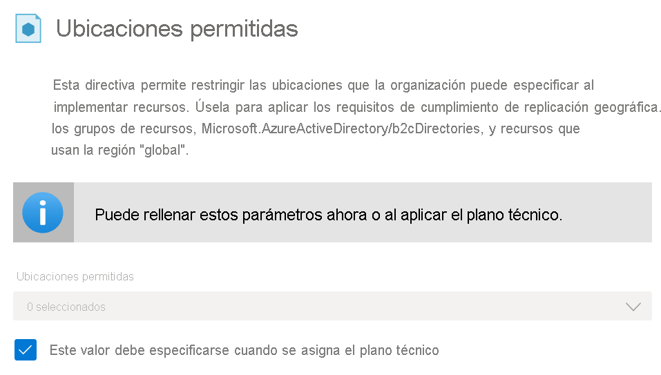
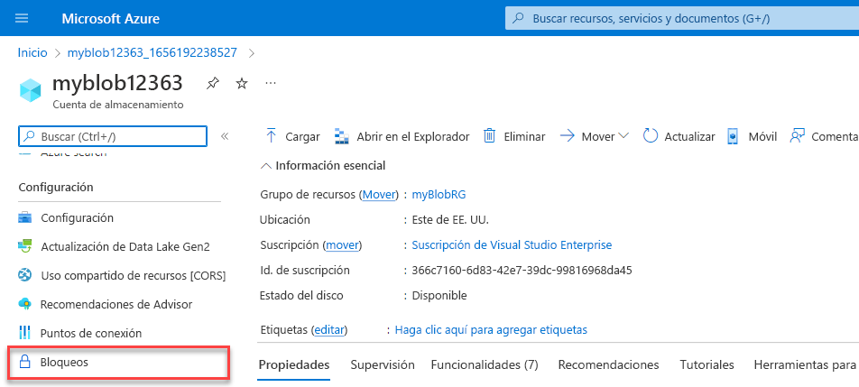
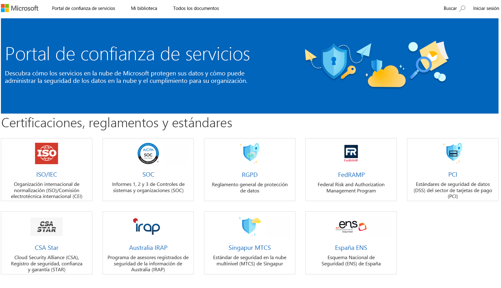

<h1 align="center"><ins>RUTA 3: DESCRIPCIÓN DE LA ADMINISTRACIÓN Y LA GOBERNANZA DE AZURE</ins></h1>
<h2 align="center">MÓDULO 2 - DESCRIPCIÓN DE LAS CARACTERÍSTICAS Y HERRAMIENTAS DE AZURE PARA LA GOBERNANZA Y EL CUMPLIMIENTO</h2>

### Descripción del propósito de Azure Blueprints

Azure Blueprints le permite estandarizar las implementaciones de entorno o suscripción en la nube. En lugar de tener que configurar características como Azure Policy para cada nueva suscripción, con Azure Blueprints puede definir la configuración repetible y las directivas que se aplican a medida que se crean suscripciones. ¿Necesita un nuevo entorno de pruebas y desarrollo? Azure Blueprints permite implementar un nuevo entorno de pruebas y desarrollo con las opciones de seguridad y cumplimiento ya configuradas. De este modo, los equipos de desarrollo pueden crear e implementar rápidamente nuevos entornos sabiendo que se crean de acuerdo con los estándares organizativos.

#### ¿Qué son los artefactos?

Cada componente de la definición de un plano técnico se denomina artefacto.

Es posible que los artefactos no tengan parámetros adicionales (configuraciones). Un ejemplo es la directiva Implementar la detección de amenazas en servidores SQL Server, que no requiere ninguna configuración adicional.

Los artefactos también pueden contener uno o más parámetros que se pueden configurar. En la siguiente captura de pantalla se muestra la directiva Ubicaciones permitidas, que incluye un parámetro que especifica las ubicaciones que se pueden usar.

Puede especificar el valor de un parámetro al crear la definición del plano técnico o al asignar la definición del plano a un ámbito. De este modo, puede mantener un plano técnico estándar, pero con la flexibilidad suficiente para especificar los parámetros de configuración pertinentes en cada ámbito en el que se asigne la definición.

Azure Blueprints implementa un nuevo entorno en función de todos los requisitos, las opciones y las configuraciones de los artefactos asociados. Los artefactos pueden incluir cosas como las siguientes:

- Asignaciones de roles
- Asignaciones de directivas
- Plantillas de Azure Resource Manager
- Grupos de recursos

#### ¿Cómo ayuda Azure Blueprints a supervisar las implementaciones?

Azure Blueprints es capaz de crear versiones, lo que le permite establecer una configuración inicial y, después, realizar actualizaciones más adelante y asignar una nueva versión a la actualización. Con el control de versiones, puede realizar pequeñas actualizaciones y realizar un seguimiento de las implementaciones que se usan en el conjunto de configuración.

Con Azure Blueprints, la relación entre la definición del plano técnico (lo que debe ser implementado) y su asignación (lo que se ha implementado) permanece. En otras palabras, Azure crea un registro que asocia un recurso con el plano técnico que lo define, y gracias a esta conexión podemos realizar el seguimiento y la auditoría de nuestras implementaciones.

### Descripción del propósito de Azure Policy

Azure Policy es un servicio de Azure que permite crear, asignar y administrar directivas que controlan o auditan los recursos. Dichas directivas aplican distintas reglas en las configuraciones de los recursos para que esas configuraciones sigan cumpliendo con los estándares corporativos.

#### ¿Cómo se definen directivas en Azure Policy?

Azure Policy permite definir tanto directivas individuales como grupos de directivas relacionadas, lo que se conoce como iniciativas. Azure Policy evalúa los recursos y resalta los que no cumplen las directivas que hemos creado. Azure Policy también puede impedir que se creen recursos no conformes.

Las directivas de Azure se pueden establecer en cada nivel, lo que le permite establecer directivas en un recurso específico, un grupo de recursos, una suscripción, etc. Además, las directivas de Azure se heredan, por lo que si establece una directiva de nivel alto, se aplicará automáticamente a todas las agrupaciones que se encuentran dentro del elemento primario. Por ejemplo, si establece una directiva de Azure en un grupo de recursos, todos los recursos creados en ese grupo de recursos recibirán automáticamente la misma directiva.

Azure Policy incluye definiciones de iniciativas y directivas integradas para categorías como Almacenamiento, Redes, Proceso, Centro de Seguridad y Supervisión. Por ejemplo, si define una directiva que permite usar exclusivamente un determinado tamaño para las máquinas virtuales (VM) en el entorno, esa directiva se invoca al crear una nueva máquina virtual y cada vez que se cambia el tamaño de las ya existentes. Azure Policy también evalúa y supervisa todas las máquinas virtuales actuales del entorno, incluidas las máquinas virtuales que se crearon antes de crear la directiva.

En algunos casos, Azure Policy puede corregir automáticamente los recursos y configuraciones no conformes para garantizar la integridad del estado de los recursos. Por ejemplo, si todos los recursos de un determinado grupo de recursos deben etiquetarse con la etiqueta AppName y un valor de "SpecialOrders", Azure Policy aplicará automáticamente esa etiqueta si se ha quitado. Sin embargo, sigue conservando el control total del entorno. Si tiene un recurso específico que no desea que Azure Policy corrija automáticamente, puede marcar ese recurso como una excepción y la directiva no corregirá automáticamente ese recurso.

Azure Policy se integra con Azure DevOps aplicando directivas de integración continua y canalización de entrega que competen a las fases de implementación anterior y posterior de las aplicaciones.

#### ¿Qué son las iniciativas Azure Policy?

Una iniciativa de Azure Policy es una forma de agrupar las directivas relacionadas. La definición de iniciativa contiene todas las definiciones de directiva para facilitar el seguimiento del estado de cumplimiento de cara a un objetivo mayor.

Por ejemplo, Azure Policy incluye una iniciativa denominada Habilitar la supervisión en Azure Security Center. Su objetivo es supervisar todas las recomendaciones de seguridad disponibles para todos los tipos de recursos de Azure en Azure Security Center.

En esta iniciativa se incluyen las siguientes definiciones de directiva:

- Supervisar base de datos SQL sin cifrar en Security Center: esta directiva supervisa servidores y bases de datos SQL sin cifrar.
- Supervisión de los puntos vulnerables del sistema operativo en Security Center: esta directiva supervisa los servidores que no cumplen la línea base de la vulnerabilidad del sistema operativo configurada.
- Supervisar la falta de Endpoint Protection en Security Center: esta directiva supervisa los servidores que no tienen instalado un agente de Endpoint Protection.

La iniciativa Habilitar la supervisión en Azure Security Center contiene más de 100 definiciones de directiva independientes, de hecho.

### Descripción del propósito de bloqueos de recursos

Los bloqueos de recursos impiden que se eliminen o modifiquen recursos por error.

Aun cuando haya directivas de control de acceso basado en roles de Azure (RBAC de Azure) en vigor, sigue existiendo el riesgo de que alguien con el nivel de acceso adecuado elimine recursos de nube críticos. Los bloqueos de recursos impiden que los recursos se eliminen o actualicen, según el tipo de bloqueo. Los bloqueos de recursos se pueden aplicar a recursos individuales, grupos de recursos o incluso a una suscripción completa. Los bloqueos de recursos se heredan, lo que significa que si coloca un bloqueo de recursos en un grupo de recursos, también se aplicará el bloqueo a todos los recursos dentro del grupo.

#### Tipos de bloqueos de recursos

Hay dos tipos de bloqueos de recursos, uno que impide que los usuarios eliminen un recurso y otro que impide que los usuarios lo cambien o eliminen.

- Eliminar significa que los usuarios autorizados pueden leer y modificar un recurso, pero no eliminarlo.
- ReadOnly significa que los usuarios autorizados solo pueden leer recursos, pero no actualizarlos ni eliminarlos. Aplicar este bloqueo es similar a restringir todos los usuarios autorizados a los permisos concedidos por el rol Lector.

#### ¿Cómo se administran los bloqueos de recursos?

Los bloqueos de recursos se pueden administrar en Azure Portal, PowerShell, la CLI de Azure o con una plantilla de Azure Resource Manager.

Para ver, agregar o eliminar bloqueos en Azure Portal, vaya a la sección Configuración del panel Configuración de cualquier recurso en Azure Portal.

#### ¿Cómo se elimina o cambia un recurso bloqueado?

Aunque los bloqueos impiden que se produzcan cambios por error, se pueden seguir realizando cambios realizando un proceso de dos pasos.

Para modificar un recurso bloqueado, primero hay que quitar el bloqueo. Tras quitarlo, podemos aplicar cualquier acción que podamos realizar de acuerdo a nuestros permisos. Los bloqueos de recursos se aplican con independencia de los permisos RBAC. Es decir, aun siendo el propietario del recurso, tendremos que quitar el bloqueo antes de poder realizar la actividad bloqueada.

### Descripción de las ventajas del portal de confianza de servicios

El Portal de confianza de servicios de Microsoft es un portal que proporciona contenido, herramientas y otros recursos sobre las prácticas de seguridad, privacidad y cumplimiento de Microsoft.

El Portal de confianza de servicios contiene detalles sobre la implementación de controles y procesos de Microsoft que protegen nuestros servicios en la nube y los datos de los clientes que contienen. Para acceder a algunos de los recursos del Portal de confianza de servicios, debe iniciar sesión con un usuario autenticado con su cuenta de Servicios en la nube de Microsoft (cuenta de organización de Azure Active Directory). Deberá revisar y aceptar el acuerdo de no divulgación de Microsoft para acceder a los materiales de cumplimiento.

#### Acceso al Portal de confianza de servicios

Puede acceder al Portal de confianza de servicios en https://servicetrust.microsoft.com/.

Las características y el contenido del Portal de confianza de servicios son accesibles desde el menú principal. Las categorías del menú principal son:

- El Portal de confianza de servicios proporciona un hipervínculo de acceso rápido para volver a la página principal del Portal de confianza de servicios.
- Mi biblioteca le permite guardar (o fijar) documentos para acceder rápidamente a ellos en la página Mi biblioteca. También puede establecer una configuración para recibir notificaciones cuando se actualicen los documentos en Mi biblioteca.
- Todos los documentos es un único lugar de aterrizaje para documentos del portal de confianza de servicios. En Todos los documentos se pueden anclar documentos para que aparezcan en Mi biblioteca.
 
Nota: Los informes y documentos del Portal de confianza de servicios están disponibles para descargarse durante al menos 12 meses después de la publicación o hasta que haya disponible una nueva versión del documento.