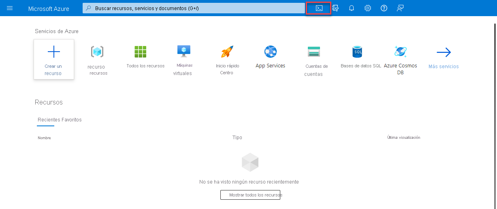

<h1 align="center"><ins>RUTA 3: DESCRIPCIÓN DE LA ADMINISTRACIÓN Y LA GOBERNANZA DE AZURE</ins></h1>
<h2 align="center">MÓDULO 3 - DESCRIPCIÓN DE LAS CARACTERÍSTICAS Y HERRAMIENTAS PARA ADMINISTRAR E IMPLEMENTAR RECURSOS EN AZURE</h2>

### Descripción de las herramientas para interactuar con Azure

Para sacar el máximo partido de Azure, necesita una manera de interactuar con el entorno de Azure, los grupos de administración, las suscripciones, los grupos de recursos, los recursos, etc. Azure proporciona varias herramientas para administrar el entorno, lo que incluye:

- Azure portal
- Azure PowerShell
- Interfaz de la línea de comandos (CLI) de Azure

#### ¿Qué es Azure Portal?

Azure Portal es una consola unificada basada en web que proporciona una alternativa a las herramientas de línea de comandos. Con Azure Portal, puedes administrar la suscripción de Azure mediante una interfaz gráfica de usuario. Puede:

- Construir, administrar y supervisar todo, desde aplicaciones web sencillas hasta complejas implementaciones en la nube.
- Crear paneles personalizados para una visualización organizada de los recursos.
- Configurar opciones de accesibilidad para una experiencia óptima.

Azure Portal está diseñado para proporcionar resistencia y disponibilidad continua. Mantiene una presencia en todos los centros de datos de Azure. Esta configuración hace que Azure Portal sea resistente a los errores de centros de datos individuales y evita que se ralentice la red al estar cerca de los usuarios. Azure Portal no deja de actualizarse y no requiere tiempo de inactividad para las actividades de mantenimiento.

##### Azure Cloud Shell
Azure Cloud Shell es una herramienta de Shell basada en explorador que permite crear, configurar y administrar recursos de Azure mediante un Shell. Azure Cloud Shell admite tanto Azure PowerShell como la interfaz de la línea de comandos (CLI) de Azure, que es un Shell de Bash.

Puede acceder a Azure Cloud Shell desde el Portal de Azure seleccionando el icono de Cloud Shell:

Azure Cloud Shell tiene varias características que lo convierten en una oferta única que le proporciona asistencia para administrar Azure. Algunas de esas características son:

- Es una experiencia de Shell basada en explorador, que no requiere instalación ni configuración local.
- Se autentica con las credenciales de Azure, por lo que cuando inicia sesión en él, sabe de forma inherente quién es y qué permisos tiene.
- Se elige el Shell con el que se está más familiarizado. Azure Cloud Shell admite tanto Azure PowerShell como la CLI de Azure (que usa Bash).
  
#### ¿Qué es Azure PowerShell?

Azure PowerShell es un Shell que permite a los desarrolladores y a los profesionales de TI y DevOps ejecutar comandos denominados command-lets (cmdlets). Estos comandos llaman a la API de REST de Azure para realizar las tareas de administración en Azure. Los cmdlets se pueden ejecutar de forma independiente para controlar los cambios puntuales o se pueden combinar para ayudar a orquestar acciones complejas como:

- La configuración de rutinas, la anulación y el mantenimiento de un único recurso o de varios recursos conectados.
- La implementación de una infraestructura completa, que puede contener decenas o cientos de recursos, de código imperativo.
- La captura de los comandos en un script hace que el proceso se pueda repetir y automatizar.

Además de estar disponible a través de Azure Cloud Shell, puede instalar y configurar Azure PowerShell en plataformas Windows, Linux y Mac.

#### ¿Qué es la CLI de Azure?

La CLI de Azure es funcionalmente equivalente a Azure PowerShell, y la diferencia principal es la sintaxis de los comandos. Azure PowerShell usa comandos de PowerShell y la CLI de Azure usa comandos de Bash.

La CLI de Azure proporciona las mismas ventajas de controlar tareas discretas u organizar operaciones complejas a través del código. También se puede instalar en plataformas Windows, Linux y Mac, así como a través de Azure Cloud Shell.

Debido a las similitudes en las funcionalidades y el acceso entre Azure PowerShell y la CLI de Azure basada en Bash, la elección entre uno y otra depende básicamente del lenguaje con el que esté más familiarizado.

### Descripción del propósito de Azure Arc

La administración de entornos híbridos y de varias nubes puede complicarse rápidamente. Azure proporciona una serie de herramientas para aprovisionar, configurar y supervisar recursos de Azure. ¿Qué ocurre con los recursos locales en una configuración híbrida o los recursos de nube en una configuración de varias nubes?

Al usar Azure Resource Manager (ARM), Arc le permite ampliar el cumplimiento y la supervisión de Azure a las configuraciones híbridas y de varias nubes. Azure Arc simplifica el gobierno y la administración al ofrecer una plataforma de administración local y multinube coherente.

Azure Arc proporciona una manera centralizada y unificada de:

- Administrar todo el entorno mediante la proyección de los recursos existentes que no son de Azure en ARM.
- Administrar las máquinas virtuales híbridas y de varias nubes, los clústeres de Kubernetes y las bases de datos como si se ejecutaran en Azure.
- Usar los servicios y funcionalidades de administración de Azure que conozca, independientemente de dónde se encuentren.
- Seguir usando ITOps tradicionales al tiempo que se incorporan procedimientos de DevOps para admitir en el entorno patrones nuevos y nativos de nube.
- Configurar ubicaciones personalizadas como una capa de abstracción a partir del clúster de Kubernetes habilitado para Azure Arc y las extensiones de clúster.
  
#### ¿Qué puede hacer Azure Arc fuera de Azure?

Actualmente, Azure Arc le permite administrar los siguientes tipos de recursos hospedados fuera de Azure:

- Servidores.
- Clústeres de Kubernetes.
- Servicios de datos de Azure.
- SQL Server.
- Máquinas virtuales (versión preliminar).

### Descripción de las plantillas de Azure Resource Manager y Azure ARM

Azure Resource Manager (ARM) es el servicio de implementación y administración de Azure. Proporciona una capa de administración que le permite crear, actualizar y eliminar recursos de la cuenta de Azure. Cada vez que haga algo con los recursos de Azure, ARM está implicado.

Cuando un usuario envía una solicitud de cualquiera de las herramientas, API o SDK de Azure, ARM la recibe. ARM autentica y autoriza la solicitud. Después, ARM envía la solicitud al servicio de Azure, que lleva a cabo la acción solicitada. Verá resultados y funcionalidades coherentes en todas las herramientas, ya que todas las solicitudes se controlan mediante la misma API.

#### Ventajas de Azure Resource Manager

Con Azure Resource Manager, puede realizar lo siguiente:

- Administrar la infraestructura mediante plantillas declarativas en lugar de scripts. Una plantilla de Resource Manager es un archivo JSON que define lo que quiere implementar en Azure.
- Implementar, administrar y supervisar todos los recursos de la solución en grupo, en lugar de controlarlos individualmente.
- Vuelva a implementar la solución a lo largo del ciclo de vida de desarrollo y tenga la seguridad de que los recursos se implementan en un estado coherente.
- Defina las dependencias entre recursos de modo que se implementen en el orden correcto.
- Aplique control de acceso a todos los servicios, puesto que RBAC se integra de forma nativa en la plataforma de administración.
- Aplicar etiquetas a los recursos para organizar de manera lógica todos los recursos de la suscripción.
- Comprenda la facturación de la organización viendo los costos de un grupo de recursos que comparten la misma etiqueta.

#### Plantillas de ARM

La infraestructura como código es un concepto en el que la infraestructura se administra como líneas de código. Aprovechar Azure Cloud Shell, Azure PowerShell o la CLI de Azure son algunos ejemplos de uso del código para implementar la infraestructura en la nube. Las plantillas de ARM son otro ejemplo de infraestructura como código en acción.

Al usar plantillas de ARM, puede describir los recursos que quiere usar en un formato JSON declarativo. Con una plantilla de ARM, el código de implementación se comprueba antes de que se ejecute cualquier código. Esto garantiza que los recursos se crearán y se conectarán correctamente. A continuación, la plantilla organiza la creación de esos recursos en paralelo. Es decir, si necesita 50 instancias del mismo recurso, se crean las 50 instancias al mismo tiempo.

Por último, el desarrollador, profesional de DevOps o profesional de TI solo tiene que definir el estado y la configuración de cada recurso en la plantilla de Resource Manager, y la plantilla hace el resto. Las plantillas pueden incluso ejecutar scripts de PowerShell y Bash antes o después de configurar el recurso.

##### Ventajas del uso de plantillas de ARM
Las plantillas de ARM proporcionan muchas ventajas al planear la implementación de recursos de Azure. Algunas de esas ventajas son las siguientes:

- Sintaxis declarativa: las plantillas de Resource Manager permiten crear e implementar una infraestructura de Azure completa de forma declarativa. La sintaxis declarativa significa que declara lo que quiere implementar, pero no es necesario escribir los comandos de programación y la secuencia reales para implementar los recursos.
- Resultados repetibles: Implemente repetidamente la infraestructura a lo largo del ciclo de vida del desarrollo y tenga la seguridad de que los recursos se implementan de forma coherente. Puede usar la misma plantilla de ARM para implementar varios entornos de desarrollo y pruebas, sabiendo que todos los entornos son los mismos.
- Orquestación: No tiene que preocuparse por la complejidad de las operaciones de ordenación. Azure Resource Manager orquesta la implementación de recursos interdependientes para que se creen en el orden correcto. Siempre que sea posible, Azure Resource Manager implementa los recursos en paralelo para que las implementaciones finalicen más rápido que las implementaciones en serie. La plantilla se implementa mediante un comando, en lugar de hacerlo con varios comandos imperativos.
- Archivos modulares: Puede dividir las plantillas en componentes más pequeños y reutilizables y vincularlos en el momento de la implementación. También puede anidar una plantilla dentro de otra. Por ejemplo, podría crear una plantilla para una pila de máquinas virtuales y, después, anidar esa plantilla dentro de las que implementan entornos completos, y esa pila de máquinas virtuales se implementará de forma coherente en cada una de las plantillas de entorno.
- Extensibilidad: con los scripts de implementación, puede agregar scripts de PowerShell o Bash a las plantillas. Los scripts de implementación amplían su capacidad para configurar recursos durante la implementación. Un script se puede incluir en la plantilla, o bien almacenarse en un origen externo y hacerle referencia en la plantilla. Los scripts de implementación le ofrecen la posibilidad de completar la configuración del entorno integral en una sola plantilla de ARM.