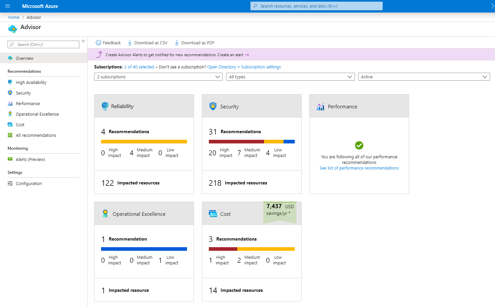

<h1 align="center"><ins>RUTA 3: DESCRIPCIÓN DE LA ADMINISTRACIÓN Y LA GOBERNANZA DE AZURE</ins></h1>
<h2 align="center">MÓDULO 4 - DESCRIPCIÓN DE LAS HERRAMIENTAS DE SUPERVISIÓN DE AZURE</h2>

### Descripción del propósito de Azure Advisor

Azure Advisor evalúa los recursos de Azure y hace recomendaciones que contribuyen a mejorar la confiabilidad, la seguridad y el rendimiento, lograr la excelencia operativa y reducir los costos. Azure Advisor está diseñado para ayudarle a ahorrar tiempo en la optimización en la nube. El servicio de recomendaciones sugiere medidas que puede adoptar de inmediato, posponer o descartar.

Las recomendaciones están disponibles con Azure Portal y la API. Además, es posible configurar notificaciones para estar al tanto de las nuevas recomendaciones.

Cuando está en Azure Portal, el panel de Advisor muestra recomendaciones personalizadas para todas las suscripciones. Puede usar filtros a fin de seleccionar recomendaciones para suscripciones, grupos de recursos o servicios específicos. Las recomendaciones se dividen en cinco categorías:

- La fiabilidad se usa para garantizar y mejorar la continuidad de las aplicaciones críticas para la empresa.
- La seguridad se usa para detectar amenazas y vulnerabilidades que podrían conducir a vulneraciones de la seguridad.
- El rendimiento se usa para mejorar la velocidad de las aplicaciones.
- La excelencia operativa se usa para aumentar la eficiencia de procesos y flujos de trabajo, mejorar la administración de recursos y obtener procedimientos recomendados para la implementación.
- El costo se usa para optimizar y reducir el gasto general de Azure.

En la imagen siguiente se muestra el panel de Azure Advisor.

### Descripción de Azure Service Health

Microsoft Azure proporciona una solución global en la nube para ayudarle a administrar sus necesidades de infraestructura, llegar a sus clientes, innovar y adaptarse rápidamente. Conocer el estado de la infraestructura global de Azure y los recursos individuales podría parecer una tarea abrumadora. Azure Service Health le permite realizar un seguimiento de los recursos de Azure, tanto los recursos implementados específicamente como el estado general de Azure. Azure Service Health lo hace combinando tres servicios de Azure diferentes:

- Estado de Azure es una visión general del estado de Azure de forma global. Estado de Azure informa de las interrupciones de servicio en Azure en la página de estado de Azure. La página es una vista global del estado de todos los servicios y regiones de Azure. Es una buena referencia de los incidentes con un impacto generalizado.
- Service Health proporciona una vista más limitada del estado de los servicios y regiones de Azure. Se centra en los servicios y regiones de Azure que usa. Es el mejor lugar para buscar comunicaciones que afecten a los servicios relativas a interrupciones, actividades de mantenimiento planeado y otros avisos de mantenimiento, ya que tras la autenticación, Service Health conoce los servicios y recursos que usa en la actualidad. Incluso puede configurar las alertas de Service Health para que le envíen notificaciones cuando se produzcan problemas del servicio, mantenimientos planeados o cualquier otro cambio que pueda afectar a los servicios y regiones de Azure que usa.
- Resource Health es una vista personalizada de los recursos reales de Azure. Proporciona información sobre el estado de los recursos en la nube individuales, como una instancia de máquina virtual concreta. Mediante Azure Monitor también puede configurar alertas que le notifiquen los cambios de disponibilidad de los recursos en la nube.

Con el Estado de Azure, Service Health y Resource Health, Azure Service Health ofrece una vista completa de todo el entorno de Azure, desde el estado global de los servicios y regiones de Azure hasta los recursos específicos. Además, las alertas históricas se almacenan y son accesibles para su revisión posterior. Algo que inicialmente pensó que era una simple anomalía que se ha convertido en una tendencia, se puede revisar e investigar fácilmente gracias a las alertas históricas.

Por último, en caso de que un evento afecte a una carga de trabajo que ejecute, Azure Service Health proporciona vínculos para prestar soporte.

### Descripción de Azure Monitor

Azure Monitor es una plataforma para recopilar datos sobre los recursos, analizar esos datos, visualizar la información e incluso actuar en función de los resultados. Azure Monitor puede supervisar los recursos de Azure, los recursos locales e incluso los recursos de varias nubes, como las máquinas virtuales hospedadas con otro proveedor de nube.

En el diagrama siguiente se muestra lo completo que es Azure Monitor:

A la izquierda aparece una lista de los orígenes de los datos de métricas y registros, que pueden recopilarse en cada nivel de la arquitectura de aplicaciones, desde la aplicación hasta el sistema operativo y la red.

En el centro, los datos de registro y métricas se almacenan en repositorios centrales.

A la derecha, los datos se usan de diversas formas. Puede ver el rendimiento histórico y en tiempo real de cada nivel de la arquitectura, o bien consultar información combinada y detallada. Los datos se muestran en diferentes niveles para distintas audiencias. Puede ver informes de alto nivel en el panel de Azure Monitor o crear vistas personalizadas mediante consultas de Power BI y Kusto.

Además, puede usar los datos para ayudarle a reaccionar ante eventos críticos en tiempo real gracias a las alertas enviadas a los equipos por SMS, correo electrónico, etc. También puede usar umbrales que desencadenen la funcionalidad de escalado automático para ajustarse a la demanda.

#### Azure Log Analytics

Azure Log Analytics es la herramienta de Azure Portal donde escribirá y ejecutará consultas de registro en los datos recopilados por Azure Monitor. Log Analytics es una herramienta sólida que admite consultas sencillas, complejas y análisis de datos. Puede escribir una consulta sencilla que devuelva un conjunto de registros y, después, usar las características de Log Analytics para ordenarlos, filtrarlos y analizarlos. Puede escribir una consulta avanzada para realizar análisis estadísticos y visualizar los resultados en un gráfico para identificar una tendencia determinada. Tanto si trabaja con los resultados de las consultas de forma interactiva como si los usa con otras características de Azure Monitor, como las alertas de consultas de registros o los libros, Log Analytics es la herramienta que va a usar para escribir y probar esas consultas.

#### Alertas de Azure Monitor

Las alertas de Azure Monitor son una manera automatizada de mantenerse informado cuando Azure Monitor detecta que se cruza un umbral. Establezca las condiciones de alerta, las acciones de notificación y, después, las alertas de Azure Monitor notifican cuándo se desencadena una alerta. En función de la configuración, las alertas de Azure Monitor también pueden intentar realizar acciones correctivas.

Las alertas se pueden configurar para supervisar los registros y desencadenarse en determinados eventos de registro, o bien se pueden establecer para supervisar métricas y desencadenarse cuando se crucen determinadas métricas. Por ejemplo, podría establecer una alerta basada en métricas para notificarle cuándo el uso de CPU de una máquina virtual ha superado el 80%. Las reglas de alertas basadas en métricas proporcionan alertas casi en tiempo real con valores numéricos. Las reglas basadas en los registros permiten una lógica compleja con datos de varios orígenes.

Las alertas de Azure Monitor usan grupos de acciones para configurar a quién realizar la notificación y qué acción realizar. Un grupo de acciones es simplemente una colección de preferencias de notificaciones y acciones que se asocian a una o varias alertas. Azure Monitor, Service Health y Azure Advisor usan grupos de acciones para notificarle cuándo se ha desencadenado una alerta.

#### Application Insights

Application Insights, una característica de Azure Monitor, supervisa las aplicaciones web. Application Insights es capaz de supervisar aplicaciones que se ejecutan en Azure, en el entorno local o en otro entorno de nube.

Hay dos maneras de configurar Application Insights para ayudar a supervisar la aplicación. Puede instalar un SDK en la aplicación, o bien puede usar el agente de Application Insights. El agente de Application Insights se admite en C#.NET, VB.NET, Java, JavaScript, Node.js y Python.

Una vez que Application Insights esté en funcionamiento, puede usarlo para supervisar una amplia gama de información, como la siguiente:

- Tasas de solicitudes, tiempos de respuesta y tasas de error.
- Las tasas de dependencia, los tiempos de respuesta y las tasas de error muestran si los servicios externos ralentizan el rendimiento.
- Vistas de página y rendimiento de carga notificados por los exploradores de los usuarios.
- Llamadas AJAX desde páginas web, incluyendo tasas, tiempos de respuesta y tasas de error.
- Recuentos de usuarios y sesiones.
- Contadores de rendimiento de las máquinas de servidor de Windows o Linux, como CPU, memoria y uso de la red.

Application Insights no solo le ayuda a supervisar el rendimiento de la aplicación, sino que también se puede configurar para enviar periódicamente solicitudes sintéticas a la aplicación, lo que le permite comprobar el estado y supervisarla incluso durante períodos de poca actividad.